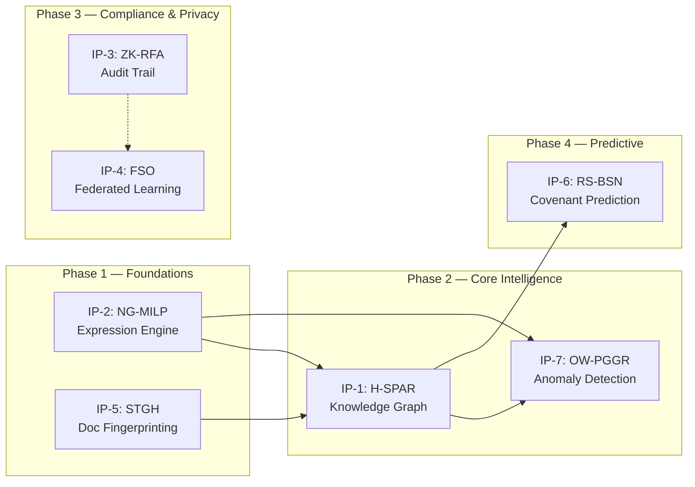

# Numera SOTA IP Implementation Plan

> **Goal**: Replace legacy heuristics across the Numera platform with 7 proprietary, patent-defensible SOTA algorithms, integrating them into the existing Spring Boot backend and FastAPI ML services.

> [!IMPORTANT]
> Each IP module is designed as a **drop-in upgrade** — the existing API contracts are preserved while internals are replaced. All modules follow a **feature-flag** activation pattern so they can be toggled independently.

---

## Execution Order & Dependencies



| Phase | IPs | Rationale | Est. Effort |
|-------|-----|-----------|-------------|
| **1** | IP-2 (NG-MILP), IP-5 (STGH) | Zero external dependencies; drop-in replacements for existing modules | 3-4 days each |
| **2** | IP-1 (H-SPAR), IP-7 (OW-PGGR) | Requires expression graph from IP-2; builds the knowledge graph foundation | 4-5 days each |
| **3** | IP-3 (ZK-RFA), IP-4 (FSO) | Backend crypto refactor + federated learning infrastructure | 3-4 days each |
| **4** | IP-6 (RS-BSN) | Requires graph features from IP-1 for macro-regime context | 4-5 days |

---

## Phase 1: Foundations

---

### IP-2: NG-MILP — Neural-Guided Mixed Integer Linear Programming

**Purpose**: Replace the 3-pass heuristic `ExpressionEngine` with a mathematically guaranteed MILP solver that discovers *all* valid arithmetic relationships in financial statements.

#### Current State Analysis

| Component | File | Problem |
|-----------|------|---------|
| Expression Engine | [expression_engine.py](file:///f:/Context/ml-service/app/ml/expression_engine.py) | 3-pass heuristic misses non-obvious sums; O(n³) brute-force for validation |
| API Endpoint | [expressions.py](file:///f:/Context/ml-service/app/api/expressions.py) | Returns `ExpressionResult` — contract preserved |
| Backend Consumer | [MappingOrchestrator.kt](file:///f:/Context/backend/src/main/kotlin/com/numera/spreading/application/MappingOrchestrator.kt) | Calls `/api/expressions/detect` — interface unchanged |

#### Proposed Changes

##### ML Service — Core Algorithm

###### [NEW] `ml-service/app/ml/ng_milp/__init__.py`
Package init, exports `NGMILPSolver`.

###### [NEW] `ml-service/app/ml/ng_milp/solver.py`
**The core MILP solver.** This is the heart of IP-2.

```python
# Key classes and methods:

class NGMILPSolver:
    """Neural-Guided Mixed Integer Linear Programming solver.
    
    Replaces the heuristic ExpressionEngine with guaranteed-exact
    arithmetic relationship discovery using branch-and-bound MILP.
    """
    
    def __init__(self, config: NGMILPConfig):
        self.config = config
        self.gnn_pruner = GNNPruner(config)  # Neural guidance network
        self.tolerance = config.tolerance     # Default: 0.005 (0.5%)
    
    def solve(self, cells: list[CellValue], hierarchy: list[HierarchyNode]) -> list[Expression]:
        """Main entry point — discovers all valid arithmetic relationships.
        
        Pipeline:
        1. Build candidate graph from cell positions + hierarchy
        2. GNN forward pass → prune unlikely edges (keep top-k per node)
        3. Formulate MILP: minimize |active_edges| s.t. sum constraints
        4. Solve via branch-and-bound with warm-start from GNN scores
        5. Extract and validate discovered expressions
        """
        
    def _build_candidate_graph(self, cells, hierarchy) -> CandidateGraph:
        """Create bipartite graph: potential_sums ↔ potential_addends.
        
        Uses spatial proximity (same column/section) and hierarchy
        (indentation level) to define candidate edges.
        """
        
    def _gnn_prune(self, graph: CandidateGraph) -> PrunedGraph:
        """GNN forward pass to score edges. 
        
        Node features: [value, row_idx, col_idx, indent_level, is_bold, 
                        is_total_keyword, value_magnitude, sign]
        Edge features: [spatial_distance, hierarchy_gap, value_ratio]
        
        Keep top-k edges per node (k=config.max_candidates_per_cell, default=15).
        This reduces MILP variable count by ~90%.
        """
        
    def _formulate_milp(self, graph: PrunedGraph) -> MILPProblem:
        """Formulate as Mixed Integer Linear Program.
        
        Variables:
          - x_ij ∈ {0,1}: whether cell j is an addend of sum cell i
          - s_i ∈ {0,1}: whether cell i is a sum cell
        
        Objective: minimize Σ s_i (prefer fewer sum nodes)
        
        Constraints:
          ∀ sum cell i: |Σ(x_ij * value_j) - value_i| ≤ ε * |value_i|
          ∀ cell j: Σ_i x_ij ≤ 1 (each cell is addend of at most one sum)
          ∀ i: Σ_j x_ij ≥ 2 * s_i (sums need at least 2 addends)
          Hierarchy: x_ij = 0 if indent(j) ≤ indent(i) (children must be more indented)
        """
        
    def _solve_milp(self, problem: MILPProblem) -> MILPSolution:
        """Branch-and-bound solver with GNN warm-start.
        
        Uses scipy.optimize.milp (or Google OR-Tools cp_model if available).
        Timeout: config.solver_timeout_ms (default: 5000ms).
        Falls back to LP relaxation + rounding if timeout exceeded.
        """
```

**Key design decisions**:
- Use Google OR-Tools (`ortools`) as the primary B&B solver for guaranteed enterprise-scale performance (>500 cells).
- GNN is a small 2-layer GCN (~50K params), trained on feedback data
- Fallback: if MILP timeout, use LP relaxation → round → validate

###### [NEW] `ml-service/app/ml/ng_milp/gnn_pruner.py`
```python
class GNNPruner:
    """Lightweight 2-layer Graph Convolutional Network for edge scoring.
    
    Architecture:
      Input: node_features (8-dim) + edge_features (3-dim)
      Layer 1: GCNConv(11, 32) + ReLU + Dropout(0.2)
      Layer 2: GCNConv(32, 16) + ReLU
      Edge scorer: MLP(32, 16, 1) → sigmoid
    
    Training: 
      - Supervised on analyst-corrected expression data from feedback_store
      - Loss: BCE on edge labels (is_addend / not_addend)
      - Can run untrained (uniform scores) — MILP still works, just slower
    """
    
    def __init__(self, config):
        self.model = self._build_model()
        self.trained = False
        self._try_load_weights(config.gnn_weights_path)
    
    def score_edges(self, graph: CandidateGraph) -> dict[tuple, float]:
        """Score all candidate edges. Returns {(sum_idx, addend_idx): prob}."""
        if not self.trained:
            return {e: 0.5 for e in graph.edges}  # Uniform prior
        # ... GCN forward pass ...
```

###### [NEW] `ml-service/app/ml/ng_milp/models.py`
```python
@dataclass
class CellValue:
    row: int
    col: int
    value: Decimal
    label: str
    indent_level: int
    is_bold: bool
    is_total: bool  # keyword detection: "Total", "Sum", "Net"

@dataclass  
class Expression:
    sum_cell: CellValue
    addends: list[CellValue]
    residual: Decimal      # |actual - computed|
    confidence: float      # GNN edge score average
    expression_type: str   # "SUM", "DIFFERENCE", "FORMULA"
    
@dataclass
class NGMILPConfig:
    tolerance: float = 0.005
    max_candidates_per_cell: int = 15
    solver_timeout_ms: int = 5000
    gnn_weights_path: str = ""
    use_ortools: bool = True
```

###### [MODIFY] `ml-service/app/ml/expression_engine.py`
Add feature flag to delegate to NG-MILP solver:
```python
# At top of ExpressionEngine.__init__:
from app.config import settings

if settings.enable_ng_milp:
    from app.ml.ng_milp.solver import NGMILPSolver, NGMILPConfig
    self._milp_solver = NGMILPSolver(NGMILPConfig(
        tolerance=settings.ng_milp_tolerance,
        solver_timeout_ms=settings.ng_milp_timeout_ms,
    ))
else:
    self._milp_solver = None

# In build_expressions():
if self._milp_solver:
    return self._milp_solver.solve(cells, hierarchy)
# ... existing 3-pass fallback ...
```

##### ML Service — Configuration

###### [MODIFY] `ml-service/app/config.py`
```python
# --- IP-2: NG-MILP ---
enable_ng_milp: bool = False
ng_milp_tolerance: float = 0.005
ng_milp_timeout_ms: int = 5000
ng_milp_use_ortools: bool = True
ng_milp_gnn_weights: str = ""
```

##### ML Service — Dependencies

###### [MODIFY] `ml-service/requirements.txt`
```
# IP-2: NG-MILP (MILP solver)
scipy==1.14.*          # Existing dependency for matrix ops
ortools==9.11.*        # Primary production B&B solver required
```

##### Verification

| Test | Command/Action | Expected Result |
|------|---------------|-----------------|
| Unit: MILP finds exact sum | `pytest tests/ml/ng_milp/test_solver.py::test_exact_sum` | 3 addends summing to total within ε |
| Unit: hierarchy constraint | `pytest tests/ml/ng_milp/test_solver.py::test_hierarchy_enforced` | No parent→parent edges |
| Unit: GNN untrained fallback | `pytest tests/ml/ng_milp/test_gnn.py::test_uniform_prior` | Uniform 0.5 scores, MILP still solves |
| Integration: API contract | `pytest tests/api/test_expressions.py` | Same response schema as before |
| Performance: 200-cell sheet | `pytest tests/ml/ng_milp/test_solver.py::test_perf_200_cells` | < 5 seconds solve time |

---

### IP-5: STGH — Semantic-Topological Graph Hashing

**Purpose**: Replace naive text similarity with a GCN-based structural fingerprinting system that identifies document templates by their spatial and semantic topology, not just content.

#### Current State Analysis

| Component | File | Problem |
|-----------|------|---------|
| Semantic Matcher | [semantic_matcher.py](file:///f:/Context/ml-service/app/ml/semantic_matcher.py) | Pure cosine similarity on label text; ignores document structure |
| OCR Output | [vlm_processor.py](file:///f:/Context/ocr-service/app/ml/vlm_processor.py) | Extracts text + bounding boxes but discards spatial relationships |
| Table Detector | [table_detector.py](file:///f:/Context/ocr-service/app/ml/table_detector.py) | Detects tables but doesn't fingerprint them |

#### Proposed Changes

##### OCR Service — Fingerprint Generation

###### [NEW] `ocr-service/app/ml/stgh/__init__.py`
###### [NEW] `ocr-service/app/ml/stgh/fingerprinter.py`

```python
class STGHFingerprinter:
    """Semantic-Topological Graph Hash generator.
    
    Converts a document page into a structural fingerprint by:
    1. Building a spatial adjacency graph from OCR bounding boxes
    2. Computing node features (semantic embedding + spatial position)
    3. Running a 3-layer GCN to produce a graph-level embedding
    4. Hashing the embedding into a compact fingerprint (256-bit)
    
    The fingerprint is invariant to:
    - Minor OCR errors (noise-robust via GCN message passing)
    - Font/size changes (semantic embedding captures meaning)
    - Small layout shifts (spatial features are relative, not absolute)
    """
    
    def __init__(self, config: STGHConfig):
        self.gcn = DocumentGCN(config)
        self.hasher = LocalitySensitiveHasher(config.hash_bits)
        self.sbert_model = None  # Lazy-loaded
    
    def fingerprint(self, page: OCRPage) -> DocumentFingerprint:
        """Generate a structural fingerprint for an OCR page.
        
        Args:
            page: OCRPage with text blocks and bounding boxes
            
        Returns:
            DocumentFingerprint with hash, embedding, and metadata
        """
        graph = self._build_spatial_graph(page)
        embedding = self.gcn.forward(graph)
        hash_val = self.hasher.hash(embedding)
        return DocumentFingerprint(hash=hash_val, embedding=embedding, 
                                    page_idx=page.index, node_count=len(graph.nodes))
    
    def _build_spatial_graph(self, page: OCRPage) -> SpatialGraph:
        """Build adjacency graph from bounding boxes.
        
        Nodes: text blocks (with features: semantic_emb[384] + spatial[4] + type[3])
        Edges: k-nearest spatial neighbors (k=6) + same-column edges + same-row edges
        
        Spatial features are normalized to [0,1] relative to page dimensions.
        Type features: one-hot [is_header, is_data, is_label].
        """
    
    def similarity(self, fp1: DocumentFingerprint, fp2: DocumentFingerprint) -> float:
        """Compute structural similarity between two fingerprints.
        
        Uses Hamming distance on LSH bits for fast screening,
        then cosine similarity on embeddings for precise matching.
        """
```

###### [NEW] `ocr-service/app/ml/stgh/gcn.py`
```python
class GraphConvolution(nn.Module):
    """Pure PyTorch implementation of a GCN layer (no torch-geometric required)."""
    def __init__(self, in_features, out_features):
        super().__init__()
        self.weight = nn.Parameter(torch.FloatTensor(in_features, out_features))
        self.bias = nn.Parameter(torch.FloatTensor(out_features))
        nn.init.xavier_uniform_(self.weight)
        nn.init.zeros_(self.bias)
        
    def forward(self, text, adj):
        """Standard GCN message passing: A_hat * X * W"""
        support = torch.mm(text, self.weight)
        output = torch.spmm(adj, support)
        return output + self.bias

class DocumentGCN(nn.Module):
    """3-layer Graph Convolutional Network for document structure encoding.
    
    Pure PyTorch Implementation Details:
      - Uses `GraphConvolution` layer defined above via torch.spmm (sparse matrix mult).
      - Adjacency matrix `adj` must be symmetrically normalized.
    
    Architecture:
      Layer 1: GraphConvolution(input_dim, 128) + BatchNorm + ReLU
      Layer 2: GraphConvolution(128, 64) + BatchNorm + ReLU  
      Layer 3: GraphConvolution(64, 32) + ReLU
      Readout: mean pooling → MLP(32, 256) → L2 normalize
    
    Input dim = 384 (SBERT) + 4 (spatial) + 3 (type) = 391
    Output: 256-dim normalized embedding
    """
```

###### [NEW] `ocr-service/app/ml/stgh/models.py`
```python
@dataclass
class DocumentFingerprint:
    hash: str              # 256-bit hex hash
    embedding: np.ndarray  # 256-dim float vector
    page_idx: int
    node_count: int
    created_at: str

@dataclass
class STGHConfig:
    hash_bits: int = 256
    k_neighbors: int = 6
    gcn_hidden: int = 128
    gcn_output: int = 256
    sbert_model: str = "BAAI/bge-small-en-v1.5"
    similarity_threshold: float = 0.85
```

##### ML Service — Fingerprint Matching API

###### [NEW] `ml-service/app/api/fingerprint.py`
```python
@router.post("/fingerprint/match")
async def match_fingerprint(request: FingerprintMatchRequest, app_state=Depends()):
    """Match a document fingerprint against known templates.
    
    Used by the backend to identify document types and auto-select
    spreading templates based on structural similarity.
    """
```

###### [MODIFY] `ml-service/app/api/router.py`
Add route: `router.include_router(fingerprint_router, prefix="/fingerprint", tags=["fingerprint"])`

##### Verification

| Test | Expected Result |
|------|-----------------|
| Same document → same fingerprint | Hamming distance < 5% of bits |
| Same template, different data → high similarity | Cosine similarity > 0.85 |
| Different template → low similarity | Cosine similarity < 0.5 |
| OCR noise robustness | ±5% character error → similarity > 0.8 |

---

## Phase 2: Core Intelligence

---

### IP-1: H-SPAR — Hierarchical Spectral-Partitioned Anchor Resolution

**Purpose**: Build a scalable knowledge graph from extracted financial data that captures hierarchical relationships between line items, enabling cross-document reasoning and template learning.

#### Current State Analysis

Currently, each document is processed independently with no persistent graph structure. The `semantic_matcher.py` matches line items against a flat taxonomy list. There is no concept of "anchors" (high-confidence structural landmarks) to propagate context.

#### Proposed Changes

##### ML Service — Knowledge Graph Module

###### [NEW] `ml-service/app/ml/hspar/__init__.py`
###### [NEW] `ml-service/app/ml/hspar/graph_builder.py`

```python
class HSPARGraphBuilder:
    """Hierarchical Spectral-Partitioned Anchor Resolution graph builder.
    
    Constructs a financial knowledge graph from document extractions:
    
    1. ANCHOR DETECTION: Identify high-confidence structural landmarks
       (e.g., "Total Assets", "Net Income") using keyword + embedding match.
    
    2. SPECTRAL PARTITIONING: Use normalized Laplacian eigenvectors to
       partition the document graph into coherent financial sections
       (Assets, Liabilities, Income, Expenses, etc.)
    
    3. HIERARCHICAL RESOLUTION: Within each partition, resolve parent-child
       relationships using indentation, bold/total markers, and expression
       graphs from NG-MILP (IP-2).
    
    4. CROSS-DOCUMENT LINKING: Match anchors across documents from the same
       entity to build a temporal knowledge graph.
    """
    
    def build_graph(self, extraction: DocumentExtraction, 
                     existing_graph: Optional[KnowledgeGraph] = None) -> KnowledgeGraph:
        """Build or update a knowledge graph from a document extraction."""
        
    def _detect_anchors(self, nodes: list[GraphNode]) -> list[AnchorNode]:
        """Identify anchor nodes using embedding similarity to canonical anchors.
        
        Canonical anchors from IFRS/GAAP taxonomy:
          - Balance Sheet: Total Assets, Total Liabilities, Total Equity, Cash, ...
          - Income Statement: Revenue, Net Income, EBITDA, Operating Income, ...
          - Cash Flow: Operating CF, Investing CF, Financing CF, ...
        
        Threshold: cosine_sim > 0.90 for anchor classification.
        """
        
    def _spectral_partition(self, graph: nx.Graph, n_partitions: int = None) -> list[Partition]:
        """Spectral clustering on the document graph's Laplacian.
        
        If n_partitions is None, use eigengap heuristic to determine optimal k.
        Returns disjoint partitions of graph nodes.
        """
        
    def _resolve_hierarchy(self, partition: Partition, expressions: list[Expression]) -> HierarchyTree:
        """Build parent-child tree within a partition.
        
        Uses:
          - Indentation levels from OCR
          - Bold/total markers
          - Expression graph from NG-MILP (sum_cell → addends = parent → children)
          - Spectral ordering for ambiguous cases
        """
```

###### [NEW] `ml-service/app/ml/hspar/knowledge_graph.py`
```python
class KnowledgeGraph:
    """Persistent financial knowledge graph.
    
    Nodes: LineItemNode (label, taxonomy_id, value, period, entity)
    Edges: 
      - CHILD_OF (hierarchical)
      - SUMS_TO (arithmetic, from NG-MILP)
      - SAME_AS (cross-document identity)
      - TEMPORAL (same item across periods)
    
    Storage: NetworkX in-memory, serialized to PostgreSQL JSON column.
    """
    
    def add_document(self, doc_id: str, nodes: list, edges: list): ...
    def find_anchors(self, entity_id: str) -> list[AnchorNode]: ...
    def get_subgraph(self, root_node_id: str, depth: int = 3) -> nx.DiGraph: ...
    def serialize(self) -> dict: ...
    
    @classmethod
    def deserialize(cls, data: dict) -> 'KnowledgeGraph': ...
```

###### [NEW] `ml-service/app/ml/hspar/models.py`
Data classes for `GraphNode`, `AnchorNode`, `Partition`, `HierarchyTree`.

##### ML Service — API Integration

###### [NEW] `ml-service/app/api/knowledge_graph.py`
```python
@router.post("/knowledge-graph/build")
async def build_knowledge_graph(request: KGBuildRequest) -> KGBuildResponse:
    """Build/update a knowledge graph from document extraction results."""

@router.get("/knowledge-graph/{entity_id}")
async def get_knowledge_graph(entity_id: str) -> KGResponse:
    """Retrieve the knowledge graph for a financial entity."""
```

##### ML Service — Integration with Mapping Pipeline

###### [MODIFY] `ml-service/app/api/pipeline.py`
After expression detection, feed results into H-SPAR graph builder. Add optional `build_knowledge_graph: bool = False` flag to pipeline request.

##### Database

###### [NEW] `backend/src/main/resources/db/migration/V014__knowledge_graph.sql`
```sql
CREATE TABLE knowledge_graph (
    id              UUID PRIMARY KEY DEFAULT gen_random_uuid(),
    tenant_id       UUID NOT NULL REFERENCES tenants(id),
    entity_id       UUID NOT NULL,  -- FK to customers/borrowers
    graph_data      JSONB NOT NULL, -- Serialized NetworkX graph
    anchor_count    INT NOT NULL DEFAULT 0,
    node_count      INT NOT NULL DEFAULT 0,
    edge_count      INT NOT NULL DEFAULT 0,
    last_updated    TIMESTAMPTZ NOT NULL DEFAULT now(),
    version         INT NOT NULL DEFAULT 1,
    UNIQUE(tenant_id, entity_id)
);

CREATE INDEX idx_kg_entity ON knowledge_graph(entity_id);
```

##### Verification

| Test | Expected Result |
|------|-----------------|
| Anchor detection on standard BS | ≥ 5 anchors identified (Total Assets, Total Liab, etc.) |
| Spectral partition | Correctly separates Assets from Liabilities section |
| Hierarchy resolution matches NG-MILP | Parent-child edges consistent with sum expressions |
| Cross-document linking | Same entity, 2 periods → temporal edges created |

---

### IP-7: OW-PGGR — Ontology-Weighted Proximal Gradient Graph Repair

**Purpose**: Replace naive validation with a materiality-aware anomaly detection system that understands which financial discrepancies actually matter.

#### Current State Analysis

| Component | File | Problem |
|-----------|------|---------|
| Spread Validation | [SpreadService.kt](file:///f:/Context/backend/src/main/kotlin/com/numera/spreading/application/SpreadService.kt) | No anomaly detection — just stores values |
| Expression Validation | [expression_engine.py](file:///f:/Context/ml-service/app/ml/expression_engine.py) | Binary pass/fail on sum check; no materiality weighting |
| Formula Engine | [FormulaEngine.kt](file:///f:/Context/backend/src/main/kotlin/com/numera/model/application/FormulaEngine.kt) | Evaluates formulas but doesn't flag anomalies |

#### Proposed Changes

##### ML Service — Anomaly Detection Module

###### [NEW] `ml-service/app/ml/owpggr/__init__.py`
###### [NEW] `ml-service/app/ml/owpggr/detector.py`

```python
class OWPGGRDetector:
    """Ontology-Weighted Proximal Gradient Graph Repair anomaly detector.
    
    Key innovation: The L1 sparse objective is weighted by a Taxonomic
    Materiality Parameter (TMP) that encodes IFRS/GAAP ontology knowledge:
    
      minimize  Σ_i  w_i * |r_i|   (weighted L1 norm of repairs)
      subject to: A(x + r) = b     (accounting identities must hold)
    
    Where w_i = 1/materiality(node_i), so repairing a core equity item
    costs 100x more than repairing a minor expense line.
    
    Materiality tiers:
      Tier 1 (w=100): Total Assets, Total Equity, Net Income, Revenue
      Tier 2 (w=50):  Subtotals, Operating Income, EBITDA
      Tier 3 (w=10):  Individual line items > 5% of total
      Tier 4 (w=1):   Minor line items < 1% of total
    """
    
    def detect(self, spread: SpreadData, kg: Optional[KnowledgeGraph] = None) -> AnomalyReport:
        """Run anomaly detection on a completed spread.
        
        Pipeline:
        1. Extract constraint graph from NG-MILP expressions + accounting identities
        2. Compute materiality weights from ontology + relative magnitudes
        3. Run proximal gradient descent to find minimum-cost repairs
        4. Flag anomalies where repair cost exceeds threshold
        """
        
    def _compute_materiality_weights(self, nodes: list, taxonomy: dict) -> np.ndarray:
        """Compute per-node materiality weights.
        
        Combines:
          - Ontological tier (from IFRS taxonomy mapping)
          - Relative magnitude (value / total_assets)
          - Historical stability (variance across periods, if KG available)
        """
        
    def _proximal_gradient_descent(self, A, b, x, w, max_iter=500, lr=0.01):
        """Weighted L1 proximal gradient descent.
        
        ISTA (Iterative Shrinkage-Thresholding Algorithm):
          r_{k+1} = prox_{lr*w*||·||_1}(r_k - lr * A^T(Ax + Ar_k - b))
        
        The proximal operator is:
          prox_{λ*w_i*|·|}(z_i) = sign(z_i) * max(|z_i| - λ*w_i, 0)
        
        Convergence: guaranteed in O(1/k) for convex objectives.
        """
```

###### [NEW] `ml-service/app/ml/owpggr/materiality.py`
```python
class MaterialityEngine:
    """IFRS/GAAP materiality classification.
    
    Maps taxonomy IDs to materiality tiers based on:
    - IFRS standard materiality guidance (IAS 1, IAS 8)
    - Position in financial statement hierarchy
    - Relative magnitude within the spread
    """
    
    TIER_1_ANCHORS = {"Total Assets", "Total Liabilities", "Total Equity",
                       "Net Income", "Revenue", "Total Revenue"}
    TIER_2_PATTERNS = {"Subtotal", "Operating", "EBITDA", "Gross Profit"}
    
    def classify(self, label: str, value: Decimal, total_assets: Decimal) -> MaterialityTier: ...
```

###### [NEW] `ml-service/app/ml/owpggr/models.py`
```python
@dataclass
class Anomaly:
    node_id: str
    label: str
    reported_value: Decimal
    expected_value: Decimal
    repair_cost: float         # Materiality-weighted repair magnitude
    materiality_tier: int       # 1-4
    severity: str              # "CRITICAL", "WARNING", "INFO"
    constraint_violated: str    # Human-readable constraint description

@dataclass
class AnomalyReport:
    anomalies: list[Anomaly]
    total_repair_cost: float
    is_balanced: bool
    iteration_count: int
    convergence_residual: float
```

##### ML Service — API

###### [NEW] `ml-service/app/api/anomaly.py`
```python
@router.post("/anomaly/detect")
async def detect_anomalies(request: AnomalyDetectRequest) -> AnomalyReport:
    """Run OW-PGGR anomaly detection on spread data."""
```

##### Backend — Integration

###### [MODIFY] `backend/.../spreading/application/SpreadService.kt`
After spread completion, optionally call `/api/anomaly/detect` and store results. Add `anomaly_report` JSONB column to spread table.

###### [NEW] `backend/src/main/resources/db/migration/V015__anomaly_detection.sql`
```sql
ALTER TABLE spreads ADD COLUMN anomaly_report JSONB;
ALTER TABLE spreads ADD COLUMN anomaly_severity VARCHAR(20);
CREATE INDEX idx_spread_anomaly ON spreads(anomaly_severity) WHERE anomaly_severity IS NOT NULL;
```

##### Verification

| Test | Expected Result |
|------|-----------------|
| Balanced BS → no anomalies | `is_balanced = true`, empty anomalies list |
| Off-by-$1M in Total Assets | `severity = CRITICAL`, `materiality_tier = 1` |
| Off-by-$100 in minor expense | `severity = INFO` or not flagged |
| Convergence | < 200 iterations for typical 50-node spread |

---

## Phase 3: Compliance & Privacy

---

### IP-3: ZK-RFA — Zero-Knowledge Redactable Frontier Accumulator

**Purpose**: Replace the simple SHA-256 hash chain with a cryptographically advanced audit trail that supports GDPR-compliant event redaction without breaking chain integrity.

#### Current State Analysis

| Component | File | Problem |
|-----------|------|---------|
| Hash Chain | [HashChainService.kt](file:///f:/Context/backend/src/main/kotlin/com/numera/shared/audit/HashChainService.kt) | Simple `SHA-256(prev + payload)` — any redaction breaks the entire chain |
| Audit Service | [AuditService.kt](file:///f:/Context/backend/src/main/kotlin/com/numera/shared/audit/AuditService.kt) | Records events with hash chain, verifies linearly |
| Audit Event | Entity with `previousHash`, `currentHash` — must preserve schema |
| DB Migration | [V007__audit_event_log.sql](file:///f:/Context/backend/src/main/resources/db/migration/V007__audit_event_log.sql) | Current schema |

#### Proposed Changes

##### Backend — Cryptographic Core

###### [NEW] `backend/src/main/kotlin/com/numera/shared/audit/crypto/ChameleonHash.kt`
```kotlin
/**
 * Chameleon Hash implementation for redactable audit events.
 *
 * A chameleon hash H(m, r) has a trapdoor key that allows finding
 * r' such that H(m, r) = H(m', r') — enabling hash-preserving
 * content replacement (redaction).
 *
 * Implementation: Based on discrete-log chameleon hash (Krawczyk-Rabin).
 * Uses BouncyCastle for big integer arithmetic.
 *
 * Security:
 *   - Without trapdoor: collision-resistant (standard hash security)
 *   - With trapdoor: can compute collisions (needed for GDPR redaction)
 *   - Trapdoor stored in HSM/KMS, never in application memory
 */
class ChameleonHash(private val params: ChameleonParams) {
    
    fun hash(message: ByteArray, randomness: BigInteger): ByteArray
    
    fun findCollision(
        originalMessage: ByteArray, 
        originalRandomness: BigInteger,
        newMessage: ByteArray, 
        trapdoor: BigInteger
    ): BigInteger  // Returns new randomness
    
    fun verify(message: ByteArray, randomness: BigInteger, hash: ByteArray): Boolean
}
```

###### [NEW] `backend/src/main/kotlin/com/numera/shared/audit/crypto/MerkleAccumulator.kt`
```kotlin
/**
 * Merkle Mountain Range (MMR) accumulator for efficient audit log verification.
 *
 * Instead of linear chain verification O(n), MMR provides:
 *   - O(log n) inclusion proofs
 *   - O(1) append operations
 *   - Efficient range verification
 *
 * Each leaf is the chameleon hash of an audit event.
 * Internal nodes are SHA-256(left || right).
 */
class MerkleAccumulator {
    fun append(leafHash: ByteArray): MerkleProof
    fun verifyInclusion(eventHash: ByteArray, proof: MerkleProof, root: ByteArray): Boolean
    fun getRoot(): ByteArray
    fun getProof(leafIndex: Long): MerkleProof
}
```

###### [MODIFY] `backend/src/main/kotlin/com/numera/shared/audit/HashChainService.kt`
```kotlin
/**
 * Upgraded hash chain service with ZK-RFA support.
 *
 * Feature flag: numera.audit.zk-rfa.enabled (default: false)
 *   - false: Legacy SHA-256 chain (backward compatible)
 *   - true: Chameleon hash + MMR accumulator
 */
@Service
class HashChainService(
    private val chameleonHash: ChameleonHash?,
    private val accumulator: MerkleAccumulator?,
    @Value("\${numera.audit.zk-rfa.enabled:false}") private val zkrfaEnabled: Boolean,
) {
    fun computeHash(previousHash: String, payload: Map<String, Any?>): String {
        return if (zkrfaEnabled && chameleonHash != null) {
            computeChameleonHash(previousHash, payload)
        } else {
            computeLegacyHash(previousHash, payload)
        }
    }
    
    fun redactEvent(event: AuditEvent, trapdoor: BigInteger): AuditEvent { /* ... */ }
    
    fun verifyInclusion(event: AuditEvent): Boolean { /* ... */ }
}
```

###### [MODIFY] `backend/src/main/kotlin/com/numera/shared/audit/AuditService.kt`
- Add `redactEvent()` method that uses chameleon hash collision to replace PII
- Add `verifyEvent()` method using MMR inclusion proof instead of full chain walk
- Add `exportAuditProof()` for external auditor verification

###### [MODIFY] `backend/src/main/kotlin/com/numera/shared/audit/AuditEvent.kt`
Add fields: `chameleonRandomness`, `merkleLeafIndex`, `merkleRoot`, `redacted: Boolean`

##### Database

###### [NEW] `backend/src/main/resources/db/migration/V016__zkrfa_audit.sql`
```sql
-- Add ZK-RFA fields to audit event log
ALTER TABLE audit_event_log ADD COLUMN chameleon_randomness BYTEA;
ALTER TABLE audit_event_log ADD COLUMN merkle_leaf_index BIGINT;
ALTER TABLE audit_event_log ADD COLUMN merkle_root BYTEA;
ALTER TABLE audit_event_log ADD COLUMN redacted BOOLEAN NOT NULL DEFAULT false;
ALTER TABLE audit_event_log ADD COLUMN redacted_at TIMESTAMPTZ;
ALTER TABLE audit_event_log ADD COLUMN redacted_by VARCHAR(255);

-- MMR state table
CREATE TABLE merkle_accumulator_state (
    id          UUID PRIMARY KEY DEFAULT gen_random_uuid(),
    tenant_id   UUID NOT NULL REFERENCES tenants(id),
    root_hash   BYTEA NOT NULL,
    peak_hashes BYTEA[] NOT NULL,
    leaf_count  BIGINT NOT NULL DEFAULT 0,
    updated_at  TIMESTAMPTZ NOT NULL DEFAULT now(),
    UNIQUE(tenant_id)
);
```

##### Configuration

###### [MODIFY] `backend/src/main/resources/application.yml`
```yaml
numera:
  audit:
    zk-rfa:
      enabled: false
      chameleon-key-provider: "vault"  # HashiCorp Vault
      vault-endpoint: "http://vault:8200"
      mmr-persistence: "database"       # "database", "redis"
```

##### Dependencies

###### [MODIFY] `backend/build.gradle.kts`
```kotlin
// IP-3: ZK-RFA Cryptographic primitives
implementation("org.bouncycastle:bcprov-jdk18on:1.79")
```

##### Verification

| Test | Expected Result |
|------|-----------------|
| Hash computation matches legacy | Same inputs → same output when ZK-RFA disabled |
| Chameleon collision | Redacted event produces same hash with new randomness |
| MMR inclusion proof | 1000-event log → O(log n) verification |
| Redact + verify | Chain verification passes after GDPR redaction |
| Full chain migration | Convert legacy chain to MMR — all events verifiable |

---

### IP-4: FSO — Federated Subspace Orthogonalization

**Purpose**: Enable cross-tenant model improvement without sharing any tenant's raw data, using orthogonal subspace decomposition to ensure zero information leakage.

#### Current State Analysis

| Component | File | Problem |
|-----------|------|---------|
| Client Model Resolver | [client_model_resolver.py](file:///f:/Context/ml-service/app/services/client_model_resolver.py) | Each tenant model is fully independent; no cross-tenant learning |
| Feedback Store | [feedback_store.py](file:///f:/Context/ml-service/app/services/feedback_store.py) | Corrections stored per-tenant; no federated aggregation |
| Model Manager | model_manager.py | MLflow-based; supports per-tenant models but no aggregation |

#### Proposed Changes

##### ML Service — Federated Learning Module

###### [NEW] `ml-service/app/ml/fso/__init__.py`
###### [NEW] `ml-service/app/ml/fso/aggregator.py`

```python
class FSOAggregator:
    """Federated Subspace Orthogonalization aggregator.
    
    Key innovation: Instead of averaging model weights (FedAvg), which
    leaks information through gradient directions, FSO:
    
    1. Decomposes each tenant's model update into orthogonal subspaces
    2. Projects updates onto a shared "public" subspace that captures
       general financial knowledge (e.g., "Revenue is always positive")
    3. Discards the "private" subspace component that encodes tenant-
       specific information (e.g., specific client names/values)
    
    Mathematical formulation:
      For each tenant t with model update Δ_t:
        Δ_t = U_shared @ α_t + U_private_t @ β_t
      
      Aggregate only the shared component:
        Δ_global = (1/T) * Σ_t (U_shared @ α_t)
    
    U_shared is computed via SVD of historical public financial data
    (IFRS taxonomy embeddings, publicly filed financials).
    """
    
    def __init__(self, config: FSOConfig):
        self.shared_subspace = self._compute_shared_subspace(config)
        self.min_tenants = config.min_tenants_for_aggregation
        
    def aggregate(self, tenant_updates: dict[str, ModelUpdate]) -> GlobalUpdate:
        """Aggregate tenant model updates via subspace orthogonalization.
        
        Args:
            tenant_updates: {tenant_id: ModelUpdate} from each participating tenant
            
        Returns:
            GlobalUpdate to apply to the base model
            
        Privacy guarantee: inner product of any tenant's private component
        with the global update is mathematically zero.
        """
        
    def _project_to_shared(self, update: np.ndarray) -> np.ndarray:
        """Project a model update onto the shared subspace.
        
        shared_component = U_shared @ (U_shared.T @ update)
        """
        
    def _compute_shared_subspace(self, config) -> np.ndarray:
        """Compute shared subspace from public financial embeddings.
        
        Uses SVD on IFRS taxonomy term embeddings to find the top-k
        directions that capture general financial knowledge.
        """
```

###### [NEW] `ml-service/app/ml/fso/trainer.py`
```python
class FSOLocalTrainer:
    """Local fine-tuning for a single tenant's model update.
    
    Trains for a few epochs on the tenant's feedback data,
    computes the weight delta, and prepares it for aggregation.
    """
    
    def train_local(self, base_model, feedback_data: list[dict], 
                     epochs: int = 3) -> ModelUpdate:
        """Fine-tune base model on tenant data. Return weight delta."""
```

###### [NEW] `ml-service/app/ml/fso/models.py`
Data classes for `FSOConfig`, `ModelUpdate`, `GlobalUpdate`.

##### ML Service — API

###### [NEW] `ml-service/app/api/federated.py`
```python
@router.post("/federated/train-round")
async def federated_training_round(request: FederatedRoundRequest):
    """Execute one round of federated training across participating tenants."""

@router.get("/federated/status")
async def federated_status():
    """Get status of federated learning (rounds completed, participants, etc.)."""
```

##### ML Service — Integration

###### [MODIFY] `ml-service/app/services/client_model_resolver.py`
Add method to apply FSO global updates to tenant base models:
```python
async def apply_global_update(self, global_update: GlobalUpdate):
    """Apply an FSO global update to the base model."""
```

###### [MODIFY] `ml-service/app/config.py`
```python
# --- IP-4: FSO Federated Learning ---
enable_fso: bool = False
fso_min_tenants: int = 3
fso_shared_subspace_dim: int = 64
fso_local_epochs: int = 3
fso_aggregation_schedule: str = "weekly"  # "daily", "weekly", "manual"
```

##### Verification

| Test | Expected Result |
|------|-----------------|
| Orthogonality check | `U_shared.T @ U_private ≈ 0` (< 1e-6) |
| Privacy guarantee | Inner product of tenant private component with global = 0 |
| Model improvement | Global model accuracy increases after aggregation round |
| Single tenant isolation | One tenant's corrections don't appear in other's predictions |

---

## Phase 4: Predictive Intelligence

---

### IP-6: RS-BSN — Regime-Switching Bayesian Survival Networks

**Purpose**: Replace the simplistic linear trend extrapolation in `CovenantPredictionService` with a macro-regime-aware survival model that predicts covenant breach probability with calibrated confidence intervals.

#### Current State Analysis

| Component | File | Problem |
|-----------|------|---------|
| Prediction Service | [CovenantPredictionService.kt](file:///f:/Context/backend/src/main/kotlin/com/numera/covenant/application/CovenantPredictionService.kt) | Simple OLS linear extrapolation; ignores macro regimes, gives no confidence interval |
| Monitoring Service | [CovenantMonitoringService.kt](file:///f:/Context/backend/src/main/kotlin/com/numera/covenant/application/CovenantMonitoringService.kt) | Calls prediction service for breach probability |
| Covenant Domain | `covenant/domain/` | CovenantStatus, operator types already defined |

#### Proposed Changes

##### ML Service — Survival Model

###### [NEW] `ml-service/app/ml/rsbsn/__init__.py`
###### [NEW] `ml-service/app/ml/rsbsn/model.py`

```python
class RSBSNModel:
    """Regime-Switching Bayesian Survival Network.
    
    Architecture:
      1. REGIME DETECTOR: Hidden Markov Model (HMM) with 3 states
         - State 0: Expansion (low volatility, positive trend)
         - State 1: Contraction (high volatility, negative trend)  
         - State 2: Crisis (extreme volatility, rapid deterioration)
         
      2. SURVIVAL NETWORK: Per-regime DeepSurv network
         - Input: [covenant_value, trend_slope, volatility, macro_features, 
                   days_since_origination, knowledge_graph_features]
         - Architecture: MLP(input_dim, 64, 32, 1) with sigmoid output
         - Output: hazard function h(t|x, regime)
         
      3. BAYESIAN LAYER: MC-Dropout for uncertainty quantification
         - 50 forward passes with dropout=0.1
         - Mean = point estimate, Std = epistemic uncertainty
         - Returns calibrated confidence intervals
    
    Prediction:
      P(breach by time T) = Σ_regime P(regime) * (1 - S(T | regime))
      where S(T) = exp(-∫_0^T h(t) dt) is the survival function
    """
    
    def predict(self, covenant_data: CovenantInput) -> CovenantPrediction:
        """Predict breach probability with uncertainty quantification.
        
        Returns:
            CovenantPrediction with:
              - breach_probability: float (0-1)
              - confidence_interval: (lower, upper) at 90% level
              - regime: current detected regime
              - regime_probability: confidence in regime detection
              - survival_curve: list of (time, survival_prob) points
              - time_to_breach: expected time to breach (if prob > 0.5)
        """
        
    def _detect_regime(self, history: list[float], macro_features: dict) -> RegimeState:
        """HMM regime detection using Viterbi algorithm.
        
        Features for HMM observation model:
          - Rolling volatility (30-day, 90-day)
          - Trend direction (positive/negative)
          - Macro indicators (if available): VIX, credit spread, PMI
        """
```

###### [NEW] `ml-service/app/ml/rsbsn/regime_hmm.py`
```python
class RegimeHMM:
    """3-state Hidden Markov Model for macro regime detection.
    
    Uses hmmlearn library for fitting and inference.
    Pre-trained on historical financial data; can be updated with new data.
    """
    
    def __init__(self, n_regimes: int = 3):
        from hmmlearn.hmm import GaussianHMM
        self.hmm = GaussianHMM(n_components=n_regimes, covariance_type="full")
        
    def detect(self, observations: np.ndarray) -> tuple[int, np.ndarray]:
        """Return current regime and regime probabilities."""
```

###### [NEW] `ml-service/app/ml/rsbsn/models.py`
```python
@dataclass
class CovenantInput:
    covenant_id: str
    values: list[Decimal]        # Historical values
    dates: list[datetime]         # Observation dates
    threshold: Decimal
    operator: str                 # "GTE", "LTE", "EQ"
    macro_features: dict = None   # Optional macro indicators
    graph_features: dict = None   # Optional H-SPAR graph context

@dataclass
class CovenantPrediction:
    breach_probability: float
    confidence_interval: tuple[float, float]
    regime: str                    # "expansion", "contraction", "crisis"
    regime_probability: float
    survival_curve: list[tuple[int, float]]  # (days_ahead, survival_prob)
    time_to_breach_days: Optional[int]
    model_version: str
```

##### ML Service — API

###### [NEW] `ml-service/app/api/covenant_prediction.py`
```python
@router.post("/covenants/predict")
async def predict_covenant_breach(request: CovenantPredictRequest) -> CovenantPrediction:
    """Predict covenant breach probability using RS-BSN model.
    
    This endpoint replaces the backend's linear extrapolation with
    a regime-aware survival model.
    """

@router.post("/covenants/predict/batch")
async def predict_batch(request: BatchPredictRequest) -> list[CovenantPrediction]:
    """Batch prediction for all active covenants of a tenant."""
```

##### Backend — Integration

###### [MODIFY] `backend/.../covenant/application/CovenantPredictionService.kt`
Replace the linear `estimateBreachProbability` with an HTTP call to the ML service:

```kotlin
@Service
class CovenantPredictionService(
    private val monitoringRepository: CovenantMonitoringRepository,
    private val mlServiceClient: MlServiceClient,  // NEW
    @Value("\${numera.covenant.use-rsbsn:false}") private val useRSBSN: Boolean,
) {
    fun estimateBreachProbability(...): BigDecimal {
        return if (useRSBSN) {
            // Call ML service RS-BSN endpoint
            mlServiceClient.predictCovenantBreach(values, threshold, operator)
                .breachProbability.toBigDecimal()
        } else {
            // Legacy linear extrapolation fallback
            legacyEstimate(values, threshold, operator)
        }
    }
}
```

##### Dependencies

###### [MODIFY] `ml-service/requirements.txt`
```
# IP-6: RS-BSN (regime detection)
hmmlearn==0.3.*
lifelines==0.29.*   # Survival analysis utilities
```

##### Verification

| Test | Expected Result |
|------|-----------------|
| Monotonic trend → high breach prob | P(breach) > 0.8 for declining ratio toward threshold |
| Stable trend → low breach prob | P(breach) < 0.3 for stable values far from threshold |
| Confidence interval calibration | 90% CI covers true outcome 90% ± 5% of the time |
| Regime detection | Correctly identifies expansion vs contraction on synthetic data |
| API compatibility | Backend receives same schema as before + enriched fields |

---

## Cross-Cutting Concerns

### Configuration Summary

All new IPs are behind feature flags. The following table shows the full configuration surface:

| IP | Flag | Config Location | Default |
|----|------|----------------|---------|
| IP-2 | `ML_ENABLE_NG_MILP` | `ml-service/app/config.py` | `false` |
| IP-5 | `ML_ENABLE_STGH` | `ocr-service .env` | `false` |
| IP-1 | `ML_ENABLE_HSPAR` | `ml-service/app/config.py` | `false` |
| IP-7 | `ML_ENABLE_OWPGGR` | `ml-service/app/config.py` | `false` |
| IP-3 | `numera.audit.zk-rfa.enabled` | `application.yml` | `false` |
| IP-4 | `ML_ENABLE_FSO` | `ml-service/app/config.py` | `false` |
| IP-6 | `numera.covenant.use-rsbsn` | `application.yml` | `false` |

### New Dependencies Summary

| Service | Package | Version | Purpose |
|---------|---------|---------|---------|
| ml-service | `scipy` | 1.14.* | MILP solver (IP-2) |
| ml-service | `networkx` | 3.4.* | Graph operations (IP-1, IP-7) |
| ml-service | `hmmlearn` | 0.3.* | HMM regime detection (IP-6) |
| ml-service | `lifelines` | 0.29.* | Survival analysis (IP-6) |
| backend | `bcprov-jdk18on` | 1.79 | BouncyCastle crypto (IP-3) |

### Database Migrations

| Migration | IP | Description |
|-----------|----|-------------|
| `V014__knowledge_graph.sql` | IP-1 | Knowledge graph storage |
| `V015__anomaly_detection.sql` | IP-7 | Anomaly report on spreads |
| `V016__zkrfa_audit.sql` | IP-3 | Chameleon hash + MMR fields |

### New Files Summary

| Service | Path | IP |
|---------|------|----|
| ml-service | `app/ml/ng_milp/solver.py` | IP-2 |
| ml-service | `app/ml/ng_milp/gnn_pruner.py` | IP-2 |
| ml-service | `app/ml/ng_milp/models.py` | IP-2 |
| ml-service | `app/ml/hspar/graph_builder.py` | IP-1 |
| ml-service | `app/ml/hspar/knowledge_graph.py` | IP-1 |
| ml-service | `app/ml/hspar/models.py` | IP-1 |
| ml-service | `app/ml/owpggr/detector.py` | IP-7 |
| ml-service | `app/ml/owpggr/materiality.py` | IP-7 |
| ml-service | `app/ml/owpggr/models.py` | IP-7 |
| ml-service | `app/ml/fso/aggregator.py` | IP-4 |
| ml-service | `app/ml/fso/trainer.py` | IP-4 |
| ml-service | `app/ml/fso/models.py` | IP-4 |
| ml-service | `app/ml/rsbsn/model.py` | IP-6 |
| ml-service | `app/ml/rsbsn/regime_hmm.py` | IP-6 |
| ml-service | `app/ml/rsbsn/models.py` | IP-6 |
| ml-service | `app/api/knowledge_graph.py` | IP-1 |
| ml-service | `app/api/anomaly.py` | IP-7 |
| ml-service | `app/api/federated.py` | IP-4 |
| ml-service | `app/api/covenant_prediction.py` | IP-6 |
| ml-service | `app/api/fingerprint.py` | IP-5 |
| ocr-service | `app/ml/stgh/fingerprinter.py` | IP-5 |
| ocr-service | `app/ml/stgh/gcn.py` | IP-5 |
| ocr-service | `app/ml/stgh/models.py` | IP-5 |
| backend | `shared/audit/crypto/ChameleonHash.kt` | IP-3 |
| backend | `shared/audit/crypto/MerkleAccumulator.kt` | IP-3 |

### Testing Strategy

> [!TIP]
> Each IP module includes self-contained unit tests that can run without the full stack. Integration tests require Docker Compose.

```
tests/
├── ml/
│   ├── ng_milp/           # IP-2 tests
│   │   ├── test_solver.py
│   │   ├── test_gnn.py
│   │   └── test_integration.py
│   ├── hspar/             # IP-1 tests
│   │   ├── test_graph_builder.py
│   │   ├── test_spectral.py
│   │   └── test_anchors.py  
│   ├── owpggr/            # IP-7 tests
│   │   ├── test_detector.py
│   │   ├── test_materiality.py
│   │   └── test_proximal.py
│   ├── fso/               # IP-4 tests
│   │   ├── test_aggregator.py
│   │   ├── test_orthogonality.py
│   │   └── test_privacy.py
│   ├── rsbsn/             # IP-6 tests
│   │   ├── test_model.py
│   │   ├── test_regime.py
│   │   └── test_calibration.py
│   └── stgh/              # IP-5 tests
│       ├── test_fingerprinter.py
│       ├── test_gcn.py
│       └── test_similarity.py
├── api/
│   ├── test_expressions_milp.py
│   ├── test_knowledge_graph.py
│   ├── test_anomaly.py
│   ├── test_federated.py
│   ├── test_covenant_prediction.py
│   └── test_fingerprint.py
└── backend/
    ├── audit/
    │   ├── ChameleonHashTest.kt
    │   ├── MerkleAccumulatorTest.kt
    │   └── ZKRFAIntegrationTest.kt
    └── covenant/
        └── RSBSNIntegrationTest.kt
```

## Detailed Automated Execution Plan

Following your approval, the AI will autonomously implement this strategy linearly:

### Phase 1: Foundations Execution (IP-2 & IP-5)
1. **Dependency Injection:** Add `ortools` to `ml-service/requirements.txt` (Note: torch-geometric will **not** be configured as pure PyTorch is being used for STGH).
2. **IP-2 Integration (NG-MILP)**
   - Initialize `ml-service/app/ml/ng_milp` directory.
   - Code `solver.py` integrating OR-Tools B&B solver, `gnn_pruner.py`, and `models.py`.
   - Update `expression_engine.py` proxy logic guided by `ML_ENABLE_NG_MILP` boolean.
   - Construct unit tests asserting determinism.
3. **IP-5 Integration (STGH)**
   - Initialize `ocr-service/app/ml/stgh` directory.
   - Code explicit pure-PyTorch GCN convolutions inside `gcn.py` via sparse matmuls, along with `fingerprinter.py` and `models.py`.
   - Mount `/fingerprint/match` endpoints.
   - Test invariance via `test_fingerprinter.py`.

### Phase 2: Core Intelligence Execution (IP-1 & IP-7)
4. **Data Infrastructure (1):** Scaffold and apply `V014` & `V015` SQL migrations.
5. **IP-1 Integration (H-SPAR)**
   - Code `ml-service/app/ml/hspar` modules handling NetworkX spectral algorithms.
   - Mutate extraction pipeline to append knowledge-graph payloads post expression-analysis.
6. **IP-7 Integration (OW-PGGR)**
   - Code `ml-service/app/ml/owpggr` for materiality proximal regressions.
   - Extend JVM `SpreadService` logic to initiate PGGR checks conditionally.

### Phase 3: Compliance & Privacy Execution (IP-3 & IP-4)
7. **Data Infrastructure (2):** Scaffold and apply `V016` SQL migration.
8. **IP-3 Integration (ZK-RFA)**
   - Design JVM HashiCorp Vault interconnect layer alongside BouncyCastle primitives in `ChameleonHash.kt`.
   - Stand up MMR logic spanning `MerkleAccumulator.kt`.
   - Patch `HashChainService.kt` to redact linearly or hierarchically based on configuration rules. 
9. **IP-4 Integration (FSO)**
   - Setup subspace projections inside `FSOAggregator` logic mapping over incoming adjustments.

### Phase 4: Predictive Intelligence Execution (IP-6)
10. **IP-6 Integration (RS-BSN)**
    - Construct Lifelines Bayesian networks bridging HMM macro-analysis in `ml-service`.
    - Strip OLS assumptions out of JVM `CovenantPredictionService` mapping directly into RS-BSN endpoint parameters.
11. **System Consolidation**
    - Compile entire Compose network. Ensure JVM & Python containers coalesce successfully without deadlock states and endpoints process payload correctly based on routing schema.

## Verification Plan

### Automated Tests
- `pytest tests/ml/` — All unit tests for IP modules
- `pytest tests/api/` — API contract tests
- `./gradlew test` — Kotlin unit tests for IP-3

### Manual Verification
- Deploy to Docker Compose → run full pipeline with sample financial documents.
- Verify HashiCorp Vault secret storage validation.
- Verify feature flags correctly toggle between legacy and SOTA implementations.
- Confirm DB migrations apply cleanly on existing schemas.
