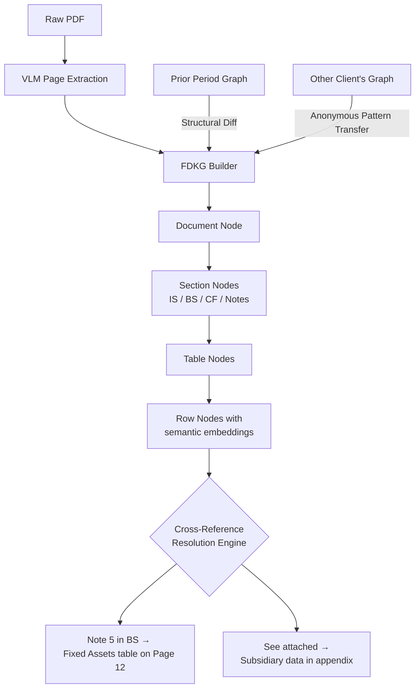
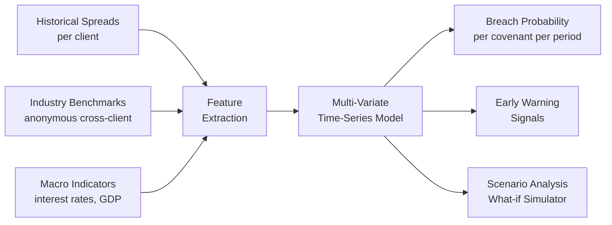
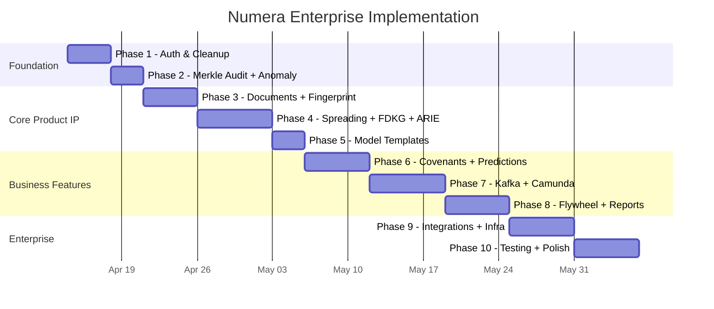

# Numera Platform — Proprietary IP Strategy & Enterprise Implementation Plan

> **Version**: 2.0 — Revised with IP Strategy  
> **Date**: April 10, 2026  
> **Key Decisions Applied**: Camunda workflow ✓ | Kafka events ✓ | Next.js cleanup ✓ | AG-Grid Community + custom ✓

---

## Part 1: Proprietary IP — What Makes Numera Uncopyable

> [!IMPORTANT]
> The current codebase is ~35% complete but nearly 100% commodity. It stitches together PaddleOCR + Sentence-BERT + Spring Boot + React — all well-documented open-source tools anyone can replicate in weeks. **The following 7 innovations transform Numera from "open-source plumbing" into a defensible product with genuine intellectual property.**

---

### IP-1: Financial Document Knowledge Graph (FDKG)
**What competitors do**: OCR a page → extract text → match keywords to fields  
**What we build**: A persistent, evolving graph that understands financial documents structurally



**Why this is proprietary IP:**
- **Cross-Reference Resolution Engine** — When a Balance Sheet line says "Note 5: Property, Plant & Equipment (see page 12)", the system automatically navigates to page 12, extracts the Note 5 breakdown table, and links the individual Fixed Asset components back to the parent BS line. No competitor does this automatically.
- **Structural Memory** — The graph remembers the *structure* of each client's financial documents across periods. When Company X submits their next annual report, the system already knows: "Page 3 is always the Income Statement, Page 7-8 is the Balance Sheet, Notes start on page 15."
- **Anonymous Pattern Transfer** — When the system learns that KPMG-audited UAE bank reports always have depreciation in Note 7, this structural knowledge transfers (anonymized) to accelerate processing for other KPMG-audited UAE banks.

**Where it lives in code:**
- New package: `com.numera.intelligence.fdkg` (backend)
- New module: `ml-service/app/intelligence/document_graph.py`
- Backed by: Neo4j graph database (or PostgreSQL with `ltree` + JSONB for simpler deployment)

---

### IP-2: Arithmetic Relationship Inference Engine (ARIE)
**What competitors do**: Match "Revenue" in PDF to "Revenue" in template by keyword  
**What we build**: Automatically *discover* the arithmetic relationships between values

**The Core Innovation**:  
Given a page of financial data, ARIE doesn't just match labels. It discovers that:
- Row 5 = Row 1 + Row 2 + Row 3 - Row 4 (even if the labels don't match anything)
- "Total Assets" = sum of all rows above it in the Assets section
- The value 15,234 in the Notes breakdown sums to 15,234 shown on the Balance Sheet

**Algorithm (3-pass constraint satisfaction)**:
```
Pass 1: SEMANTIC MATCH
  — SBERT cosine similarity against target model items
  — Zone-aware penalty (IS items penalized if matched from BS zone)
  
Pass 2: ARITHMETIC DISCOVERY (novel)
  — For every unmatched target item, search for combinations of source values
  — Constraint: find subset S of source values where SUM(S) = target value
  — Use branch-and-bound with tolerance ε (handles rounding)
  — Prune search space using accounting hierarchy (children MUST be in same section)
  
Pass 3: CROSS-VALIDATION
  — Verify discovered relationships against accounting identities
  — A = L + E, Revenue - Expenses = Net Income, etc.
  — If a mapping violates an identity, reduce its confidence
  — If an identity holds perfectly, boost confidence of participating mappings
```

**Why this is proprietary IP:**
- No spreading tool does automated arithmetic discovery — they all require manual expression building
- The constraint satisfaction approach with accounting-identity cross-validation is a **novel technical method** that can potentially be patented
- Every expression discovered teaches future documents (feeds IP-4 flywheel)

**Where it lives in code:**
- Enhanced: [expression_engine.py](file:///f:/Context/ml-service/app/ml/expression_engine.py) — already has `_try_sum_expression`, extend with full constraint solver
- New: `ml-service/app/intelligence/arithmetic_solver.py` — the constraint satisfaction engine
- New: `ml-service/app/intelligence/accounting_validator.py` — cross-validation against GAAP/IFRS identities

---

### IP-3: Cryptographic Merkle Audit Chain (CMAC)
**What competitors do**: Basic change logs ("User X modified value Y at time Z")  
**What we build**: A cryptographically tamper-proof, independently verifiable audit chain

**Architecture:**
```
Spread v1 ─hash→ Block 1 ─────────┐
                                   ├─hash→ Branch A
Spread v2 ─hash→ Block 2 ─────────┘           │
                                               ├─hash→ Merkle Root
Spread v3 ─hash→ Block 3 ─────────┐           │         (stored in
                                   ├─hash→ Branch B      immutable DB
Spread v4 ─hash→ Block 4 ─────────┘            │         + external
                                                          witness)
```

**What makes this defensible:**
1. **Every spread version** produces an immutable block containing: snapshot hash, previous hash, actor ID, timestamp, IP, action, diff
2. **Merkle tree** aggregation allows proving any single version's integrity without revealing other versions (privacy-preserving audit)
3. **External witness service** — periodically publish the Merkle root to an immutable external store (e.g., Ethereum L2 timestamp, AWS QLDB, or simply a public API) so even Numera itself cannot retroactively alter the chain
4. **Regulatory selling point** — when a bank regulator asks "prove this spread was approved by Manager X on March 15 and hasn't been modified since", the system produces a **Merkle proof** (a 256-byte cryptographic certificate) that is independently verifiable without access to the Numera system

**Why competitors can't easily copy:**
- The HashChainService already exists ([HashChainService.kt](file:///f:/Context/backend/src/main/kotlin/com/numera/shared/audit/HashChainService.kt)) but is trivial — extend to full Merkle tree with external witnessing
- The integration with spread version control and the ability to produce compact Merkle proofs is a system-level innovation
- Once clients' data is in the chain, switching costs are immense (breaking the chain invalidates audit history)

**Where it lives in code:**
- Enhanced: `shared/audit/HashChainService.kt` → `shared/audit/MerkleAuditService.kt`
- New: `shared/audit/MerkleTree.kt` — tree construction + proof generation
- New: `shared/audit/ExternalWitnessClient.kt` — publish roots to external service
- New API: `GET /api/audit/proof/{entityType}/{entityId}` → returns Merkle proof certificate

---

### IP-4: Self-Improving Data Flywheel (SIDF)
**What competitors do**: Static rule-based matching that never improves  
**What we build**: A system that gets smarter with every analyst interaction, creating a compound advantage over time

```
┌─────────────────────────────────────────────────────────┐
│                  THE ACCURACY FLYWHEEL                   │
│                                                         │
│   More Clients ──→ More Documents ──→ More Corrections  │
│        ↑                                    │           │
│        │                                    ▼           │
│   Better Accuracy ◄── Model Retraining ◄── Feedback    │
│        │                                    Store      │
│        ▼                                    │           │
│   Higher Confidence ──→ Less Manual Work    │           │
│        │                                    │           │
│        ▼                                    ▼           │
│   Client Retention ◄───── Switching Cost (trained model │
│                            is worthless outside Numera)  │
└─────────────────────────────────────────────────────────┘
```

**Three feedback channels (all proprietary):**

| Channel | Signal | Feeds Into |
|---|---|---|
| **Explicit Correction** | Analyst remaps a value from Item A → Item B | SBERT fine-tuning pairs |
| **Expression Override** | Analyst changes SUM(a,b,c) → SUM(a,b) | ARIE constraint weights |
| **Implicit Acceptance** | Analyst bulk-accepts all HIGH confidence → confirms calibration | Confidence threshold tuning |

**Per-Client Model Specialization:**
- After N corrections (default: 100), auto-trigger fine-tuning job
- Client-specific SBERT adapter layers (LoRA-style) — only 4MB per client vs 400MB global model
- The client's model is useless outside Numera (it's trained on Numera's embedding space)

**Where it lives in code:**
- Existing: [feedback_store.py](file:///f:/Context/ml-service/app/services/feedback_store.py), [client_model_resolver.py](file:///f:/Context/ml-service/app/services/client_model_resolver.py) — enhance significantly
- New: `ml-service/app/intelligence/flywheel_orchestrator.py` — manages retraining triggers, A/B promotion
- New: `ml-service/app/intelligence/confidence_calibrator.py` — Bayesian calibration of confidence scores
- Enhanced: `ml-training/notebooks/20_feedback_retraining.ipynb` — automated Colab pipeline

---

### IP-5: Document Format Fingerprinting (DFF)
**What competitors do**: Treat every document as a fresh extraction problem  
**What we build**: Recognize document formats across clients and apply learned layouts

**How it works:**
1. When a PDF is processed, the system computes a **layout fingerprint** — a compact vector encoding the visual structure (number of tables, positions, column counts, header patterns)
2. The fingerprint is matched against a global library of known formats
3. If a match is found (e.g., "This is the standard Deloitte audit report format for UAE banks"), the system pre-loads the zone classification, column assignments, and period detection from the fingerprint
4. Result: **Zero-shot accuracy** on documents from the same auditor/company format, even for a brand-new client

**The fingerprint vector (conceptual):**
```python
fingerprint = {
    "page_count_range": (45, 60),
    "table_layout_hash": "a7f3c2...",  # Hash of table positions across pages
    "header_pattern": ["Company Name", "Income Statement", "Year Ended"],
    "column_structure": [1, 3, 3, 2, 3],  # columns per table
    "zone_sequence": ["IS", "BS", "CF", "NOTES_FA", "NOTES_REC"],
    "auditor_signature": "deloitte_uae_v3",
}
```

**Why this is defensible:**
- The fingerprint library grows with every client → compound advantage
- Fingerprints are derived from proprietary document graph representations (IP-1)
- A new competitor starts with zero fingerprints; Numera has thousands after a year

**Where it lives in code:**
- New: `ocr-service/app/intelligence/fingerprint_engine.py`
- New: `ml-service/app/intelligence/fingerprint_matcher.py`
- New DB table: `document_fingerprints` (layout hash, auditor signature, client count, accuracy stats)

---

### IP-6: Covenant Breach Prediction Network (CBPN)
**What competitors do**: Track current status (Met/Breached). That's it.  
**What we build**: Predict future breaches using multi-variate financial pattern recognition

**Current state:** [CovenantPredictionService.kt](file:///f:/Context/backend/src/main/kotlin/com/numera/covenant/application/CovenantPredictionService.kt) has basic linear regression — this is a placeholder, not IP.

**The real engine:**



**Novel features:**
1. **Cross-Client Pattern Transfer** — "Company A's debt/EBITDA trajectory looks like Company B did 6 months before it breached" (anonymized patterns)
2. **Scenario Simulator** — Manager asks: "What happens to covenant compliance if revenue drops 15%?" — system recomputes all affected ratios and breach probabilities in real-time
3. **Leading Indicator Detection** — ML model identifies which financial ratios are *predictive* of breach for each covenant type (e.g., "For this client, working capital ratio leads debt service coverage by 2 quarters")

**Where it lives in code:**
- Enhanced: `CovenantPredictionService.kt` → full ML integration
- New: `ml-service/app/intelligence/breach_predictor.py` — time-series model
- New: `ml-service/app/intelligence/scenario_simulator.py` — what-if engine
- New API: `POST /api/covenants/simulate` — accepts scenario parameters, returns projected breach probabilities

---

### IP-7: Financial Anomaly Detection Engine (FADE)
**What competitors do**: Balance check (A = L + E). That's it.  
**What we build**: Multi-layer anomaly detection that catches errors, fraud signals, and data quality issues

**Three detection layers:**

| Layer | Method | What It Catches |
|---|---|---|
| **Benford's Law** | First-digit frequency analysis across all mapped values | Data fabrication, manual round-number entry |
| **Ratio Consistency** | Compare 20+ financial ratios against prior period + industry benchmarks | Unusual ratio swings that may indicate misclassification |
| **Cross-Statement Validation** | Verify IS→BS→CF flows (e.g., Net Income flows to Retained Earnings, Depreciation in CF matches IS) | Values mapped to wrong statements, missing adjustments |

**Output**: An **Anomaly Score** per spread (0-100) with specific flagged items and explanations. This becomes a "Quality Badge" that gives the Manager confidence before approval.

**Where it lives in code:**
- New: `com.numera.intelligence.anomaly` package (backend)
  - `BenfordAnalyzer.kt` — first-digit distribution test
  - `RatioConsistencyChecker.kt` — 20+ ratio checks against history + benchmarks
  - `CrossStatementValidator.kt` — IS/BS/CF flow validation
  - `AnomalyScoreService.kt` — aggregates all layers into final score
- New frontend: Anomaly report in spread workspace sidebar

---

### IP Summary: Commodity vs. Proprietary

| Component | Current State | After IP Implementation |
|---|---|---|
| OCR/VLM | Qwen3-VL (open-source) | Qwen3-VL + **DFF fingerprinting** (proprietary) |
| Semantic Matching | SBERT (open-source) | SBERT + **ARIE constraint solver** + **FDKG context** (proprietary) |
| Expression Building | Rule-based SUM detection | **Arithmetic discovery** + accounting identity validation (proprietary) |
| Confidence Scoring | Fixed thresholds | **Bayesian calibrated** per-client confidence (proprietary) |
| Audit Trail | SHA-256 hash chain | **Merkle tree** + external witnessing + proof certificates (proprietary) |
| Version Control | DB snapshots | Snapshots + **FDKG structural diff** (proprietary) |
| Covenant Tracking | Linear regression | **Multi-variate prediction** + scenario simulation (proprietary) |
| Quality Check | Balance A=L+E | **Benford + Ratio + Cross-Statement** anomaly detection (proprietary) |
| Learning | Feedback stored, unused | **Self-improving flywheel** with per-client specialization (proprietary) |

---

## Part 2: 10-Phase Enterprise Implementation Plan

> [!NOTE]
> **User decisions applied**: Custom Camunda workflow engine | Kafka event bus | Next.js App Router cleanup | AG-Grid Community with custom row grouping/export extensions

---

### Phase 1: Foundation Cleanup & Auth Hardening
**Effort**: ~3-4 days | **Priority**: 🔴 Critical

#### 1.1 Frontend Architecture Cleanup
- [ ] Remove `vite.config.ts`, `vite-env.d.ts`, `index.html` from `numera-ui/`
- [ ] Remove `react-router-dom` from `package.json` (using Next.js App Router)
- [ ] Remove `_pages_archive/` directory (old Vite/SPA pages)
- [ ] Remove `App.css`, `App.tsx`, `main.tsx` from archive
- [ ] Verify all routing uses Next.js `app/` directory conventions
- [ ] Add `@next/font` with Inter for typography

#### 1.2 Database Migrations
- [ ] `V014__password_policy.sql` — password policy columns on `tenants` table
- [ ] `V015__session_management.sql` — `user_sessions` table
- [ ] `V016__user_lifecycle.sql` — account status enum, approval_requests table
- [ ] `V017__document_fingerprints.sql` — fingerprint library table (for IP-5)
- [ ] `V018__merkle_audit.sql` — merkle_roots, merkle_nodes tables (for IP-3)
- [ ] `V019__anomaly_scores.sql` — spread anomaly scores + flagged items (for IP-7)

#### 1.3 Auth Hardening
- [ ] `PasswordPolicyService.kt` — complexity, expiry, history validation
- [ ] `SessionService.kt` — concurrent limits, configurable timeout, forced logout
- [ ] `AccountLifecycleService.kt` — self-registration, admin approval, bulk CSV
- [ ] Wire real SAML 2.0 token exchange in `SsoService.kt`
- [ ] Wire real OIDC exchange (using existing `spring-boot-starter-oauth2-client`)
- [ ] Add `@PreAuthorize` at method-level across ALL controllers
- [ ] Implement data-level tenant/group filtering in all JPA repositories

#### 1.4 Frontend Auth Pages
- [ ] MFA enrollment page (QR code display, backup code download)
- [ ] User registration with approval status tracking
- [ ] Session timeout warning modal
- [ ] Role/permission-aware navigation sidebar

**Acceptance**: Failed login locks account after 5 attempts. Users only see own tenant/group data. MFA works E2E.

---

### Phase 2: IP-3 Merkle Audit Chain + IP-7 Anomaly Foundation
**Effort**: ~3 days | **Priority**: 🔴 Critical (regulatory differentiator)

#### 2.1 Merkle Audit Chain
- [ ] `MerkleTree.kt` — Merkle tree construction from leaf hashes, proof generation
- [ ] `MerkleAuditService.kt` — wrap existing `AuditService` to maintain tree
  - Every `record()` call creates a leaf node
  - Tree is recomputed in batches (every 100 events or every 5 minutes)
  - Root hash stored in `merkle_roots` table
- [ ] `MerkleProofController.kt` — `GET /api/audit/proof/{entityType}/{entityId}` → returns Merkle proof JSON
- [ ] `ExternalWitnessClient.kt` — publish roots to configurable external endpoint (placeholder for AWS QLDB / blockchain timestamp)
- [ ] Proof verification utility — standalone function that validates a proof without DB access
- [ ] Frontend: "Audit Certificate" button in spread history → downloads proof JSON

#### 2.2 Anomaly Detection Foundation
- [ ] `BenfordAnalyzer.kt` — first-digit distribution test (Kuiper statistic)
  - Input: all mapped values in a spread
  - Output: p-value + flagged values that deviate most
- [ ] `RatioConsistencyChecker.kt` — compute 20+ core financial ratios:
  - Current Ratio, Quick Ratio, Debt/Equity, DSCR, Interest Coverage, etc.
  - Compare against prior period (flag >20% swing)
  - Compare against configurable industry benchmarks
- [ ] `CrossStatementValidator.kt`:
  - Net Income (IS) matches change in Retained Earnings (BS)
  - Depreciation (CF) matches Depreciation (IS)
  - Capex (CF) matches Fixed Assets change (BS) + Depreciation
- [ ] `AnomalyScoreService.kt` — aggregate scores: 0-30 (green), 30-60 (amber), 60-100 (red)
- [ ] Wire into `MappingOrchestrator.processSpread()` → compute anomaly score after mapping
- [ ] Frontend: Anomaly Score badge on spread workspace toolbar + expandable panel

**Acceptance**: Process a spread → anomaly score computed → Benford violations highlighted → ratio swings flagged. Merkle proof downloadable for any spread version.

---

### Phase 3: Document Pipeline + IP-5 Fingerprinting
**Effort**: ~4-5 days | **Priority**: 🟡 High

#### 3.1 Document Service Enhancements
- [ ] Multi-file merge endpoint (combine multiple files per period)
- [ ] Password-protected PDF handling (Apache PDFBox)
- [ ] Language auto-detection (Apache Tika LanguageIdentifier)
- [ ] Background bulk pre-processing with `@Scheduled`
- [ ] File state machine: UPLOADED → PROCESSING → READY → MAPPED → ERROR
- [ ] "My Files" / "All Files" / "Error Files" filtered views API
- [ ] Document clean-file: despeckle, deskew dispatch to OCR service

#### 3.2 OCR Service Enhancements
- [ ] `/clean` endpoint — despeckle, watermark removal, deskew (OpenCV)
- [ ] Word (.docx) → PDF conversion (LibreOffice headless or python-docx)
- [ ] Excel (.xlsx) → structured extraction (openpyxl)
- [ ] Language detection endpoint

#### 3.3 Document Format Fingerprinting (IP-5)
- [ ] `fingerprint_engine.py`:
  - Compute layout fingerprint from VLM extraction result
  - Vector: table count per page, column structure, zone sequence, header text hash
  - Normalize to 128-dimensional embedding for similarity matching
- [ ] `fingerprint_matcher.py`:
  - Match incoming fingerprint against library (cosine similarity > 0.85)
  - On match: pre-load zone assignments, column mappings, period detection
  - On new format: store as new fingerprint entry
- [ ] Backend: `DocumentFingerprintService.kt` — maintains fingerprint library
- [ ] Metrics: track fingerprint hit rate (% of documents with format match)

#### 3.4 Frontend — File Store
- [ ] Redesign documents page: My Files / All Files / Error Files tabs
- [ ] Multi-file drag-drop upload with progress bars
- [ ] Document re-process action button
- [ ] PDF inline preview modal
- [ ] Fingerprint match indicator ("Format recognized: 95% confidence")

**Acceptance**: Upload PDF → fingerprint computed → if format recognized, zones auto-classified with high confidence. Multi-file upload works. Error files retryable.

---

### Phase 4: Spreading Workspace — Production Grade + IP-1 & IP-2
**Effort**: ~6-7 days | **Priority**: 🔴 Critical (core product)

#### 4.1 PDF Viewer with Zone Overlays (IP-1 Visualization)
- [ ] Integrate PDF.js with `pdfjs-dist` package
- [ ] Coordinate-aware rendering with zone bounding boxes
- [ ] Color-coded overlays: IS=blue, BS=green, CF=purple, Notes=amber
- [ ] Clickable value overlays — clicking a number in PDF highlights the corresponding grid cell
- [ ] Cross-reference links visualized — dashed lines connecting "Note 5" to Note 5 table
- [ ] Zoom, pan, rotate controls
- [ ] Split-view mode (two document panes, different pages)
- [ ] Page navigation with zone jump pills

#### 4.2 Financial Document Knowledge Graph (IP-1)
- [ ] `document_graph.py`:
  - Build graph from VLM extraction: Document → Sections → Tables → Rows
  - Edge types: `CONTAINS`, `REFERENCES` (cross-reference), `SUMS_TO` (arithmetic)
  - Persist to PostgreSQL JSONB (graph representation)
- [ ] Cross-reference resolution:
  - Detect "Note X" / "See page Y" patterns in text
  - Link to corresponding table node
  - Propagate values from Notes back to parent statement
- [ ] Structural diff between periods (for same customer)
- [ ] Backend: `FdkgService.kt` — CRUD for document graphs, structural queries

#### 4.3 Arithmetic Relationship Inference Engine (IP-2)
- [ ] `arithmetic_solver.py` — constraint satisfaction engine:
  - Given source values and target templates, discover SUM and DIFFERENCE relationships
  - Branch-and-bound algorithm with accounting hierarchy pruning
  - Tolerance handling for rounding (configurable ε)
- [ ] `accounting_validator.py` — cross-validate against GAAP/IFRS identities:
  - A = L + E
  - Revenue - Expenses = Net Income
  - Opening Balance + Movements = Closing Balance
- [ ] Integrate into `ExpressionEngine.build_expressions()` as Pass 2 after semantic matching
- [ ] Expression explanations: "Revenue = Product Sales + Service Revenue (discovered via arithmetic match, verified against IS total)"

#### 4.4 AG-Grid Spread Table (Custom Extensions)
- [ ] Replace HTML table with AG-Grid Community
- [ ] Custom row grouping component (since AG-Grid Community lacks built-in grouping):
  - Category headers as sticky rows
  - Collapsible sections (Assets, Liabilities, Equity, etc.)
- [ ] Confidence-coded cell backgrounds (green ≥90%, amber 70-89%, red <70%)
- [ ] Cell editing with expression editor modal
- [ ] Custom Excel export using SheetJS (xlsx) — free alternative to AG-Grid Enterprise export
- [ ] "Show/Hide Unmapped Rows" toggle
- [ ] Variance column (difference from base period, highlight >10%)
- [ ] Currency & unit indicator columns
- [ ] Anomaly Score badge per cell (red flag icon for anomalous values from IP-7)
- [ ] Category bubble navigation bar
- [ ] Right-click context menu: Accept / Reject & Remap / Edit Expression / View Source / View Anomaly
- [ ] Auto-generated comments per cell (source PDF, page, line-item, clickable link)
- [ ] CL Notes inline sidebar

#### 4.5 Expression Editor UI
- [ ] Visual formula builder dialog
- [ ] Source values panel (drag-drop to expression area)
- [ ] Operator palette (+, -, ×, ÷, parentheses)
- [ ] Adjustment factor selectors (unit scale, absolute/negative/contra)
- [ ] ARIE-discovered expressions shown as "Suggested Expression" with explanation
- [ ] Expression preview with live computed result

#### 4.6 Spread Workflow
- [ ] Submit → Manager Review → Approve/Reject (basic, before Phase 6 Camunda)
- [ ] Manager approval page with side-by-side diff view
- [ ] "Submit & Continue" — auto-create next period spread
- [ ] Override vs Duplicate submission (Restated 1…5)
- [ ] Load historical periods (up to 20) for comparison

**Acceptance**: Analyst opens PDF → sees zone overlays with cross-reference links → AG-Grid shows ARIE-discovered expressions → edits values → anomaly score badge shows "12 (Green)" → submits → Manager approves.

---

### Phase 5: Financial Model Engine + Seed Templates
**Effort**: ~3 days | **Priority**: 🟢 Medium

#### 5.1 Backend
- [ ] `V020__global_templates.sql` — seed IFRS Corporate, IFRS Banking, US GAAP Corporate templates (50+ line items each, real taxonomy)
- [ ] Model versioning — track template structure changes with diff
- [ ] Model copy-to-customer with override protection
- [ ] Pre-built validation rules (A=L+E, etc.) seeded per template
- [ ] Add formula library — reusable formula definitions linkable to line items

#### 5.2 Frontend — Template Management
- [ ] `/admin/templates` page with tree-view editor
- [ ] Drag-drop reorder for line items within hierarchy
- [ ] Formula assignment dialog for computed cells
- [ ] Template import/export via Excel (SheetJS)
- [ ] Template version history viewer with diff

**Acceptance**: Admin creates IFRS template with 80 line items, assigns formulas, copies to customer, version history preserved.

---

### Phase 6: Covenant Module Completion + IP-6 Predictions
**Effort**: ~5-6 days | **Priority**: 🟡 High

#### 6.1 Visual Formula Builder
- [ ] `/admin/formulas` — visual builder using model line items
- [ ] Drag-drop line items into formula expression
- [ ] Formula audit trail (creation, modification history)
- [ ] Active/inactive toggle with soft delete

#### 6.2 Non-Financial Document Verification
- [ ] Maker upload flow for non-financial covenant docs
- [ ] Checker verification screen (preview, download, approve, reject)
- [ ] Rejection comments + re-submission flow
- [ ] Auto-approve "Financial Statement" type when spread submitted

#### 6.3 Breach Prediction Network (IP-6)
- [ ] `breach_predictor.py`:
  - Multi-variate time-series model using historical spread values
  - Features: trailing 4-8 quarter financial ratios, trend slopes, volatility
  - Output: breach probability per covenant per future period
- [ ] `scenario_simulator.py`:
  - Accept scenario parameters (revenue -15%, costs +10%)
  - Recompute all covenant values with projected changes
  - Return projected breach probabilities under scenario
- [ ] Cross-client pattern matching (anonymized):
  - When client A's trajectory matches pattern of past breaches by other clients, raise probability
- [ ] API: `POST /api/covenants/predict` — returns time-series breach forecast
- [ ] API: `POST /api/covenants/simulate` — accepts scenario, returns projected compliance

#### 6.4 Covenant Dashboard
- [ ] Breach risk heatmap (customers × covenants matrix, color = breach probability)
- [ ] Trend charts per covenant per customer (Recharts line charts)
- [ ] Upcoming covenant calendar (timeline view with risk coloring)
- [ ] Scenario simulator panel — slider controls for revenue/cost changes → live probability update
- [ ] Covenant drill-down: portfolio → customer → covenant → monitoring items

#### 6.5 Waiver Flow UI + Notifications
- [ ] Waiver dialog: letter type, template picker, recipient selector
- [ ] Letter preview/edit (rich text) with Print button
- [ ] Email send + PDF download actions
- [ ] `CovenantReminderScheduler` — Spring `@Scheduled` (X days before due, Y days after)
- [ ] Signature management CRUD + UI

**Acceptance**: Create covenant → monitor → breach detected with 78% probability forecast → Manager sees heatmap → runs scenario "what if revenue drops 10%" → decides to waive → letter generated → sent → item closed.

---

### Phase 7: Kafka Event Bus + Camunda Workflow Engine
**Effort**: ~6-7 days | **Priority**: 🟡 High

#### 7.1 Kafka Integration
- [ ] Add Kafka to `docker-compose.yml` (KRaft mode, no Zookeeper)
- [ ] Create `EventPublisherService.kt` — abstract Spring event + Kafka dual-publish
- [ ] Key events to Kafka topics:
  - `numera.spreads.submitted` — triggers covenant recalculation
  - `numera.covenants.breached` — triggers notifications + workflow
  - `numera.documents.processed` — triggers downstream processing
  - `numera.feedback.correction` — triggers flywheel pipeline
- [ ] Kafka consumers in each module (replace `@EventListener` with `@KafkaListener`)
- [ ] Dead letter topic handling
- [ ] Schema Registry (Confluent/Apicurio) for event schemas

#### 7.2 Camunda Workflow Engine
- [ ] Add `spring-boot-starter-camunda` dependency
- [ ] Create `com.numera.workflow` package:
  - `WorkflowDefinition.kt` — domain model with BPMN-inspired step definitions
  - `WorkflowStep.kt` — step types: APPROVE, REVIEW, CONDITIONAL, PARALLEL, ESCALATION
  - `WorkflowInstance.kt` — running instance with current step, state, timestamps
  - `WorkflowExecutionService.kt` — advance through steps, evaluate conditions
- [ ] Condition expressions: `spread.totalAssets > 10000000 → require VP approval`
- [ ] Parallel step support — wait for all required approvals
- [ ] Escalation scheduler — `@Scheduled` check for overdue steps
- [ ] SLA timer per step with notification on breach

#### 7.3 Pre-Built Workflow Definitions
- [ ] "Standard Spread Approval" — Analyst → Manager → Approved
- [ ] "High-Value Spread Approval" — Analyst → Manager → VP → Approved (threshold: $10M+)
- [ ] "Covenant Doc Verification" — Maker Upload → Checker Review → Approved/Rejected
- [ ] "Covenant Waiver" — Trigger → Manager Review → Decision → Letter Generation → Closed
- [ ] "User Registration" — Self-Register → Admin Review → Approved/Rejected

#### 7.4 Workflow Designer UI
- [ ] `/admin/workflows` — visual step editor
- [ ] Drag-drop step creation (Approve, Review, Conditional, Parallel)
- [ ] Step property panel (assignee role, SLA hours, escalation rules)
- [ ] Wire into domain: spread submission creates workflow instance

#### 7.5 Wire Events to Workflows
- [ ] Kafka: `spreads.submitted` → create workflow instance
- [ ] Kafka: `covenants.breached` → create waiver workflow instance
- [ ] Kafka: `documents.uploaded` → create verification workflow instance

**Acceptance**: Admin designs 4-step approval chain → Analyst submits spread → Kafka event → workflow instance created → steps advance through roles → escalation fires if SLA exceeded → Manager approves → next step auto-advances.

---

### Phase 8: IP-4 Self-Improving Flywheel + Reporting
**Effort**: ~5-6 days | **Priority**: 🟢 Medium

#### 8.1 Flywheel Orchestrator (IP-4)
- [ ] `flywheel_orchestrator.py`:
  - Monitor correction count per tenant
  - When threshold reached, trigger fine-tuning job
  - Manage A/B test lifecycle: train → deploy as Staging → compare metrics → promote to Production
- [ ] `confidence_calibrator.py`:
  - Bayesian calibration: when system says 85% confidence, verify it's right 85% of the time
  - Per-client calibration curves
  - Auto-adjust thresholds based on client's correction patterns
- [ ] Kafka consumer: `feedback.correction` → update flywheel metrics → check thresholds
- [ ] Dashboard: "Model Accuracy" admin page showing:
  - Accuracy trend over time (per tenant + global)
  - A/B test results (production vs staging model)
  - Retraining history with impact analysis

#### 8.2 Reporting Module Backend
- [ ] Create `com.numera.reporting` package:
  - `ReportService.kt`, `ReportController.kt`, `ReportDefinition.kt`
- [ ] Report generators:
  - Spread Details Report
  - Customer Activity Report
  - Analyst Productivity Report (spreads/day, avg time, accuracy)
  - AI Accuracy Report (mapping accuracy trending, confidence calibration)
  - Covenant Pending/Breach/History Reports
  - Non-Financial Covenant Item Report
- [ ] Export engine: Excel (Apache POI), PDF (OpenPDF), HTML
- [ ] Scheduled report delivery: `@Scheduled` + email dispatch

#### 8.3 Analytics Dashboard & Reports UI
- [ ] Spreading Dashboard: analyst productivity, AI accuracy trending, retrain impact
- [ ] Portfolio Analytics: cross-client ratio comparisons, sector/geography filtering
- [ ] Drill-down: portfolio → client → spread → cell
- [ ] `/reports` page: report catalog, filter panel, generate + download, schedule config

**Acceptance**: Manager generates "Covenant Breach Report" filtered by Q1 → exports Excel → sets weekly schedule. AI accuracy dashboard shows improvement trajectory per client.

---

### Phase 9: External Integrations & Enterprise Infrastructure
**Effort**: ~5-6 days | **Priority**: 🔵 Lower (client-driven)

#### 9.1 Integration Adapter Architecture
- [ ] Create `com.numera.integration` package
- [ ] `IntegrationAdapter` interface: `pushSpread()`, `pullMetadata()`, `syncValues()`
- [ ] `IntegrationConfiguration` entity (per-tenant credentials, endpoints)
- [ ] Adapter registry with dynamic loading

#### 9.2 CreditLens Adapter
- [ ] Metadata sync (Statement Date, Audit Method, Frequency, Currency)
- [ ] Value push (spread values rounded to entity unit)
- [ ] Value pull (external changes pulled back)
- [ ] Retained Earnings fetch
- [ ] Retry/circuit-breaker (Resilience4j)

#### 9.3 Generic REST Adapter
- [ ] Configurable field mapping (source → target)
- [ ] Auth: API key, OAuth2, basic
- [ ] Customer sync from external systems

#### 9.4 Kubernetes & Helm
- [ ] Helm chart with `values.yaml` for all services
- [ ] Horizontal pod autoscaling (OCR service GPU-aware)
- [ ] Kubernetes secrets for all credentials
- [ ] Air-gapped deployment variant

#### 9.5 Observability
- [ ] Grafana dashboards: API latency, ML accuracy, document throughput
- [ ] AlertManager rules (error rate >5%, latency >2s)
- [ ] Distributed tracing (OpenTelemetry already imported)

#### 9.6 Security Hardening
- [ ] Enable CSRF with token approach
- [ ] CORS explicit origin whitelist
- [ ] Snyk/Dependabot in CI
- [ ] SAST scan (Semgrep) in CI
- [ ] Non-root Docker images

**Acceptance**: `helm install numera` deploys to K8s. CreditLens adapter pushes/pulls spreads. Grafana shows live metrics.

---

### Phase 10: Testing, Documentation & Polish
**Effort**: ~5-6 days | **Priority**: 🟢 Medium

#### 10.1 Backend Tests (target >80% coverage)
- [ ] Unit tests for ALL service classes
- [ ] Integration tests: full document pipeline E2E
- [ ] Integration tests: covenant lifecycle
- [ ] Integration tests: workflow engine
- [ ] Integration tests: Merkle audit proof
- [ ] Integration tests: anomaly detection
- [ ] API contract tests (OpenAPI validation)
- [ ] Performance benchmarks (document throughput)

#### 10.2 Frontend Tests
- [ ] Set up Playwright
- [ ] E2E: Login → Dashboard → Upload → Spreading → Submit → Approval
- [ ] E2E: Covenant creation → Monitoring → Breach → Waiver
- [ ] E2E: Admin pages (users, workflows, templates)
- [ ] Component tests with Vitest + React Testing Library

#### 10.3 ML/OCR Tests
- [ ] OCR pipeline integration tests
- [ ] ARIE constraint solver tests (known arithmetic relationships)
- [ ] Fingerprint engine tests (same format recognition)
- [ ] A/B test routing tests
- [ ] Anomaly detection tests (inject known anomalies)

#### 10.4 Documentation
- [ ] OpenAPI spec with complete descriptions
- [ ] Deployment guide (Docker, K8s, air-gapped)
- [ ] IP documentation: ARIE algorithm specification (for patent application)
- [ ] IP documentation: CMAC Merkle proof protocol specification
- [ ] User guide / onboarding documentation

#### 10.5 UI Polish
- [ ] Responsive design audit
- [ ] Accessibility (ARIA) audit
- [ ] Loading/error/empty states across all pages
- [ ] Dark/light mode toggle
- [ ] Framer Motion animation refinements

**Acceptance**: CI green with >80% backend coverage. 5 E2E flows pass. API docs complete. Patent-ready algorithm specs documented.

---

## Execution Timeline



**Total estimated effort**: ~50-55 AI-agent working days

---

## Defensibility Assessment

| Moat Type | Mechanism | Time to Replicate |
|---|---|---|
| **Data Flywheel** | Every correction improves model; compound advantage | 12-18 months of client data |
| **Fingerprint Library** | Document formats learned; zero-shot on known formats | Proportional to client count |
| **Merkle Audit Chain** | Client's entire audit history is in the chain; can't migrate | Permanent lock-in |
| **ARIE Algorithm** | Novel constraint satisfaction + accounting validation | 6-12 months to reverse-engineer |
| **FDKG Cross-References** | Notes-to-accounts linking is structurally novel | 3-6 months to build |
| **Client Model Specialization** | Fine-tuned models are useless outside Numera's embedding space | Built on Numera's infra |
| **Workflow Embeddedness** | Multi-level approval chains configured per client | High switching cost |

> [!TIP]
> **Patent recommendations**: File provisional patents for ARIE (arithmetic relationship inference via constrained search with accounting identity validation) and CMAC (Merkle audit proof protocol with external witnessing for financial compliance). These have the strongest "novel technical method solving a specific problem" characteristics that survive Alice scrutiny.
