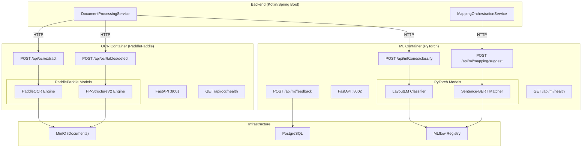
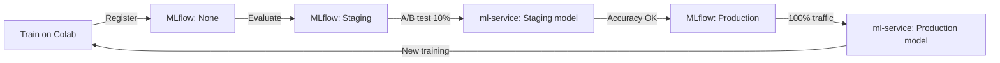

# Numera ML Implementation Plan

> **Scope**: All ML/AI components across the Numera platform  
> **Compute**: All training on **Google Colab** (free T4 GPU) + **Kaggle Notebooks** (30 hrs/week free GPU). No local GPU.  
> **Architecture**: Two-container split — **OCR Container** (PaddlePaddle) + **ML Container** (PyTorch)  
> **Model Registry**: **MLflow** for model versioning, artifact storage, and promotion  
> **Cost**: **₹0/month** pre-revenue (Stage 1 bootstrapping strategy)  
> **Timeline**: Phased across the 18-month roadmap, Demo MVP (Phase 0) as priority

---

## Table of Contents

1. [Architecture Overview](#1-architecture-overview)
2. [Google Colab Training Infrastructure](#2-google-colab-training-infrastructure)
3. [Phase 0: Demo MVP ML Components](#3-phase-0-demo-mvp-ml-components)
4. [Phase 0: ML Training Pipeline (Colab)](#4-phase-0-ml-training-pipeline-colab)
5. [Phase 1: Production ML Enhancements](#5-phase-1-production-ml-enhancements)
6. [Phase 2: Covenant Intelligence ML](#6-phase-2-covenant-intelligence-ml)
7. [Phase 4: LLM Copilot & Advanced AI](#7-phase-4-llm-copilot--advanced-ai)
8. [MLflow Model Registry](#8-mlflow-model-registry)
9. [Verification Plan](#9-verification-plan)

---

## 1. Architecture Overview

### 1.1 Two-Container Architecture

> [!IMPORTANT]
> PaddlePaddle (OCR/Table Detection) and PyTorch (LayoutLM/Sentence-BERT) are separated into two containers for resource isolation, independent scaling, and cleaner dependency management.



### 1.2 Container Specifications

| Container | Framework | Base Image | Models Loaded | RAM (Idle) | RAM (Peak) |
|---|---|---|---|---|---|
| **ocr-service** | PaddlePaddle 3.0 + FastAPI | `python:3.11-slim` | PaddleOCR (det+rec+cls), PP-StructureV2 | ~1.2 GB | ~2.5 GB |
| **ml-service** | PyTorch 2.6 + FastAPI | `python:3.11-slim` | LayoutLM-base, all-MiniLM-L6-v2 | ~800 MB | ~1.5 GB |
| **mlflow** | MLflow 2.18 | `python:3.11-slim` | — (artifact store only) | ~200 MB | ~500 MB |

> [!NOTE]
> Total RAM for all ML containers: **~2.2 GB idle, ~4.5 GB peak**. This fits comfortably on a 16 GB development machine alongside the Kotlin backend, React frontend, PostgreSQL, Redis, and MinIO.

### 1.3 Directory Structure

```
numera/
├── ocr-service/                   # PaddlePaddle container
│   ├── Dockerfile
│   ├── requirements.txt
│   ├── app/
│   │   ├── __init__.py
│   │   ├── main.py                # FastAPI app, lifespan, CORS
│   │   ├── config.py              # Settings via pydantic-settings
│   │   ├── api/
│   │   │   ├── __init__.py
│   │   │   ├── router.py
│   │   │   ├── health.py          # GET /api/ocr/health
│   │   │   ├── ocr.py             # POST /api/ocr/extract
│   │   │   └── tables.py          # POST /api/ocr/tables/detect
│   │   ├── services/
│   │   │   ├── __init__.py
│   │   │   ├── ocr_service.py     # PaddleOCR wrapper
│   │   │   ├── table_service.py   # PP-StructureV2 wrapper
│   │   │   └── period_parser.py   # Date/currency/unit regex parser
│   │   ├── ml/
│   │   │   ├── __init__.py
│   │   │   ├── paddle_ocr.py      # PaddleOCR initialization & config
│   │   │   └── table_detector.py  # PP-StructureV2 inference
│   │   └── utils/
│   │       ├── __init__.py
│   │       ├── pdf_utils.py       # PDF → image conversion (PyMuPDF)
│   │       ├── image_utils.py     # Image preprocessing
│   │       ├── text_cleaning.py   # OCR text normalization
│   │       └── numeric_parser.py  # Financial number parsing
│   ├── models/                    # PaddlePaddle model files (git-ignored)
│   │   ├── paddleocr/
│   │   └── pp-structure/
│   └── tests/
│       ├── conftest.py
│       ├── test_ocr.py
│       ├── test_tables.py
│       └── test_integration.py
│
├── ml-service/                    # PyTorch container
│   ├── Dockerfile
│   ├── requirements.txt
│   ├── app/
│   │   ├── __init__.py
│   │   ├── main.py                # FastAPI app, lifespan, CORS
│   │   ├── config.py              # Settings via pydantic-settings
│   │   ├── api/
│   │   │   ├── __init__.py
│   │   │   ├── router.py
│   │   │   ├── health.py          # GET /api/ml/health
│   │   │   ├── zones.py           # POST /api/ml/zones/classify
│   │   │   ├── mapping.py         # POST /api/ml/mapping/suggest
│   │   │   └── feedback.py        # POST /api/ml/feedback
│   │   ├── services/
│   │   │   ├── __init__.py
│   │   │   ├── zone_service.py    # Heuristic + LayoutLM classifier
│   │   │   ├── mapping_service.py # Sentence-BERT matching engine
│   │   │   └── model_manager.py   # MLflow model loading, caching
│   │   ├── ml/
│   │   │   ├── __init__.py
│   │   │   ├── zone_classifier.py # LayoutLM inference wrapper
│   │   │   ├── semantic_matcher.py# Sentence-BERT cosine similarity
│   │   │   └── embeddings_cache.py# Pre-computed embedding store
│   │   └── utils/
│   │       └── __init__.py
│   ├── models/                    # PyTorch model files (git-ignored, fetched from MLflow)
│   │   ├── layoutlm/
│   │   └── sentence-bert/
│   └── tests/
│       ├── conftest.py
│       ├── test_zones.py
│       ├── test_mapping.py
│       └── test_integration.py
│
├── ml-training/                   # Training scripts — runs ONLY on Google Colab
│   ├── notebooks/                 # Colab notebooks (.ipynb)
│   │   ├── 00_environment_setup.ipynb
│   │   ├── 01_edgar_data_collection.ipynb
│   │   ├── 02_lse_gcc_data_collection.ipynb
│   │   ├── 03_xbrl_parsing_autolabeling.ipynb
│   │   ├── 04_ocr_batch_processing.ipynb
│   │   ├── 05_table_extraction_eval.ipynb
│   │   ├── 06_zone_annotation_tool.ipynb
│   │   ├── 07_layoutlm_zone_training.ipynb
│   │   ├── 08_sbert_baseline_eval.ipynb
│   │   ├── 09_sbert_finetuning.ipynb
│   │   ├── 10_ifrs_taxonomy_builder.ipynb
│   │   ├── 11_model_evaluation_report.ipynb
│   │   ├── 12_export_to_mlflow.ipynb
│   │   ├── 20_feedback_retraining.ipynb
│   │   └── 21_client_model_specialization.ipynb
│   ├── scripts/                   # Reusable Python modules imported by notebooks
│   │   ├── edgar_downloader.py
│   │   ├── lse_scraper.py
│   │   ├── gcc_scraper.py
│   │   ├── xbrl_parser.py
│   │   ├── data_splitter.py
│   │   └── evaluation_utils.py
│   ├── configs/
│   │   ├── training_config.yaml
│   │   └── colab_secrets.yaml.template  # Template for API keys (never committed)
│   └── README.md                  # How to use these notebooks on Colab
│
├── mlflow/                        # MLflow server configuration
│   ├── Dockerfile
│   ├── docker-compose.yml
│   └── mlflow.env
│
└── data/
    ├── ifrs_taxonomy.json         # IFRS line-item synonym dictionary
    ├── sample_documents/          # Demo PDFs for testing
    └── model_templates/           # IFRS model template seed data
```

### 1.4 Container Dependencies

**ocr-service/requirements.txt:**
```
# Framework
fastapi==0.115.*
uvicorn[standard]==0.34.*
pydantic==2.11.*
pydantic-settings==2.8.*

# PaddlePaddle OCR Stack
paddlepaddle==3.0.*           # CPU-only
paddleocr==2.9.*
paddlex==3.0.*                # PP-StructureV2

# PDF Processing
PyMuPDF==1.25.*
pdf2image==1.17.*
Pillow==11.*

# Utilities
numpy==2.2.*
httpx==0.28.*
python-multipart==0.0.*
orjson==3.10.*
boto3==1.37.*                 # MinIO/S3 client
```

**ml-service/requirements.txt:**
```
# Framework
fastapi==0.115.*
uvicorn[standard]==0.34.*
pydantic==2.11.*
pydantic-settings==2.8.*

# PyTorch ML Stack
torch==2.6.*                  # CPU-only
transformers==4.50.*          # LayoutLM
sentence-transformers==4.0.*  # Sentence-BERT
tokenizers==0.21.*

# Utilities
numpy==2.2.*
scikit-learn==1.6.*
httpx==0.28.*
python-multipart==0.0.*
orjson==3.10.*
boto3==1.37.*
mlflow-skinny==2.18.*         # MLflow client (no server deps)
```

### 1.5 Key Design Decisions

| Decision | Choice | Rationale |
|---|---|---|
| **Training compute** | Google Colab / Kaggle only | ₹0 cost. No local GPU available. T4 GPU sufficient for all Phase 0 training |
| **Container split** | OCR (PaddlePaddle) + ML (PyTorch) | Resource isolation, independent scaling, no framework conflicts |
| **Model registry** | MLflow | Versioning, A/B testing, model promotion, experiment tracking across Colab runs |
| **Communication** | Sync HTTP (Phase 0), Async queue (Phase 1+) | Simplicity for demo; production adds RabbitMQ/Kafka |
| **Model loading** | Lazy load on first request, keep in memory | Avoid slow startup; models loaded once, reused |
| **Embedding cache** | Pre-compute model line-item embeddings, cache in-memory | Model templates rarely change; avoids redundant computation |
| **File I/O** | Read from MinIO, results to MinIO + DB | Both services are stateless; backend manages lifecycle |
| **Model download** | MLflow → container on startup (or first request) | Single source of truth for all model versions |

---

## 2. Google Colab Training Infrastructure

> [!IMPORTANT]
> ALL ML training, fine-tuning, data processing, and model evaluation runs on Google Colab.
> The local machine is used ONLY for inference (running the pre-trained/fine-tuned models inside Docker containers).

### 2.1 Colab Resource Constraints & Strategy

| Resource | Colab Free | Colab Pro (₹750/mo) | Kaggle | Strategy |
|---|---|---|---|---|
| **GPU** | T4 16GB (variable) | T4/A100 (priority) | T4/P100 (30 hrs/week) | Use free tier first; upgrade to Pro only if session limits block progress |
| **Session length** | ~12 hours max | ~24 hours | ~12 hours | Checkpoint every 30 min; design training to resume from checkpoints |
| **Disk** | ~100 GB | ~225 GB | ~70 GB | Store data on Google Drive; download per session |
| **RAM** | ~12 GB | ~25 GB | ~13 GB | Process data in batches; use memory-efficient loading |
| **Internet** | Unrestricted | Unrestricted | Unrestricted | Download EDGAR/LSE/GCC data → Drive; train from Drive |

### 2.2 Colab Workflow

```
┌─────────────────────────────────────────────────────────────────────┐
│                    GOOGLE COLAB WORKFLOW                             │
│                                                                     │
│  ┌────────────┐     ┌──────────────┐     ┌───────────────────┐     │
│  │ Notebook   │     │ Google Drive │     │ MLflow (remote)   │     │
│  │ (.ipynb)   │────▶│ /numera-ml/  │────▶│ Tracking Server   │     │
│  │            │     │   data/      │     │                   │     │
│  │ Train on   │     │   models/    │     │ Log metrics       │     │
│  │ T4 GPU     │     │   checkpoints│     │ Store artifacts   │     │
│  └────────────┘     └──────────────┘     │ Version models    │     │
│                                          └─────────┬─────────┘     │
└─────────────────────────────────────────────────────┼───────────────┘
                                                      │
                                            Download model artifact
                                                      │
                                                      ▼
┌─────────────────────────────────────────────────────────────────────┐
│                    LOCAL DEVELOPMENT MACHINE                         │
│                                                                     │
│  ┌──────────────┐  ┌──────────────┐  ┌──────────────┐              │
│  │ ocr-service  │  │ ml-service   │  │ MLflow Server│              │
│  │ (Paddle)     │  │ (PyTorch)    │  │ (UI + Store) │              │
│  │              │  │              │  │              │              │
│  │ Pre-trained  │  │ Fine-tuned   │  │ Model        │              │
│  │ models (DL   │  │ models (DL   │  │ registry     │              │
│  │ on startup)  │  │ from MLflow) │  │              │              │
│  └──────────────┘  └──────────────┘  └──────────────┘              │
└─────────────────────────────────────────────────────────────────────┘
```

### 2.3 Google Drive Structure for Colab

```
Google Drive/
└── numera-ml/
    ├── data/
    │   ├── edgar/
    │   │   ├── raw_pdfs/              # Downloaded 10-K/20-F PDFs
    │   │   ├── xbrl/                  # XBRL structured files
    │   │   └── metadata.csv           # Company, date, path, standard
    │   ├── lse/
    │   │   ├── raw_pdfs/
    │   │   └── metadata.csv
    │   ├── gcc/
    │   │   ├── raw_pdfs/
    │   │   └── metadata.csv
    │   ├── processed/
    │   │   ├── ocr_results/           # PaddleOCR JSON outputs
    │   │   ├── table_extractions/     # PP-StructureV2 outputs
    │   │   └── page_images/           # Rendered page images (300 DPI)
    │   ├── annotations/
    │   │   ├── zone_labels.json       # table_id → zone_type
    │   │   ├── mapping_pairs.json     # source_text → target_label
    │   │   └── annotation_log.csv     # Tracking annotation progress
    │   └── taxonomy/
    │       ├── ifrs_taxonomy.json     # ~500 terms with synonyms
    │       ├── xbrl_concept_map.json  # XBRL concept → zone_type
    │       └── exclusion_list.json    # Terms to ignore
    ├── models/
    │   ├── checkpoints/               # Training checkpoints (auto-saved)
    │   │   ├── layoutlm/
    │   │   └── sbert/
    │   └── exported/                  # Final exported models
    │       ├── layoutlm_zone_v1/
    │       └── sbert_ifrs_v1/
    ├── experiments/
    │   ├── zone_classifier/           # Experiment logs, plots
    │   └── sbert_calibration/
    └── configs/
        └── training_config.yaml
```

### 2.4 Colab Session Management Strategy

Each notebook follows this resilience pattern to handle Colab disconnections:

```python
# Standard Colab Notebook Header — Paste in every notebook

import os
from pathlib import Path

# Mount Google Drive
from google.colab import drive
drive.mount('/content/drive')

# Project root on Drive
PROJECT_ROOT = Path("/content/drive/MyDrive/numera-ml")
DATA_DIR = PROJECT_ROOT / "data"
MODELS_DIR = PROJECT_ROOT / "models"
CHECKPOINTS_DIR = MODELS_DIR / "checkpoints"
EXPORTED_DIR = MODELS_DIR / "exported"

# Ensure directories exist
for d in [DATA_DIR, MODELS_DIR, CHECKPOINTS_DIR, EXPORTED_DIR]:
    d.mkdir(parents=True, exist_ok=True)

# --- Checkpoint Resume Logic ---
def get_latest_checkpoint(checkpoint_dir: Path) -> Path | None:
    """Find the latest checkpoint to resume from."""
    checkpoints = sorted(checkpoint_dir.glob("checkpoint-*"), 
                         key=lambda p: int(p.name.split("-")[1]))
    return checkpoints[-1] if checkpoints else None

def save_progress(data: dict, progress_file: Path):
    """Save progress to Drive so it persists across sessions."""
    import json
    with open(progress_file, 'w') as f:
        json.dump(data, f, indent=2)

def load_progress(progress_file: Path) -> dict:
    """Load progress from a previous session."""
    import json
    if progress_file.exists():
        with open(progress_file) as f:
            return json.load(f)
    return {}

# --- MLflow Remote Tracking ---
# Option A: MLflow on local machine, exposed via ngrok
# Option B: MLflow on free-tier cloud (Dagshub, etc.)
import mlflow
MLFLOW_TRACKING_URI = "https://dagshub.com/<user>/numera-ml.mlflow"  # Free tier
mlflow.set_tracking_uri(MLFLOW_TRACKING_URI)

print(f"✅ Project root: {PROJECT_ROOT}")
print(f"✅ GPU: {!torch.cuda.is_available() and 'CPU' or torch.cuda.get_device_name(0)}")
```

### 2.5 MLflow Tracking Options (Free Tier)

Since Colab needs to log experiments to a remote MLflow server:

| Option | Cost | Setup | Limitations |
|---|---|---|---|
| **DagsHub** (recommended) | Free (10 GB storage) | Sign up → get tracking URI + credentials | 3 users, 10 GB artifacts |
| **Self-hosted (ngrok tunnel)** | ₹0 | Run MLflow locally, expose via ngrok | Requires local machine to be on |
| **Google Cloud Run** | ~₹0 (free tier) | Deploy MLflow container on Cloud Run | Needs GCP account |

**Recommended**: Use **DagsHub free tier** for Phase 0. It provides MLflow tracking, artifact storage, and a web UI — all free. Migrate to self-hosted MLflow in Phase 1 when running on a VPS.

---

## 3. Phase 0: Demo MVP ML Components

> **Timeline**: Weeks 1–10 (parallel with frontend/backend)  
> **Goal**: End-to-end pipeline: PDF → OCR → Tables → Zones → Mappings with confidence scores  
> **Compute**: CPU inference only. All models pre-trained or fine-tuned on Colab.

---

### 3.1 OCR Container Scaffolding (Week 1)

#### 3.1.1 Project Setup — ocr-service

- [ ] Initialize Python project with `pyproject.toml` (PEP 621)
- [ ] Create `Dockerfile`:
  ```dockerfile
  # ocr-service/Dockerfile
  FROM python:3.11-slim AS base
  
  # Install system deps for PDF rendering
  RUN apt-get update && apt-get install -y --no-install-recommends \
      libgl1-mesa-glx libglib2.0-0 poppler-utils && \
      rm -rf /var/lib/apt/lists/*
  
  WORKDIR /app
  COPY requirements.txt .
  RUN pip install --no-cache-dir -r requirements.txt
  
  COPY app/ ./app/
  COPY models/ ./models/
  
  EXPOSE 8001
  CMD ["uvicorn", "app.main:app", "--host", "0.0.0.0", "--port", "8001"]
  ```
- [ ] Add to `docker-compose.yml`:
  ```yaml
  ocr-service:
    build: ./ocr-service
    ports:
      - "8001:8001"
    volumes:
      - ocr-models:/app/models    # Persistent model storage
    environment:
      - OCR_MINIO_ENDPOINT=minio:9000
      - OCR_USE_GPU=false
      - OCR_LANG=en
    depends_on:
      - minio
    mem_limit: 3g
    
  ml-service:
    build: ./ml-service
    ports:
      - "8002:8002"
    volumes:
      - ml-models:/app/models
    environment:
      - ML_MINIO_ENDPOINT=minio:9000
      - ML_MLFLOW_URI=http://mlflow:5000
      - ML_DEVICE=cpu
    depends_on:
      - minio
      - mlflow
    mem_limit: 2g
    
  mlflow:
    build: ./mlflow
    ports:
      - "5000:5000"
    volumes:
      - mlflow-data:/mlflow
    environment:
      - MLFLOW_BACKEND_STORE_URI=sqlite:///mlflow/mlflow.db
      - MLFLOW_DEFAULT_ARTIFACT_ROOT=/mlflow/artifacts
  ```
- [ ] Set up `app/config.py` for OCR container:
  ```python
  class OcrSettings(BaseSettings):
      model_config = SettingsConfigDict(env_prefix="OCR_")
      
      host: str = "0.0.0.0"
      port: int = 8001
      debug: bool = False
      
      # Storage
      minio_endpoint: str = "localhost:9000"
      minio_access_key: str = "minioadmin"
      minio_secret_key: str = "minioadmin"
      minio_bucket: str = "numera-documents"
      
      # OCR Config
      lang: str = "en"
      use_gpu: bool = False
      dpi: int = 300
      
      # Table Detection
      table_confidence_threshold: float = 0.5
  ```
- [ ] Create health endpoint (`GET /api/ocr/health`):
  ```json
  {
      "status": "healthy",
      "service": "ocr-service",
      "models": {
          "paddleocr": {"loaded": true, "version": "2.9.1", "lang": "en"},
          "pp_structure": {"loaded": true, "version": "3.0.0"}
      },
      "device": "cpu",
      "uptime_seconds": 1234
  }
  ```

#### 3.1.2 Project Setup — ml-service

- [ ] Initialize Python project with `pyproject.toml`
- [ ] Create `Dockerfile` (similar structure, PyTorch deps instead)
- [ ] Set up `app/config.py`:
  ```python
  class MlSettings(BaseSettings):
      model_config = SettingsConfigDict(env_prefix="ML_")
      
      host: str = "0.0.0.0"
      port: int = 8002
      debug: bool = False
      
      # Storage
      minio_endpoint: str = "localhost:9000"
      minio_access_key: str = "minioadmin"
      minio_secret_key: str = "minioadmin"
      
      # MLflow
      mlflow_uri: str = "http://localhost:5000"
      layoutlm_model_name: str = "layoutlm-zone-classifier"
      layoutlm_model_version: str = "latest"  # or "Production"
      sbert_model_name: str = "sbert-ifrs-matcher"
      sbert_model_version: str = "latest"
      
      # Inference
      device: str = "cpu"
      mapping_high_confidence: float = 0.85
      mapping_medium_confidence: float = 0.65
  ```
- [ ] Create health endpoint (`GET /api/ml/health`):
  ```json
  {
      "status": "healthy",
      "service": "ml-service",
      "models": {
          "layoutlm": {"loaded": true, "version": "v1.0", "source": "mlflow", "stage": "Production"},
          "sentence_bert": {"loaded": true, "version": "v1.0", "source": "mlflow", "stage": "Production"}
      },
      "device": "cpu",
      "uptime_seconds": 5678
  }
  ```
- [ ] Create `app/services/model_manager.py` — MLflow model loader:
  ```python
  import mlflow
  from pathlib import Path
  
  class ModelManager:
      """Loads models from MLflow registry, caches locally."""
      
      def __init__(self, mlflow_uri: str, local_cache_dir: str = "models"):
          mlflow.set_tracking_uri(mlflow_uri)
          self.cache_dir = Path(local_cache_dir)
          self._loaded_models: dict[str, Any] = {}
      
      def load_model(self, model_name: str, stage: str = "Production") -> Path:
          """Download model from MLflow if not cached, return local path."""
          cache_key = f"{model_name}/{stage}"
          if cache_key in self._loaded_models:
              return self._loaded_models[cache_key]
          
          # Try loading from MLflow
          try:
              model_uri = f"models:/{model_name}/{stage}"
              local_path = mlflow.artifacts.download_artifacts(
                  artifact_uri=model_uri,
                  dst_path=str(self.cache_dir / model_name)
              )
              self._loaded_models[cache_key] = Path(local_path)
              return Path(local_path)
          except Exception:
              # Fallback: Load from local models/ directory
              fallback = self.cache_dir / model_name
              if fallback.exists():
                  self._loaded_models[cache_key] = fallback
                  return fallback
              raise
  ```
- [ ] Write unit test stubs with pytest + httpx AsyncClient for both containers

---

### 3.2 OCR Processing — PaddleOCR (Weeks 2–3)

#### 3.2.1 PaddleOCR Service

**Endpoint**: `POST /api/ocr/extract`

**Request Schema:**
```python
class OcrRequest(BaseModel):
    document_id: str
    storage_path: str          # MinIO path to the document
    language: str = "en"       # "en", "ar", "fr"
    dpi: int = 300
    pages: list[int] | None = None  # None = all pages
```

**Response Schema:**
```python
class BoundingBox(BaseModel):
    x: float                   # Normalized 0.0-1.0
    y: float
    width: float
    height: float

class OcrTextBlock(BaseModel):
    text: str
    confidence: float          # 0.0 - 1.0
    bbox: BoundingBox
    page: int

class OcrPageResult(BaseModel):
    page_number: int
    width: int                 # Original page width in pixels
    height: int                # Original page height in pixels
    text_blocks: list[OcrTextBlock]
    full_text: str             # Concatenated text for the page

class OcrResponse(BaseModel):
    document_id: str
    total_pages: int
    pages: list[OcrPageResult]
    processing_time_ms: int
    language: str
```

**Implementation Details:**

- [ ] Create `app/ml/paddle_ocr.py`:
  ```python
  from paddleocr import PaddleOCR
  
  class PaddleOCREngine:
      _instances: dict[str, "PaddleOCREngine"] = {}  # Singleton per language
      
      def __init__(self, lang: str = "en", use_gpu: bool = False):
          self.ocr = PaddleOCR(
              use_angle_cls=True,    # Handle rotated text
              lang=lang,
              use_gpu=use_gpu,
              show_log=False,
              det_db_thresh=0.3,
              det_db_box_thresh=0.5,
              rec_batch_num=16,
          )
          self.lang = lang
      
      @classmethod
      def get_instance(cls, lang: str = "en", use_gpu: bool = False):
          if lang not in cls._instances:
              cls._instances[lang] = cls(lang, use_gpu)
          return cls._instances[lang]
      
      def extract_page(self, image: np.ndarray, page_num: int) -> OcrPageResult:
          h, w = image.shape[:2]
          results = self.ocr.ocr(image, cls=True)
          
          text_blocks = []
          if results and results[0]:
              for line in results[0]:
                  bbox_points, (text, confidence) = line
                  # Convert 4-point bbox to normalized x, y, w, h
                  xs = [p[0] for p in bbox_points]
                  ys = [p[1] for p in bbox_points]
                  bbox = BoundingBox(
                      x=min(xs) / w,
                      y=min(ys) / h,
                      width=(max(xs) - min(xs)) / w,
                      height=(max(ys) - min(ys)) / h,
                  )
                  text_blocks.append(OcrTextBlock(
                      text=text, confidence=confidence,
                      bbox=bbox, page=page_num
                  ))
          
          full_text = " ".join(tb.text for tb in text_blocks)
          return OcrPageResult(
              page_number=page_num, width=w, height=h,
              text_blocks=text_blocks, full_text=full_text
          )
  ```

- [ ] Create `app/utils/pdf_utils.py`:
  ```python
  import fitz  # PyMuPDF
  
  def pdf_to_images(
      pdf_bytes: bytes, 
      dpi: int = 300,
      pages: list[int] | None = None
  ) -> list[tuple[int, np.ndarray]]:
      """Convert PDF pages to numpy images.
      
      Returns list of (page_number, image_array) tuples.
      Memory-efficient: processes one page at a time.
      """
      doc = fitz.open(stream=pdf_bytes, filetype="pdf")
      results = []
      
      page_range = pages or range(len(doc))
      for page_num in page_range:
          if page_num >= len(doc):
              continue
          page = doc[page_num]
          zoom = dpi / 72  # 72 is default DPI
          mat = fitz.Matrix(zoom, zoom)
          pix = page.get_pixmap(matrix=mat)
          img = np.frombuffer(pix.samples, dtype=np.uint8).reshape(
              pix.height, pix.width, pix.n
          )
          if pix.n == 4:  # RGBA → RGB
              img = img[:, :, :3]
          results.append((page_num, img))
      
      doc.close()
      return results
  ```

- [ ] Create `app/utils/image_utils.py`:
  - Deskew detection and correction (for scanned docs)
  - Contrast enhancement (CLAHE) for low-quality scans
  - Noise reduction (optional, configurable)

- [ ] Arabic RTL support:
  - PaddleOCR supports Arabic natively via `lang="ar"`
  - Post-process: Detect mixed LTR/RTL text blocks

- [ ] Store OCR results as JSON in MinIO: `{document_id}/ocr_results.json`
- [ ] Performance target: < 3 seconds per page (300 DPI) on CPU

#### 3.2.2 OCR Tests

- [ ] Test with clean digital PDF (expected: >95% text accuracy)
- [ ] Test with scanned PDF (expected: >90% text accuracy)
- [ ] Test with Arabic annual report (expected: >85% text accuracy)
- [ ] Test with multi-column layout (expected: correct column ordering)
- [ ] Benchmark processing time per page

---

### 3.3 Table Detection — PP-StructureV2 (Weeks 3–4)

#### 3.3.1 Table Detection Service

**Endpoint**: `POST /api/ocr/tables/detect`

> [!NOTE]
> Table detection lives in the **ocr-service** container since PP-StructureV2 is PaddlePaddle-based.

**Request Schema:**
```python
class TableDetectionRequest(BaseModel):
    document_id: str
    storage_path: str
    ocr_results_path: str | None = None  # Pre-computed OCR results
    pages: list[int] | None = None
```

**Response Schema:**
```python
class TableCell(BaseModel):
    text: str
    bbox: BoundingBox
    row_index: int
    col_index: int
    row_span: int = 1
    col_span: int = 1
    is_header: bool = False
    cell_type: Literal["TEXT", "NUMERIC", "EMPTY", "MIXED"]

class DetectedTable(BaseModel):
    table_id: str              # UUID
    page_number: int
    bbox: BoundingBox
    confidence: float
    rows: int
    cols: int
    cells: list[TableCell]
    header_rows: list[int]
    account_column: int | None
    value_columns: list[int]

class TableDetectionResponse(BaseModel):
    document_id: str
    tables: list[DetectedTable]
    total_tables: int
    processing_time_ms: int
```

**Implementation Details:**

- [ ] Create `app/ml/table_detector.py`:
  ```python
  from ppstructure import PPStructure
  
  class TableDetector:
      def __init__(self, use_gpu: bool = False):
          self.engine = PPStructure(
              table=True,
              ocr=False,
              show_log=False,
              use_gpu=use_gpu,
          )
      
      def detect_tables(self, image: np.ndarray, page_num: int) -> list[DetectedTable]:
          result = self.engine(image)
          tables = []
          for item in result:
              if item.get("type") == "table":
                  table = self._parse_table_result(item, page_num)
                  if table:
                      tables.append(table)
          return tables
      
      def _parse_table_result(self, item: dict, page_num: int) -> DetectedTable | None:
          # Parse HTML table output from PP-StructureV2
          # Convert to structured cells with row/col indices
          ...
  ```

- [ ] Smart column type detection:
  - Column with >70% numeric cells → NUMERIC (value column)
  - First column with >70% text cells → ACCOUNT column
  - Header detection: First row(s) with non-numeric content spanning value columns

- [ ] Post-processing:
  - Merge fragmented tables (two adjacent boxes that are one logical table)
  - Filter false-positive tables (minimum: 2 rows × 2 columns)
  - Handle merged cells (row_span, col_span)

- [ ] Period/currency/unit detection (runs on table headers):
  ```python
  # Integrated into table detection output
  class DetectedTable(BaseModel):
      # ... existing fields ...
      detected_periods: list[str]   # e.g., ["2024", "2023"]
      detected_currency: str | None # e.g., "GBP", "EUR"
      detected_unit: str | None     # e.g., "thousands", "millions"
  ```

- [ ] Store table results: `{document_id}/table_results.json`

#### 3.3.2 Period / Currency / Unit Parser

- [ ] Create `app/services/period_parser.py`:
  ```python
  import re
  
  YEAR_PATTERNS = [
      r'\b(20\d{2})\b',
      r'\b(FY\s*20\d{2})\b',
      r'(?:year ended|period ended)\s+(.+?\d{4})',
      r'\b(\d{1,2}\s+\w+\s+20\d{2})\b',
      r'\b(Q[1-4]\s*20\d{2})\b',
      r'(\d{1,2}[-/]\d{1,2}[-/]\d{2,4})',
  ]
  
  CURRENCY_PATTERNS = {
      "€": "EUR", "£": "GBP", "$": "USD", "AED": "AED",
      "SAR": "SAR", "CHF": "CHF", "QAR": "QAR", "BHD": "BHD",
  }
  
  UNIT_PATTERNS = [
      (r"in\s+thousands|in\s+'000s|'000", "thousands"),
      (r"in\s+millions|in\s+m(?:illion)?s?|\(€m\)|\(£m\)", "millions"),
      (r"in\s+billions", "billions"),
  ]
  ```

---

### 3.4 Zone Classification — ML Container (Weeks 4–5)

#### 3.4.1 Zone Classification Service

**Endpoint**: `POST /api/ml/zones/classify`

**Request Schema:**
```python
class ZoneClassificationRequest(BaseModel):
    document_id: str
    tables: list[DetectedTable]  # From ocr-service table detection
```

**Response Schema:**
```python
class ZoneType(str, Enum):
    BALANCE_SHEET = "BALANCE_SHEET"
    INCOME_STATEMENT = "INCOME_STATEMENT"
    CASH_FLOW = "CASH_FLOW"
    NOTES_FIXED_ASSETS = "NOTES_FIXED_ASSETS"
    NOTES_RECEIVABLES = "NOTES_RECEIVABLES"
    NOTES_DEBT = "NOTES_DEBT"
    NOTES_OTHER = "NOTES_OTHER"
    OTHER = "OTHER"

class ClassifiedZone(BaseModel):
    table_id: str
    zone_type: ZoneType
    zone_label: str
    confidence: float
    classification_method: Literal["HEURISTIC", "ML", "COMBINED"]
    detected_periods: list[str]
    detected_currency: str | None
    detected_unit: str | None

class ZoneClassificationResponse(BaseModel):
    document_id: str
    zones: list[ClassifiedZone]
    processing_time_ms: int
```

**Implementation — Two-Stage Classification:**

- [ ] **Stage 1: Keyword Heuristic** (fast, high precision — no model needed):
  ```python
  ZONE_KEYWORDS = {
      ZoneType.BALANCE_SHEET: {
          "strong": ["total assets", "total liabilities", "total equity",
                     "shareholders' equity", "net assets",
                     "statement of financial position"],
          "moderate": ["current assets", "non-current assets", "goodwill",
                       "trade receivables", "inventories", "property plant",
                       "right-of-use", "lease liabilities"]
      },
      ZoneType.INCOME_STATEMENT: {
          "strong": ["revenue", "net income", "profit for the year",
                     "operating profit", "earnings per share", "gross profit",
                     "statement of profit or loss",
                     "statement of comprehensive income"],
          "moderate": ["cost of sales", "distribution costs",
                       "administrative expenses", "finance costs",
                       "other operating income"]
      },
      ZoneType.CASH_FLOW: {
          "strong": ["cash from operations", "cash from investing",
                     "cash from financing", "net increase in cash",
                     "cash and cash equivalents at end",
                     "statement of cash flows"],
          "moderate": ["depreciation", "working capital changes",
                       "dividends paid", "proceeds from borrowings"]
      },
      ZoneType.NOTES_FIXED_ASSETS: {
          "strong": ["cost at beginning", "accumulated depreciation",
                     "net book value", "additions during"],
          "moderate": ["property plant and equipment", "tangible assets",
                       "disposals", "write-offs"]
      },
  }
  
  def classify_by_keywords(table_text: str) -> tuple[ZoneType, float]:
      table_text_lower = table_text.lower()
      scores = {}
      for zone_type, keywords in ZONE_KEYWORDS.items():
          strong = sum(1 for kw in keywords["strong"] if kw in table_text_lower)
          moderate = sum(1 for kw in keywords["moderate"] if kw in table_text_lower)
          scores[zone_type] = strong * 2.0 + moderate * 1.0
      
      if max(scores.values()) == 0:
          return ZoneType.OTHER, 0.3
      
      best = max(scores, key=scores.get)
      confidence = min(0.95, 0.5 + (scores[best] / 10))
      return best, confidence
  ```

- [ ] **Stage 2: LayoutLM Classifier** (fallback, loaded from MLflow):
  ```python
  class LayoutLMZoneClassifier:
      def __init__(self, model_manager: ModelManager):
          model_path = model_manager.load_model(
              "layoutlm-zone-classifier", stage="Production"
          )
          self.tokenizer = AutoTokenizer.from_pretrained(str(model_path))
          self.model = AutoModelForSequenceClassification.from_pretrained(
              str(model_path), num_labels=len(ZoneType)
          )
          self.model.eval()
      
      def classify(self, text: str, bboxes: list[list[int]]) -> tuple[ZoneType, float]:
          encoding = self.tokenizer(
              text, boxes=bboxes, truncation=True,
              max_length=512, return_tensors="pt"
          )
          with torch.no_grad():
              outputs = self.model(**encoding)
              probs = torch.softmax(outputs.logits, dim=-1)
              predicted = torch.argmax(probs, dim=-1).item()
              confidence = probs[0][predicted].item()
          return list(ZoneType)[predicted], confidence
  ```

- [ ] **Combined strategy**:
  1. Keyword heuristic first
  2. If confidence ≥ 0.80 → accept heuristic
  3. If < 0.80 → run LayoutLM
  4. If both agree → boost confidence
  5. If disagree → use higher confidence, flag for review

---

### 3.5 Semantic Mapping Engine — Sentence-BERT (Weeks 5–7)

#### 3.5.1 Mapping Suggestion Service

**Endpoint**: `POST /api/ml/mapping/suggest`

**Request Schema:**
```python
class SourceRow(BaseModel):
    row_id: str
    text: str
    value: str | None
    page: int
    coordinates: BoundingBox
    zone_type: ZoneType

class TargetLineItem(BaseModel):
    line_item_id: str
    label: str
    parent_label: str | None
    zone_type: ZoneType
    item_type: Literal["INPUT", "FORMULA", "VALIDATION", "CATEGORY"]

class MappingSuggestionRequest(BaseModel):
    document_id: str
    source_rows: list[SourceRow]
    target_items: list[TargetLineItem]
    taxonomy_path: str | None = None  # Path to synonym JSON
```

**Response Schema:**
```python
class ConfidenceLevel(str, Enum):
    HIGH = "HIGH"       # >= 0.85
    MEDIUM = "MEDIUM"   # 0.65 - 0.84
    LOW = "LOW"         # < 0.65

class SuggestedMapping(BaseModel):
    target_line_item_id: str
    target_label: str
    confidence: float
    confidence_level: ConfidenceLevel
    expression: str
    adjustments: dict

class MappedRow(BaseModel):
    source_row_id: str
    source_text: str
    source_value: str | None
    source_page: int
    source_coordinates: BoundingBox
    suggested_mappings: list[SuggestedMapping]  # Top-3

class MappingSummary(BaseModel):
    total_source_rows: int
    high_confidence: int
    medium_confidence: int
    low_confidence: int
    unmapped: int

class MappingSuggestionResponse(BaseModel):
    document_id: str
    mappings: list[MappedRow]
    summary: MappingSummary
    processing_time_ms: int
```

**Implementation Details:**

- [ ] Create `app/ml/semantic_matcher.py`:
  ```python
  from sentence_transformers import SentenceTransformer
  from sklearn.metrics.pairwise import cosine_similarity
  
  class SemanticMatcher:
      def __init__(self, model_manager: ModelManager):
          model_path = model_manager.load_model(
              "sbert-ifrs-matcher", stage="Production"
          )
          self.model = SentenceTransformer(str(model_path))
          self._target_cache: dict[str, np.ndarray] = {}
          self._taxonomy: dict[str, list[str]] = {}
      
      def load_taxonomy(self, taxonomy_path: str):
          """Load IFRS synonym dictionary."""
          with open(taxonomy_path) as f:
              self._taxonomy = json.load(f)
      
      def precompute_target_embeddings(
          self, items: list[TargetLineItem]
      ) -> tuple[np.ndarray, list[int]]:
          """Encode all target labels + their synonyms."""
          cache_key = hashlib.md5(
              "|".join(i.label for i in items).encode()
          ).hexdigest()
          
          if cache_key not in self._target_cache:
              texts = []
              index_map = []  # Maps embedding index → original item index
              for i, item in enumerate(items):
                  # Add primary label
                  texts.append(item.label)
                  index_map.append(i)
                  # Add synonyms
                  for syn in self._taxonomy.get(item.label, []):
                      texts.append(syn)
                      index_map.append(i)
              
              embeddings = self.model.encode(
                  texts, normalize_embeddings=True, batch_size=64
              )
              self._target_cache[cache_key] = (embeddings, index_map)
          
          return self._target_cache[cache_key]
      
      def match(
          self,
          source_rows: list[SourceRow],
          target_items: list[TargetLineItem],
          top_k: int = 3
      ) -> list[MappedRow]:
          # 1. Encode source texts
          source_texts = [self._clean_text(r.text) for r in source_rows]
          source_embs = self.model.encode(
              source_texts, normalize_embeddings=True, batch_size=32
          )
          
          # 2. Get target embeddings (with synonyms)
          target_embs, index_map = self.precompute_target_embeddings(target_items)
          
          # 3. Cosine similarity
          sim_matrix = cosine_similarity(source_embs, target_embs)
          
          # 4. Collapse synonym scores → max per target item
          n_items = len(target_items)
          collapsed = np.zeros((len(source_rows), n_items))
          for emb_idx, item_idx in enumerate(index_map):
              collapsed[:, item_idx] = np.maximum(
                  collapsed[:, item_idx], sim_matrix[:, emb_idx]
              )
          
          # 5. Zone-aware penalty
          for i, src in enumerate(source_rows):
              for j, tgt in enumerate(target_items):
                  if src.zone_type != tgt.zone_type:
                      collapsed[i][j] *= 0.3
          
          # 6. Build top-k per source row
          results = []
          for i, src in enumerate(source_rows):
              top_indices = np.argsort(collapsed[i])[-top_k:][::-1]
              suggestions = []
              for idx in top_indices:
                  score = float(collapsed[i][idx])
                  if score < 0.3:
                      continue
                  suggestions.append(SuggestedMapping(
                      target_line_item_id=target_items[idx].line_item_id,
                      target_label=target_items[idx].label,
                      confidence=round(score, 4),
                      confidence_level=self._classify(score),
                      expression=self._extract_value(src),
                      adjustments={}
                  ))
              results.append(MappedRow(
                  source_row_id=src.row_id,
                  source_text=src.text,
                  source_value=src.value,
                  source_page=src.page,
                  source_coordinates=src.coordinates,
                  suggested_mappings=suggestions
              ))
          return results
  ```

- [ ] Create `app/utils/numeric_parser.py`:
  ```python
  def parse_financial_number(text: str) -> float | None:
      """Parse financial numbers: '1,234,567', '(1,234)', 'nil', '-'."""
      if not text or text.strip() in ('-', '—', '–', ''):
          return None
      text = text.strip()
      negative = text.startswith('(') and text.endswith(')')
      if negative:
          text = text[1:-1]
      text = text.replace(',', '').replace(' ', '')
      # Handle European format: 1.234.567,89
      if text.count('.') > 1:
          text = text.replace('.', '')
      if text.lower() in ('nil', 'null', 'n/a'):
          return 0.0
      try:
          value = float(text)
          return -value if negative else value
      except ValueError:
          return None
  ```

---

### 3.6 Backend ↔ ML Service Communication Flow (Week 7)

The Kotlin backend orchestrates the full pipeline by calling both containers sequentially:

```
Backend DocumentProcessingService:

1. Document uploaded → status = UPLOADED
2. Call ocr-service: POST /api/ocr/extract
   → Store OCR results in MinIO
   → status = OCR_COMPLETE
3. Call ocr-service: POST /api/ocr/tables/detect
   → Store table results in MinIO
   → status = TABLES_DETECTED
4. Call ml-service: POST /api/ml/zones/classify
   → Store zone results in DB (detected_zones table)
   → status = ZONES_CLASSIFIED
5. status = READY

Backend MappingOrchestrationService (triggered separately):

6. Call ml-service: POST /api/ml/mapping/suggest
   → Store mappings in DB (spread_values table)
   → Return mapping summary to frontend
```

---

### 3.7 Error Handling & Resilience

- [ ] Graceful degradation per step:
  - OCR fails on a page → skip page, log warning, continue
  - Table detection finds no tables → return empty with warning
  - Zone classification ambiguous → return `OTHER` with low confidence
  - Mapping low confidence → return suggestions with `LOW` tag
- [ ] Structured error responses:
  ```python
  class MLError(BaseModel):
      error_code: str        # "OCR_FAILURE", "TABLE_DETECTION_FAILURE"
      message: str
      page: int | None
      recoverable: bool
  ```
- [ ] Request timeout: 120 seconds per request max
- [ ] Memory: Process pages in batches (5 at a time) to avoid OOM

---

## 4. Phase 0: ML Training Pipeline (Colab, Weeks 3–10)

> [!IMPORTANT]
> Every notebook below runs on **Google Colab** with data stored on **Google Drive**. Training results are logged to **MLflow** (DagsHub free tier). Exported models are uploaded to MLflow model registry.

### 4.1 Notebook 00: Environment Setup

**File**: `ml-training/notebooks/00_environment_setup.ipynb`

Purpose: Install all training dependencies and verify GPU access.

```python
# Cell 1: Install dependencies
!pip install -q paddlepaddle-gpu paddleocr paddlex \
    transformers sentence-transformers torch torchvision \
    datasets evaluate scikit-learn mlflow \
    python-xbrl arelle PyMuPDF Pillow \
    streamlit plotly wandb

# Cell 2: Mount Drive
from google.colab import drive
drive.mount('/content/drive')

# Cell 3: Verify GPU
import torch
print(f"GPU: {torch.cuda.get_device_name(0)}")
print(f"VRAM: {torch.cuda.get_device_properties(0).total_mem / 1e9:.1f} GB")

# Cell 4: Configure MLflow
import mlflow
mlflow.set_tracking_uri("https://dagshub.com/<user>/numera-ml.mlflow")
os.environ["MLFLOW_TRACKING_USERNAME"] = "<token>"
os.environ["MLFLOW_TRACKING_PASSWORD"] = "<token>"
```

---

### 4.2 Notebook 01: SEC EDGAR Data Collection

**File**: `ml-training/notebooks/01_edgar_data_collection.ipynb`

**Timeline**: Week 3–4

```python
# SEC EDGAR XBRL filings downloader
# Target: 500 companies × 2 years = ~1,000 annual reports (20-F for IFRS filers)

import requests
import time
import json
from pathlib import Path

EDGAR_BASE = "https://efts.sec.gov/LATEST/search-index"
EDGAR_ARCHIVES = "https://www.sec.gov/Archives/edgar/data"
HEADERS = {"User-Agent": "Numera AI research@numera.ai"}

# Rate limit: 10 requests/second max (SEC Fair Access policy)
REQUEST_DELAY = 0.1

def search_filings(form_type: str = "20-F", count: int = 1000):
    """Search EDGAR for IFRS annual reports (20-F = foreign filers)."""
    url = f"https://efts.sec.gov/LATEST/search-index?q=&dateRange=custom&startdt=2022-01-01&enddt=2025-12-31&forms={form_type}"
    # ... pagination through results
    
def download_filing(accession_number: str, cik: str, save_dir: Path):
    """Download PDF + XBRL for a filing."""
    # Get filing index page
    index_url = f"{EDGAR_ARCHIVES}/{cik}/{accession_number}"
    # Find PDF and XBRL files from index
    # Download both
    
# --- Execution ---
# Download in batches of 50 with checkpointing
progress_file = DATA_DIR / "edgar" / "download_progress.json"
progress = load_progress(progress_file)
start_idx = progress.get("last_completed", 0)

filings = search_filings("20-F", count=1000)
for i, filing in enumerate(filings[start_idx:], start=start_idx):
    download_filing(filing["accession"], filing["cik"], DATA_DIR / "edgar" / "raw")
    save_progress({"last_completed": i + 1}, progress_file)
    time.sleep(REQUEST_DELAY)
```

**Key points:**
- Focus on **20-F filings** (foreign filers using IFRS) not 10-K (US GAAP)
- XBRL is the "secret weapon" — free ground truth labels
- Checkpoint after every download to survive Colab disconnects

---

### 4.3 Notebook 02: LSE & GCC Report Collection

**File**: `ml-training/notebooks/02_lse_gcc_data_collection.ipynb`

**Timeline**: Week 3–4

- [ ] LSE: Download FTSE 100 annual reports from investor relations pages
  - 50 companies × 2 years = 100 reports
  - Provides UK IFRS formatting patterns
  - Manual download list (IR page URLs) + automated download
- [ ] GCC: Download from ADX (Abu Dhabi Securities Exchange), DFM (Dubai Financial Market)
  - 25 companies × 2 years = 50 reports
  - Arabic + English bilingual reports
  - Provides GCC region formatting patterns
- [ ] Total dataset: ~1,150 annual reports

---

### 4.4 Notebook 03: XBRL Parsing & Auto-Labeling

**File**: `ml-training/notebooks/03_xbrl_parsing_autolabeling.ipynb`

**Timeline**: Week 4–5

```python
# Parse XBRL files to extract structured labels
# This creates FREE ground truth for both zone classification and mapping

from arelle import Cntlr

# XBRL Concept → Zone Type mapping
CONCEPT_TO_ZONE = {
    "ifrs-full:Revenue": "INCOME_STATEMENT",
    "ifrs-full:CostOfSales": "INCOME_STATEMENT",
    "ifrs-full:GrossProfit": "INCOME_STATEMENT",
    "ifrs-full:ProfitLoss": "INCOME_STATEMENT",
    
    "ifrs-full:CashAndCashEquivalents": "BALANCE_SHEET",
    "ifrs-full:TradeAndOtherReceivables": "BALANCE_SHEET",
    "ifrs-full:PropertyPlantAndEquipment": "BALANCE_SHEET",
    "ifrs-full:TotalAssets": "BALANCE_SHEET",
    "ifrs-full:TotalLiabilities": "BALANCE_SHEET",
    "ifrs-full:TotalEquity": "BALANCE_SHEET",
    
    "ifrs-full:CashFlowsFromUsedInOperatingActivities": "CASH_FLOW",
    "ifrs-full:CashFlowsFromUsedInInvestingActivities": "CASH_FLOW",
    "ifrs-full:CashFlowsFromUsedInFinancingActivities": "CASH_FLOW",
    # ... 200+ concept mappings
}

# XBRL Concept → Model Line Item label mapping
CONCEPT_TO_LABEL = {
    "ifrs-full:Revenue": "Revenue",
    "ifrs-full:CostOfSales": "Cost of Sales",
    "ifrs-full:GrossProfit": "Gross Profit",
    # ... maps to our IFRS model template line items
}

def parse_xbrl_filing(xbrl_path: str) -> dict:
    """Extract concept-value pairs from XBRL file."""
    ctrl = Cntlr.Cntlr()
    model = ctrl.modelManager.load(xbrl_path)
    
    facts = {}
    for fact in model.facts:
        concept = fact.concept.qname.localName
        value = fact.value
        context = fact.contextID
        facts[f"ifrs-full:{concept}"] = {
            "value": value,
            "zone": CONCEPT_TO_ZONE.get(f"ifrs-full:{concept}", "OTHER"),
            "label": CONCEPT_TO_LABEL.get(f"ifrs-full:{concept}", concept),
        }
    
    ctrl.close()
    return facts
```

**Output:**
- `annotations/xbrl_zone_labels.json` — auto-labeled zone types for each filing
- `annotations/xbrl_mapping_pairs.json` — (source_text, target_label) pairs for SBERT training

---

### 4.5 Notebook 04: Batch OCR Processing

**File**: `ml-training/notebooks/04_ocr_batch_processing.ipynb`

**Timeline**: Week 4–5

```python
# Batch process all PDFs through PaddleOCR + PP-StructureV2
# Running on Colab T4 GPU for speed: ~50 pages/minute

from paddleocr import PaddleOCR
from ppstructure import PPStructure

ocr = PaddleOCR(use_angle_cls=True, lang='en', use_gpu=True, show_log=False)
structure = PPStructure(table=True, ocr=False, use_gpu=True, show_log=False)

# Process all PDFs
progress_file = DATA_DIR / "processed" / "ocr_progress.json"
progress = load_progress(progress_file)

pdf_files = list((DATA_DIR / "edgar" / "raw_pdfs").glob("*.pdf"))
pdf_files += list((DATA_DIR / "lse" / "raw_pdfs").glob("*.pdf"))
pdf_files += list((DATA_DIR / "gcc" / "raw_pdfs").glob("*.pdf"))

for i, pdf_path in enumerate(pdf_files):
    if str(pdf_path) in progress.get("completed", []):
        continue
    
    try:
        # Convert PDF to images
        images = pdf_to_images(pdf_path.read_bytes(), dpi=300)
        
        # OCR each page
        ocr_results = []
        for page_num, img in images:
            result = ocr.ocr(img, cls=True)
            ocr_results.append({"page": page_num, "blocks": result})
        
        # Save OCR results
        output_path = DATA_DIR / "processed" / "ocr_results" / f"{pdf_path.stem}.json"
        output_path.write_text(json.dumps(ocr_results))
        
        # Table detection
        table_results = []
        for page_num, img in images:
            tables = structure(img)
            table_results.append({"page": page_num, "tables": tables})
        
        # Save table results
        table_path = DATA_DIR / "processed" / "table_extractions" / f"{pdf_path.stem}.json"
        table_path.write_text(json.dumps(table_results, default=str))
        
        # Update progress
        progress.setdefault("completed", []).append(str(pdf_path))
        if i % 10 == 0:
            save_progress(progress, progress_file)
            
    except Exception as e:
        progress.setdefault("errors", []).append({"file": str(pdf_path), "error": str(e)})

save_progress(progress, progress_file)
print(f"Processed {len(progress['completed'])} / {len(pdf_files)} files")
```

**Estimated time**: ~1,150 PDFs × ~30 pages avg × 1.2 s/page ÷ 60 = **~575 minutes (~10 hours)**
→ 1 Colab session can process all data.

---

### 4.6 Notebook 06: Zone Annotation Tool

**File**: `ml-training/notebooks/06_zone_annotation_tool.ipynb`

**Timeline**: Week 5–6

```python
# Lightweight annotation tool using Colab forms + widgets
# Annotate ~200 documents manually (tables not covered by XBRL auto-labeling)

import ipywidgets as widgets
from IPython.display import display, Image
import json

# Load detected tables
table_files = sorted((DATA_DIR / "processed" / "table_extractions").glob("*.json"))
annotations_file = DATA_DIR / "annotations" / "zone_labels.json"

# Load existing annotations
if annotations_file.exists():
    annotations = json.loads(annotations_file.read_text())
else:
    annotations = {}

# Find unannotated tables
unannotated = []
for f in table_files:
    tables = json.loads(f.read_text())
    for page_data in tables:
        for table in page_data.get("tables", []):
            table_id = f"{f.stem}_p{page_data['page']}_t{table.get('idx', 0)}"
            if table_id not in annotations:
                unannotated.append((table_id, f.stem, page_data["page"], table))

print(f"📊 {len(unannotated)} tables need annotation ({len(annotations)} already done)")

# Interactive annotation widget
zone_dropdown = widgets.Dropdown(
    options=["BALANCE_SHEET", "INCOME_STATEMENT", "CASH_FLOW", 
             "NOTES_FIXED_ASSETS", "NOTES_RECEIVABLES", "NOTES_DEBT",
             "NOTES_OTHER", "OTHER", "SKIP"],
    description="Zone:"
)

current_idx = [0]

def annotate(b):
    table_id = unannotated[current_idx[0]][0]
    zone = zone_dropdown.value
    if zone != "SKIP":
        annotations[table_id] = zone
    # Save progress
    annotations_file.write_text(json.dumps(annotations, indent=2))
    current_idx[0] += 1
    show_next()

def show_next():
    if current_idx[0] >= len(unannotated):
        print("✅ All tables annotated!")
        return
    tid, doc, page, table = unannotated[current_idx[0]]
    print(f"\n--- Table {current_idx[0]+1}/{len(unannotated)} ---")
    print(f"Document: {doc}, Page: {page}")
    # Display table text
    if "res" in table:
        for row in table["res"][:10]:  # First 10 rows
            print(f"  {row.get('text', '')}")
    display(zone_dropdown)

btn = widgets.Button(description="Submit")
btn.on_click(annotate)
display(btn)
show_next()
```

**Annotation target**: ~1,000 tables across 200 documents (~33 hours of annotation work)

---

### 4.7 Notebook 07: LayoutLM Zone Classifier Training

**File**: `ml-training/notebooks/07_layoutlm_zone_training.ipynb`

**Timeline**: Week 6–8

```python
# Fine-tune LayoutLM-base for zone classification on Colab T4 GPU
# Dataset: ~1,800 labeled tables (800 XBRL auto-labeled + 1,000 manual)

import mlflow
from transformers import (
    LayoutLMForSequenceClassification,
    LayoutLMTokenizer,
    TrainingArguments,
    Trainer,
    EarlyStoppingCallback
)
from datasets import Dataset
from sklearn.model_selection import train_test_split
from sklearn.metrics import classification_report, confusion_matrix
import torch

# ─── Load Data ───
zone_labels = json.loads((DATA_DIR / "annotations" / "zone_labels.json").read_text())
xbrl_labels = json.loads((DATA_DIR / "annotations" / "xbrl_zone_labels.json").read_text())
all_labels = {**xbrl_labels, **zone_labels}  # Manual overrides XBRL

LABEL2ID = {
    "BALANCE_SHEET": 0, "INCOME_STATEMENT": 1, "CASH_FLOW": 2,
    "NOTES_FIXED_ASSETS": 3, "NOTES_RECEIVABLES": 4,
    "NOTES_DEBT": 5, "NOTES_OTHER": 6, "OTHER": 7
}
ID2LABEL = {v: k for k, v in LABEL2ID.items()}

# Build dataset: (table_text, bboxes, label)
dataset_rows = []
for table_id, zone_type in all_labels.items():
    # Load table text + bboxes from processed data
    table_data = load_table_data(table_id)  # helper function
    if table_data:
        dataset_rows.append({
            "text": table_data["text"],
            "bboxes": table_data["bboxes"],
            "label": LABEL2ID[zone_type]
        })

# Split: 80% train, 10% val, 10% test
train_data, temp = train_test_split(dataset_rows, test_size=0.2, 
                                     stratify=[r["label"] for r in dataset_rows])
val_data, test_data = train_test_split(temp, test_size=0.5,
                                       stratify=[r["label"] for r in temp])

print(f"Train: {len(train_data)}, Val: {len(val_data)}, Test: {len(test_data)}")

# ─── Model Setup ───
model_name = "microsoft/layoutlm-base-uncased"
tokenizer = LayoutLMTokenizer.from_pretrained(model_name)
model = LayoutLMForSequenceClassification.from_pretrained(
    model_name, num_labels=8, id2label=ID2LABEL, label2id=LABEL2ID
)

# ─── Training ───
with mlflow.start_run(run_name="layoutlm-zone-v1"):
    mlflow.log_params({
        "model": model_name,
        "train_samples": len(train_data),
        "val_samples": len(val_data),
        "num_labels": 8,
    })
    
    training_args = TrainingArguments(
        output_dir=str(CHECKPOINTS_DIR / "layoutlm"),
        num_train_epochs=15,
        per_device_train_batch_size=8,
        per_device_eval_batch_size=16,
        learning_rate=2e-5,
        weight_decay=0.01,
        eval_strategy="epoch",
        save_strategy="epoch",
        save_total_limit=3,          # Keep only 3 best checkpoints
        load_best_model_at_end=True,
        metric_for_best_model="accuracy",
        fp16=True,                   # Mixed precision for T4
        dataloader_num_workers=2,
        report_to="mlflow",
    )
    
    trainer = Trainer(
        model=model,
        args=training_args,
        train_dataset=train_dataset,
        eval_dataset=val_dataset,
        compute_metrics=compute_metrics,
        callbacks=[EarlyStoppingCallback(early_stopping_patience=3)]
    )
    
    trainer.train(resume_from_checkpoint=get_latest_checkpoint(
        CHECKPOINTS_DIR / "layoutlm"
    ))
    
    # Evaluate on test set
    test_results = trainer.evaluate(test_dataset)
    mlflow.log_metrics(test_results)
    
    # Classification report
    predictions = trainer.predict(test_dataset)
    y_pred = predictions.predictions.argmax(-1)
    y_true = [r["label"] for r in test_data]
    report = classification_report(y_true, y_pred, target_names=list(LABEL2ID.keys()))
    print(report)
    mlflow.log_text(report, "classification_report.txt")
    
    # Save model
    export_path = EXPORTED_DIR / "layoutlm_zone_v1"
    trainer.save_model(str(export_path))
    tokenizer.save_pretrained(str(export_path))
    
    # Register in MLflow
    mlflow.pytorch.log_model(
        model, "layoutlm-zone-classifier",
        registered_model_name="layoutlm-zone-classifier"
    )

print("✅ Training complete! Model registered in MLflow.")
```

**Training time estimate**: ~1,800 samples × 15 epochs ÷ batch 8 ≈ 3,375 steps → ~45 minutes on T4

**Target metrics:**
| Zone Type | F1 Target |
|---|---|
| Balance Sheet | ≥ 95% |
| Income Statement | ≥ 94% |
| Cash Flow | ≥ 93% |
| Notes subtypes | ≥ 85% |
| **Overall Accuracy** | **≥ 92%** |

---

### 4.8 Notebook 08-09: Sentence-BERT Calibration & Fine-Tuning

**File**: `ml-training/notebooks/08_sbert_baseline_eval.ipynb`

**Timeline**: Week 7–9

```python
# Evaluate pre-trained all-MiniLM-L6-v2 on IFRS mapping task
# If Top-1 accuracy < 85%: proceed to notebook 09 for fine-tuning

from sentence_transformers import SentenceTransformer
from sklearn.metrics.pairwise import cosine_similarity
import numpy as np

model = SentenceTransformer("all-MiniLM-L6-v2")

# Load evaluation pairs from XBRL mappings
# Format: [{"source": "Revenue from contracts", "target": "Revenue"}, ...]
eval_pairs = json.loads((DATA_DIR / "annotations" / "xbrl_mapping_pairs.json").read_text())

# Load IFRS model template line items (all ~200 labels)
target_labels = json.loads((DATA_DIR / "taxonomy" / "ifrs_model_labels.json").read_text())
target_embs = model.encode(target_labels, normalize_embeddings=True)

# Evaluate
top1_correct = 0
top3_correct = 0
mrr_sum = 0

for pair in eval_pairs:
    source_emb = model.encode([pair["source"]], normalize_embeddings=True)
    sims = cosine_similarity(source_emb, target_embs)[0]
    ranked = np.argsort(sims)[::-1]
    
    correct_idx = target_labels.index(pair["target"])
    rank = np.where(ranked == correct_idx)[0][0] + 1
    
    if rank == 1: top1_correct += 1
    if rank <= 3: top3_correct += 1
    mrr_sum += 1.0 / rank

n = len(eval_pairs)
print(f"Top-1 Accuracy: {top1_correct/n:.2%}")
print(f"Top-3 Accuracy: {top3_correct/n:.2%}")
print(f"MRR: {mrr_sum/n:.4f}")

# Log to MLflow
with mlflow.start_run(run_name="sbert-baseline-eval"):
    mlflow.log_metrics({
        "top1_accuracy": top1_correct/n,
        "top3_accuracy": top3_correct/n,
        "mrr": mrr_sum/n,
    })
```

**If Top-1 < 85%** → Run Notebook 09:

```python
# Fine-tune Sentence-BERT on IFRS financial term pairs

from sentence_transformers import (
    SentenceTransformer, InputExample, losses,
    evaluation, SentenceTransformerTrainer,
    SentenceTransformerTrainingArguments
)

model = SentenceTransformer("all-MiniLM-L6-v2")

# Training data: positive pairs (synonyms) + negative pairs (different concepts)
train_examples = []
# From XBRL concept mappings
for pair in xbrl_pairs:
    train_examples.append(InputExample(texts=[pair["source"], pair["target"]], label=1.0))
# From IFRS taxonomy synonyms
for term, synonyms in ifrs_taxonomy.items():
    for syn in synonyms:
        train_examples.append(InputExample(texts=[term, syn], label=1.0))
# Negative pairs (random different-concept pairs)
for _ in range(len(train_examples)):
    i, j = random.sample(range(len(ifrs_terms)), 2)
    train_examples.append(InputExample(texts=[ifrs_terms[i], ifrs_terms[j]], label=0.0))

# Fine-tune
with mlflow.start_run(run_name="sbert-ifrs-finetune-v1"):
    training_args = SentenceTransformerTrainingArguments(
        output_dir=str(CHECKPOINTS_DIR / "sbert"),
        num_train_epochs=5,
        per_device_train_batch_size=32,
        learning_rate=2e-5,
        warmup_ratio=0.1,
        fp16=True,
        save_strategy="epoch",
        report_to="mlflow",
    )
    
    trainer = SentenceTransformerTrainer(
        model=model,
        args=training_args,
        train_dataset=train_examples,
        loss=losses.CosineSimilarityLoss(model),
    )
    
    trainer.train()
    
    # Save & register
    export_path = EXPORTED_DIR / "sbert_ifrs_v1"
    model.save(str(export_path))
    
    mlflow.log_model(model, "sbert-ifrs-matcher",
                     registered_model_name="sbert-ifrs-matcher")
```

**Training time**: ~5,000 pairs × 5 epochs → ~10 minutes on T4

---

### 4.9 Notebook 10: IFRS Taxonomy Builder

**File**: `ml-training/notebooks/10_ifrs_taxonomy_builder.ipynb`

**Timeline**: Week 6–7

```python
# Build ifrs_taxonomy.json — ~500 financial terms with synonyms
# Sources: IFRS Foundation Taxonomy + XBRL mappings + manual augmentation

taxonomy = {
    # === INCOME STATEMENT ===
    "Revenue": [
        "Turnover", "Net Sales", "Total Income", "Sales Revenue",
        "Revenue from contracts with customers",
        "Revenue from operations", "Net Revenue", "Operating Revenue"
    ],
    "Cost of Sales": [
        "Cost of Goods Sold", "COGS", "Cost of Revenue",
        "Direct Costs", "Cost of Products Sold"
    ],
    "Gross Profit": [
        "Gross Margin", "Gross Income"
    ],
    # ... 150+ Income Statement terms

    # === BALANCE SHEET ===
    "Cash and Cash Equivalents": [
        "Cash", "Cash at Bank", "Cash and Bank Balances",
        "Liquid Assets", "Cash on Hand"
    ],
    "Trade Receivables": [
        "Accounts Receivable", "Trade and Other Receivables",
        "Debtors", "Amount Due from Customers",
        "Trade Debtors", "Receivables"
    ],
    # ... 200+ Balance Sheet terms

    # === CASH FLOW ===
    "Cash from Operating Activities": [
        "Operating Cash Flow", "Cash Generated from Operations",
        "Net Cash from Operating Activities",
        "Cash Flows from Used in Operating Activities"
    ],
    # ... 100+ Cash Flow terms

    # === RATIOS ===
    "Current Ratio": ["Liquidity Ratio", "Working Capital Ratio"],
    "Debt to Equity": ["D/E Ratio", "Leverage Ratio", "Gearing Ratio"],
    # ... 20+ Ratio terms
}

# Validate: Every IFRS model template label must have entries
model_labels = json.loads((DATA_DIR / "taxonomy" / "ifrs_model_labels.json").read_text())
missing = [l for l in model_labels if l not in taxonomy]
if missing:
    print(f"⚠️ Missing taxonomy entries for: {missing}")

# Save
output_path = DATA_DIR / "taxonomy" / "ifrs_taxonomy.json"
output_path.write_text(json.dumps(taxonomy, indent=2))
print(f"✅ Taxonomy saved: {len(taxonomy)} terms, "
      f"{sum(len(v) for v in taxonomy.values())} total synonyms")
```

---

### 4.10 Notebook 12: Export Models to MLflow

**File**: `ml-training/notebooks/12_export_to_mlflow.ipynb`

**Timeline**: Week 9–10

```python
# Export trained models to MLflow registry and promote to "Production" stage

import mlflow
from mlflow.tracking import MlflowClient

client = MlflowClient()

# ─── 1. Register LayoutLM Zone Classifier ───
layoutlm_path = EXPORTED_DIR / "layoutlm_zone_v1"
with mlflow.start_run(run_name="layoutlm-zone-export"):
    mlflow.log_artifact(str(layoutlm_path), "model")
    mlflow.log_metrics({"test_accuracy": 0.93, "test_f1_macro": 0.91})
    
    result = mlflow.register_model(
        f"runs:/{mlflow.active_run().info.run_id}/model",
        "layoutlm-zone-classifier"
    )
    
    # Promote to Production
    client.transition_model_version_stage(
        name="layoutlm-zone-classifier",
        version=result.version,
        stage="Production"
    )

# ─── 2. Register Sentence-BERT Matcher ───
sbert_path = EXPORTED_DIR / "sbert_ifrs_v1"
with mlflow.start_run(run_name="sbert-ifrs-export"):
    mlflow.log_artifact(str(sbert_path), "model")
    mlflow.log_metrics({"top1_accuracy": 0.87, "top3_accuracy": 0.95, "mrr": 0.91})
    
    result = mlflow.register_model(
        f"runs:/{mlflow.active_run().info.run_id}/model",
        "sbert-ifrs-matcher"
    )
    
    client.transition_model_version_stage(
        name="sbert-ifrs-matcher",
        version=result.version,
        stage="Production"
    )

# ─── 3. Export taxonomy artifact ───
with mlflow.start_run(run_name="ifrs-taxonomy-export"):
    mlflow.log_artifact(str(DATA_DIR / "taxonomy" / "ifrs_taxonomy.json"))

print("✅ All models registered and promoted to Production!")
print("   Download them in your local ml-service via MLflow model URI")
```

---

## 5. Phase 1: Production ML Enhancements (Weeks 13–32)

### 5.1 ML Feedback Loop (Weeks 28–32)

#### 5.1.1 Feedback Collection

**Endpoint**: `POST /api/ml/feedback` (ml-service container)

```python
class FeedbackRecord(BaseModel):
    document_id: str
    source_text: str
    source_zone_type: ZoneType
    suggested_item_id: str
    suggested_confidence: float
    corrected_item_id: str
    correction_type: Literal["REMAPPED", "REJECTED", "ACCEPTED"]
    analyst_id: str
    tenant_id: str
    timestamp: datetime
```

- [ ] Store in `ml_feedback` PostgreSQL table (via backend callback)
- [ ] Batch export API: `GET /api/ml/feedback/export?since=<date>` → JSON for Colab

#### 5.1.2 Retraining on Colab

**File**: `ml-training/notebooks/20_feedback_retraining.ipynb`

```python
# Periodic retraining notebook — run on Colab when feedback accumulates
# Triggered manually (Phase 0-1); automated via Cloud Function (Phase 2+)

# 1. Download feedback from API
feedback = httpx.get(f"{BACKEND_URL}/api/ml/feedback/export?since={last_training_date}")
records = feedback.json()

# 2. Quality filter: ≥ 3 consistent corrections for same pattern
from collections import Counter
correction_counts = Counter((r["source_text"], r["corrected_item_id"]) for r in records)
high_quality = [(src, item) for (src, item), count in correction_counts.items() if count >= 3]

# 3. Generate training pairs
new_pairs = [InputExample(texts=[src, label_for(item)], label=1.0) for src, item in high_quality]

# 4. Load current Production model from MLflow
model = SentenceTransformer(str(model_manager.load_model("sbert-ifrs-matcher", "Production")))

# 5. Fine-tune incrementally
trainer = SentenceTransformerTrainer(model=model, ...)
trainer.train()

# 6. Evaluate on validation set
new_accuracy = evaluate_model(model, eval_pairs)
old_accuracy = mlflow.get_metric("sbert-ifrs-matcher", "Production", "top1_accuracy")

# 7. Promote if improved
if new_accuracy > old_accuracy:
    mlflow.register_model(...)  # Register new version
    client.transition_model_version_stage(name="sbert-ifrs-matcher", 
                                          version=new_version, 
                                          stage="Staging")  # A/B test first
    print(f"✅ New model promoted to Staging: {old_accuracy:.2%} → {new_accuracy:.2%}")
else:
    print(f"⚠️ New model did not improve: {new_accuracy:.2%} vs {old_accuracy:.2%}")
```

#### 5.1.3 A/B Testing (ml-service)

```python
# In ml-service: Route 10% of requests to Staging model
class SemanticMatcher:
    def __init__(self, model_manager):
        self.prod_model = load_model("sbert-ifrs-matcher", "Production")
        self.staging_model = load_model("sbert-ifrs-matcher", "Staging")  # May be None
    
    def match(self, source_rows, target_items):
        if self.staging_model and random.random() < 0.10:
            result = self._match_with(self.staging_model, source_rows, target_items)
            result.model_version = "staging"
        else:
            result = self._match_with(self.prod_model, source_rows, target_items)
            result.model_version = "production"
        return result
```

#### 5.1.4 Per-Client Model Specialization

**File**: `ml-training/notebooks/21_client_model_specialization.ipynb`

- Triggered when a tenant accumulates 100+ corrections
- Fine-tunes a client-specific SBERT variant
- Registers as `sbert-ifrs-matcher-{tenant_id}` in MLflow
- ml-service resolves model by `tenant_id` header, falls back to global

---

## 6. Phase 2: Covenant Intelligence ML (Weeks 40–44)

### 6.1 Breach Probability Forecasting

- [ ] Endpoint: `POST /api/ml/covenants/predict-breach` (ml-service container)
- [ ] Uses scipy + sklearn (no GPU needed, pure statistical forecasting)
- [ ] Implementation as shown in previous plan (LinearRegression + Normal CDF)
- [ ] Phase 4 upgrade: ARIMA/exponential smoothing for seasonal data

---

## 7. Phase 4: LLM Copilot & Advanced AI (Weeks 65–76)

High-level (details to be refined 12+ months from now):

- **LLM**: Ollama + Llama 3.1 8B (local) or API-capped Anthropic/OpenAI
- **RAG**: ChromaDB/Qdrant vector store with Sentence-BERT embeddings
- **NL Queries**: LLM translates natural language → structured SQL/API filters
- **Advanced NLP**: Dedicated NER model for financial value extraction from free text
- **Document Classification**: Fine-tuned BERT/LayoutLM for document type detection

---

## 8. MLflow Model Registry

### 8.1 Local MLflow Setup

```yaml
# mlflow/docker-compose.yml (part of main docker-compose)
mlflow:
  image: python:3.11-slim
  command: >
    bash -c "pip install mlflow==2.18.* &&
    mlflow server
      --backend-store-uri sqlite:///mlflow/mlflow.db
      --default-artifact-root /mlflow/artifacts
      --host 0.0.0.0 --port 5000"
  ports:
    - "5000:5000"
  volumes:
    - mlflow-data:/mlflow
```

### 8.2 Model Lifecycle



### 8.3 Model Versions

| Model | Registry Name | First Version | Update Cadence |
|---|---|---|---|
| LayoutLM Zone Classifier | `layoutlm-zone-classifier` | Week 8 (Colab export) | Quarterly |
| Sentence-BERT Matcher | `sbert-ifrs-matcher` | Week 9 (Colab export) | Monthly (feedback-driven) |
| Client-Specific SBERT | `sbert-ifrs-matcher-{tenant}` | After 100 corrections | Per-client cadence |
| IFRS Taxonomy | `ifrs-taxonomy` (artifact) | Week 7 | As needed |

---

## 9. Verification Plan

### 9.1 Automated Tests

| Component | Container | Test Type | Tool | Target |
|---|---|---|---|---|
| OCR Service | ocr-service | Unit + integration | pytest + httpx | >95% text accuracy |
| Table Detection | ocr-service | Integration | pytest | Correct table count on 10 PDFs |
| Zone Classification | ml-service | Unit + eval set | pytest + sklearn | ≥92% accuracy |
| Semantic Mapping | ml-service | Unit + eval set | pytest + sklearn | ≥85% Top-1 accuracy |
| Period Parser | ocr-service | Unit | pytest | 100% on regex suite |
| Numeric Parser | ocr-service | Unit | pytest | 100% on number formats |
| Full Pipeline | both | End-to-end | pytest | <60s for 30-page PDF |

### 9.2 Performance Benchmarks (CPU Only)

| Metric | Target |
|---|---|
| OCR per page | < 3s |
| Table detection per page | < 4s |
| Zone classification per table | < 0.5s |
| Mapping per 50 source rows | < 1s |
| Full 30-page PDF pipeline | < 90s |

### 9.3 Demo Validation

- [ ] Process 3 demo documents end-to-end:
  1. Clean FTSE 100 annual report (e.g., Unilever)
  2. GCC company annual report (e.g., Emirates NBD)
  3. Challenging scanned document
- [ ] Verify ≥60% cells at HIGH confidence
- [ ] Verify zero crashes / unhandled errors

---

## Proposed Execution Timeline

```
Week 1       ┃ Container scaffolding: ocr-service + ml-service + MLflow Docker setup
Week 2-3     ┃ PaddleOCR integration + PDF utilities (ocr-service)
Week 3-4     ┃ PP-StructureV2 table detection (ocr-service)
Week 4-5     ┃ Zone classification: heuristic + LayoutLM (ml-service)
Week 5-7     ┃ Sentence-BERT mapping engine + taxonomy (ml-service)
Week 7       ┃ End-to-end pipeline integration + backend coordination
             ┃
Week 3-4     ┃ ═══ COLAB: Data collection (EDGAR 20-F, FTSE 100, GCC)
Week 4-5     ┃ ═══ COLAB: XBRL parsing + batch OCR processing
Week 5-6     ┃ ═══ COLAB: Manual zone annotation (~33 hrs)
Week 6-8     ┃ ═══ COLAB: LayoutLM zone classifier training
Week 7-9     ┃ ═══ COLAB: SBERT baseline eval + fine-tuning
Week 6-7     ┃ ═══ COLAB: IFRS taxonomy builder
Week 9-10    ┃ ═══ COLAB: Model evaluation + export to MLflow
             ┃
Week 10-12   ┃ Demo polish: optimize speed, edge cases, demo docs
             ┃
Week 28-32   ┃ Phase 1: Feedback retraining (Colab notebook) + A/B testing
Week 40-44   ┃ Phase 2: Covenant breach probability (statistical, no GPU)
Week 65-76   ┃ Phase 4: LLM copilot + advanced NLP
```
