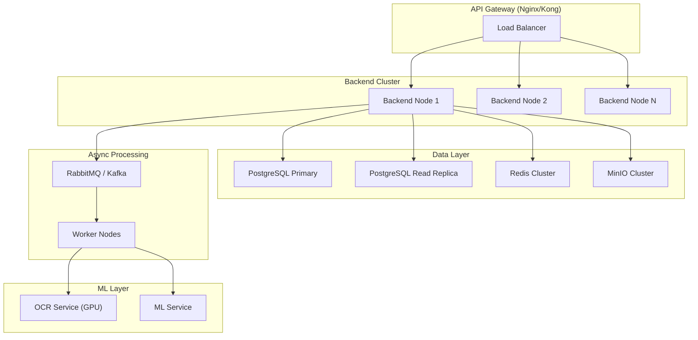

# Numera Backend Implementation Plan

> **Stack**: Kotlin 2.1 + Spring Boot 3.4 + PostgreSQL 16 + Redis 7  
> **Architecture**: Clean hexagonal architecture with domain-driven module boundaries  
> **ML Integration**: HTTP calls to `ocr-service` (port 8001) + `ml-service` (port 8002)  
> **Storage**: MinIO (S3-compatible) for documents  
> **Auth**: JWT + SAML 2.0 + OIDC (extensible)  
> **Event Bus**: Spring Events (Phase 0-1) → RabbitMQ/Kafka (Phase 2+)

---

## Architecture Decisions

### Why Hexagonal (Ports & Adapters)

```
         ┌─────────────────────────────────────────────────┐
         │                 REST Controllers                 │
         │           (Spring MVC / WebFlux)                 │
         └────────────────────┬────────────────────────────┘
                              │ calls
         ┌────────────────────▼────────────────────────────┐
         │              APPLICATION SERVICES                │
         │   (Use cases: SpreadDocument, CreateCovenant)    │
         │   Transaction boundaries live here               │
         └──┬───────────┬────────────┬────────────┬────────┘
            │           │            │            │
   ┌────────▼──┐  ┌─────▼───┐  ┌────▼────┐  ┌───▼──────┐
   │  Domain   │  │ Domain  │  │ Domain  │  │  Domain  │
   │  Model    │  │ Events  │  │ Ports   │  │  Rules   │
   │ (Entities)│  │         │  │(Repos)  │  │          │
   └───────────┘  └─────────┘  └────┬────┘  └──────────┘
                                    │ implements
         ┌──────────────────────────▼──────────────────────┐
         │              INFRASTRUCTURE ADAPTERS             │
         │  JPA Repos │ MinIO Client │ ML Client │ Redis   │
         └─────────────────────────────────────────────────┘
```

### Key Design Choices

| Decision | Choice | Rationale |
|---|---|---|
| Concurrency | Kotlin Coroutines + Virtual Threads | Non-blocking ML calls without reactive complexity |
| Multi-tenancy | Schema-per-tenant (PostgreSQL schemas) | Strongest data isolation, easy compliance |
| Event model | Domain events → Spring `@TransactionalEventListener` | Simple now, swappable to Kafka later |
| Versioning | Git-like immutable snapshots for spreads | Audit trail + rollback required by banking |
| Formula engine | Custom DSL evaluator (not a spreadsheet lib) | We control semantics, formulas are simple arithmetic |
| Search | PostgreSQL full-text + trigram indexes | Good enough for 10K+ customers per tenant |
| File storage | MinIO with pre-signed URLs | Works on-prem + cloud, S3 API compatible |

---

## Module Structure

```
backend/
├── build.gradle.kts
├── src/main/kotlin/com/numera/
│   ├── NumeraApplication.kt
│   │
│   ├── common/                     # Shared kernel
│   │   ├── config/                 # Spring Boot configuration
│   │   │   ├── SecurityConfig.kt
│   │   │   ├── CorsConfig.kt
│   │   │   ├── AsyncConfig.kt
│   │   │   ├── JacksonConfig.kt
│   │   │   └── TenantConfig.kt
│   │   ├── domain/                 # Base entities & value objects
│   │   │   ├── BaseEntity.kt
│   │   │   ├── AuditableEntity.kt
│   │   │   └── TenantAwareEntity.kt
│   │   ├── events/                 # Domain event infrastructure
│   │   │   ├── DomainEvent.kt
│   │   │   └── EventPublisher.kt
│   │   ├── exception/              # Global error handling
│   │   │   ├── GlobalExceptionHandler.kt
│   │   │   ├── BusinessException.kt
│   │   │   └── ErrorResponse.kt
│   │   ├── security/               # Auth infrastructure
│   │   │   ├── JwtTokenProvider.kt
│   │   │   ├── TenantResolver.kt
│   │   │   └── CurrentUser.kt
│   │   └── util/                   # Shared utilities
│   │       ├── SlugGenerator.kt
│   │       └── PaginationUtils.kt
│   │
│   ├── auth/                       # Authentication module
│   │   ├── api/                    # REST controllers
│   │   ├── application/            # Use cases
│   │   ├── domain/                 # User, Role, Permission entities
│   │   └── infrastructure/         # JPA repos, SSO adapters
│   │
│   ├── customer/                   # Customer management module
│   │   ├── api/
│   │   ├── application/
│   │   ├── domain/
│   │   └── infrastructure/
│   │
│   ├── document/                   # Document processing module
│   │   ├── api/
│   │   ├── application/
│   │   │   └── DocumentProcessingService.kt
│   │   ├── domain/
│   │   └── infrastructure/
│   │       ├── MinioStorageAdapter.kt
│   │       ├── OcrServiceClient.kt
│   │       └── MlServiceClient.kt
│   │
│   ├── model/                      # Model template module
│   │   ├── api/
│   │   ├── application/
│   │   │   ├── TemplateService.kt
│   │   │   └── FormulaEngine.kt
│   │   ├── domain/
│   │   └── infrastructure/
│   │
│   ├── spreading/                  # Spreading workspace module
│   │   ├── api/
│   │   ├── application/
│   │   │   ├── SpreadService.kt
│   │   │   ├── MappingOrchestrator.kt
│   │   │   ├── ExpressionEvaluator.kt
│   │   │   └── AutofillService.kt
│   │   ├── domain/
│   │   └── infrastructure/
│   │
│   ├── covenant/                   # Covenant module (Phase 2)
│   │   ├── api/
│   │   ├── application/
│   │   ├── domain/
│   │   └── infrastructure/
│   │
│   ├── reporting/                  # Reporting module (Phase 3)
│   │   ├── api/
│   │   ├── application/
│   │   └── infrastructure/
│   │
│   ├── admin/                      # Admin module
│   │   ├── api/
│   │   ├── application/
│   │   └── infrastructure/
│   │
│   └── integration/                # External system adapters (Phase 5)
│       ├── api/
│       ├── adapter/
│       │   ├── ExternalSystemAdapter.kt
│       │   └── CreditLensAdapter.kt
│       └── infrastructure/
│
├── src/main/resources/
│   ├── application.yml
│   ├── application-dev.yml
│   ├── application-prod.yml
│   └── db/migration/               # Flyway migrations
│       ├── V001__core_schema.sql
│       ├── V002__auth_tables.sql
│       ├── V003__document_tables.sql
│       ├── V004__model_template_tables.sql
│       ├── V005__spreading_tables.sql
│       ├── V006__seed_ifrs_template.sql
│       ├── V007__admin_tables.sql
│       └── V100__covenant_tables.sql  # Phase 2
│
└── src/test/
    ├── kotlin/                     # Unit + integration tests
    └── resources/                  # Test fixtures
```

---

## Phase 0: Demo MVP Backend (Weeks 1-12)

### P0.1 — Project Bootstrap (Week 1)

#### P0.1.1 Spring Boot Initialization

```kotlin
// build.gradle.kts dependencies
dependencies {
    // Core
    implementation("org.springframework.boot:spring-boot-starter-web")
    implementation("org.springframework.boot:spring-boot-starter-data-jpa")
    implementation("org.springframework.boot:spring-boot-starter-security")
    implementation("org.springframework.boot:spring-boot-starter-validation")
    implementation("org.springframework.boot:spring-boot-starter-actuator")
    
    // Kotlin
    implementation("org.jetbrains.kotlin:kotlin-reflect")
    implementation("org.jetbrains.kotlinx:kotlinx-coroutines-core")
    implementation("org.jetbrains.kotlinx:kotlinx-coroutines-reactor")
    implementation("com.fasterxml.jackson.module:jackson-module-kotlin")
    
    // Database
    implementation("org.postgresql:postgresql")
    implementation("org.flywaydb:flyway-core")
    implementation("org.flywaydb:flyway-database-postgresql")
    
    // Redis
    implementation("org.springframework.boot:spring-boot-starter-data-redis")
    
    // Storage
    implementation("io.minio:minio:8.5.13")
    
    // Auth
    implementation("io.jsonwebtoken:jjwt-api:0.12.6")
    runtimeOnly("io.jsonwebtoken:jjwt-impl:0.12.6")
    runtimeOnly("io.jsonwebtoken:jjwt-jackson:0.12.6")
    
    // HTTP Client (for ML service calls)
    implementation("org.springframework.boot:spring-boot-starter-webflux")
    
    // OpenAPI
    implementation("org.springdoc:springdoc-openapi-starter-webmvc-ui:2.7.0")
    
    // Testing
    testImplementation("org.springframework.boot:spring-boot-starter-test")
    testImplementation("io.mockk:mockk:1.13.13")
    testImplementation("org.testcontainers:postgresql:1.20.4")
    testImplementation("org.testcontainers:minio:1.20.4")
}
```

#### P0.1.2 Base Entity & Audit Infrastructure

```kotlin
// BaseEntity.kt
@MappedSuperclass
abstract class BaseEntity {
    @Id
    @GeneratedValue(strategy = GenerationType.UUID)
    val id: UUID? = null
    
    @Column(updatable = false)
    val createdAt: Instant = Instant.now()
    
    var updatedAt: Instant = Instant.now()
}

// TenantAwareEntity.kt — all tenant data extends this
@MappedSuperclass
abstract class TenantAwareEntity : BaseEntity() {
    @Column(name = "tenant_id", nullable = false)
    lateinit var tenantId: UUID
}
```

#### P0.1.3 Configuration Files

```yaml
# application.yml
spring:
  datasource:
    url: jdbc:postgresql://localhost:5432/numera
    username: ${DB_USER:numera}
    password: ${DB_PASSWORD:numera_dev}
  jpa:
    hibernate:
      ddl-auto: validate  # Flyway manages schema
    properties:
      hibernate.default_schema: public
  flyway:
    enabled: true
    locations: classpath:db/migration
  servlet:
    multipart:
      max-file-size: 50MB

numera:
  jwt:
    secret: ${JWT_SECRET}
    access-token-expiry: 15m
    refresh-token-expiry: 7d
  ml:
    ocr-service-url: http://localhost:8001/api
    ml-service-url: http://localhost:8002/api
    timeout-seconds: 120
  storage:
    type: minio  # or "filesystem" for dev
    endpoint: http://localhost:9000
    access-key: ${MINIO_ACCESS_KEY:minioadmin}
    secret-key: ${MINIO_SECRET_KEY:minioadmin}
    bucket: numera-documents
  processing:
    max-concurrent: 5
    page-batch-size: 5
```

---

### P0.2 — Authentication & Core Schema (Week 2)

#### P0.2.1 Database Migration V001-V002

```sql
-- V001__core_schema.sql
CREATE EXTENSION IF NOT EXISTS "uuid-ossp";
CREATE EXTENSION IF NOT EXISTS "pg_trgm";  -- For fuzzy text search

-- Tenant registry
CREATE TABLE tenants (
    id              UUID PRIMARY KEY DEFAULT uuid_generate_v4(),
    name            TEXT NOT NULL UNIQUE,
    display_name    TEXT NOT NULL,
    schema_name     TEXT NOT NULL UNIQUE,
    db_schema       TEXT NOT NULL UNIQUE,
    status          TEXT NOT NULL DEFAULT 'ACTIVE',  -- ACTIVE, SUSPENDED, ARCHIVED
    settings        JSONB DEFAULT '{}',
    created_at      TIMESTAMPTZ NOT NULL DEFAULT NOW(),
    updated_at      TIMESTAMPTZ NOT NULL DEFAULT NOW()
);

-- V002__auth_tables.sql
CREATE TABLE users (
    id              UUID PRIMARY KEY DEFAULT uuid_generate_v4(),
    tenant_id       UUID NOT NULL REFERENCES tenants(id),
    email           TEXT NOT NULL,
    password_hash   TEXT,  -- NULL when SSO-only
    full_name       TEXT NOT NULL,
    status          TEXT NOT NULL DEFAULT 'PENDING', -- PENDING, ACTIVE, INACTIVE, LOCKED
    auth_provider   TEXT NOT NULL DEFAULT 'FORM',    -- FORM, SAML, OIDC
    external_id     TEXT,  -- SSO subject ID
    mfa_enabled     BOOLEAN DEFAULT FALSE,
    mfa_secret      TEXT,  -- TOTP secret (encrypted)
    last_login_at   TIMESTAMPTZ,
    created_at      TIMESTAMPTZ NOT NULL DEFAULT NOW(),
    updated_at      TIMESTAMPTZ NOT NULL DEFAULT NOW(),
    UNIQUE(tenant_id, email)
);

CREATE TABLE roles (
    id              UUID PRIMARY KEY DEFAULT uuid_generate_v4(),
    tenant_id       UUID REFERENCES tenants(id),     -- NULL = system role
    name            TEXT NOT NULL,
    description     TEXT,
    is_system_role  BOOLEAN DEFAULT FALSE,
    created_at      TIMESTAMPTZ NOT NULL DEFAULT NOW()
);

CREATE TABLE permissions (
    id              UUID PRIMARY KEY DEFAULT uuid_generate_v4(),
    module          TEXT NOT NULL,  -- SPREADING, COVENANTS, ADMIN, REPORTING, FILE_STORE
    action          TEXT NOT NULL,  -- CREATE, READ, UPDATE, DELETE, APPROVE, SUBMIT
    resource        TEXT NOT NULL,  -- e.g., "spread_item", "covenant", "user"
    UNIQUE(module, action, resource)
);

CREATE TABLE role_permissions (
    role_id         UUID NOT NULL REFERENCES roles(id) ON DELETE CASCADE,
    permission_id   UUID NOT NULL REFERENCES permissions(id) ON DELETE CASCADE,
    PRIMARY KEY (role_id, permission_id)
);

CREATE TABLE user_roles (
    user_id         UUID NOT NULL REFERENCES users(id) ON DELETE CASCADE,
    role_id         UUID NOT NULL REFERENCES roles(id) ON DELETE CASCADE,
    PRIMARY KEY (user_id, role_id)
);

-- Session management
CREATE TABLE refresh_tokens (
    id              UUID PRIMARY KEY DEFAULT uuid_generate_v4(),
    user_id         UUID NOT NULL REFERENCES users(id) ON DELETE CASCADE,
    token_hash      TEXT NOT NULL UNIQUE,
    device_info     TEXT,
    ip_address      TEXT,
    expires_at      TIMESTAMPTZ NOT NULL,
    revoked         BOOLEAN DEFAULT FALSE,
    created_at      TIMESTAMPTZ NOT NULL DEFAULT NOW()
);

-- Login audit
CREATE TABLE login_audit (
    id              BIGSERIAL PRIMARY KEY,
    user_id         UUID REFERENCES users(id),
    email           TEXT NOT NULL,
    tenant_id       UUID NOT NULL,
    success         BOOLEAN NOT NULL,
    ip_address      TEXT,
    user_agent      TEXT,
    failure_reason  TEXT,
    created_at      TIMESTAMPTZ NOT NULL DEFAULT NOW()
);

-- Seed system roles and permissions
INSERT INTO roles (id, name, description, is_system_role) VALUES
    ('00000000-0000-0000-0000-000000000001', 'ADMIN',          'System Administrator', TRUE),
    ('00000000-0000-0000-0000-000000000002', 'ANALYST',        'Financial Analyst (Maker)', TRUE),
    ('00000000-0000-0000-0000-000000000003', 'MANAGER',        'Manager (Checker)', TRUE),
    ('00000000-0000-0000-0000-000000000004', 'GLOBAL_MANAGER', 'Global Manager', TRUE),
    ('00000000-0000-0000-0000-000000000005', 'AUDITOR',        'Read-Only Auditor', TRUE);
```

#### P0.2.2 Auth REST API

| Method | Endpoint | Description |
|--------|----------|-------------|
| `POST` | `/api/auth/login` | Email/password → JWT access + refresh tokens |
| `POST` | `/api/auth/refresh` | Refresh token → new access token |
| `POST` | `/api/auth/logout` | Revoke refresh token |
| `GET`  | `/api/auth/me` | Current user profile |

---

### P0.3 — Document Processing Pipeline (Weeks 3-5)

> [!IMPORTANT]
> This is the **most critical backend module**. It connects the frontend upload to the ML services and persists all extraction results. The VLM performs OCR + table extraction + zone classification in one shot for scanned PDFs. Native PDFs are handled entirely by PyMuPDF without any ML calls.

#### P0.3.1 Database Migration V003

```sql
-- V003__document_tables.sql
CREATE TABLE documents (
    id                  UUID PRIMARY KEY DEFAULT uuid_generate_v4(),
    tenant_id           UUID NOT NULL REFERENCES tenants(id),
    filename            TEXT NOT NULL,
    original_filename   TEXT NOT NULL,
    file_type           TEXT NOT NULL,        -- PDF, DOCX, XLSX, JPG, PNG
    file_size           BIGINT NOT NULL,
    language            TEXT NOT NULL DEFAULT 'en',
    storage_path        TEXT NOT NULL,         -- MinIO object key
    ocr_status          TEXT NOT NULL DEFAULT 'PENDING',
    processing_status   TEXT NOT NULL DEFAULT 'UPLOADED',
    pdf_type            TEXT,                  -- NATIVE, SCANNED, MIXED
    backend_used        TEXT,                  -- native, qwen3vl, paddleocr
    total_pages         INT,
    page_count          INT,
    processing_time_ms  INT,
    error_message       TEXT,
    uploaded_by         UUID NOT NULL REFERENCES users(id),
    created_at          TIMESTAMPTZ NOT NULL DEFAULT NOW(),
    updated_at          TIMESTAMPTZ NOT NULL DEFAULT NOW()
);

-- Detected zones (tables found in document)
CREATE TABLE detected_zones (
    id                  UUID PRIMARY KEY DEFAULT uuid_generate_v4(),
    document_id         UUID NOT NULL REFERENCES documents(id) ON DELETE CASCADE,
    page_number         INT NOT NULL,
    zone_type           TEXT NOT NULL,         -- INCOME_STATEMENT, BALANCE_SHEET, etc.
    zone_label          TEXT,                  -- Human-readable: "Consolidated P&L"
    bounding_box        JSONB NOT NULL,        -- {x, y, width, height}
    confidence_score    FLOAT NOT NULL,
    classification_method TEXT,                -- VLM, HEURISTIC, ML, COMBINED
    account_column      INT,
    value_columns       INT[],
    header_rows         INT[],
    detected_periods    TEXT[],
    detected_currency   TEXT,
    detected_unit       TEXT,                  -- "thousands", "millions", "actual"
    cell_data           JSONB,                 -- Full cell grid from VLM extraction
    status              TEXT NOT NULL DEFAULT 'DETECTED', -- DETECTED, CONFIRMED, REJECTED
    created_at          TIMESTAMPTZ NOT NULL DEFAULT NOW()
);

CREATE INDEX idx_documents_tenant ON documents(tenant_id);
CREATE INDEX idx_documents_status ON documents(processing_status);
CREATE INDEX idx_detected_zones_document ON detected_zones(document_id);
```

#### P0.3.2 Document Processing Flow

```
Frontend                  Backend                     ML Services
────────                  ───────                     ───────────
POST /api/documents/upload
  ──► Validate file ──►
      Store in MinIO ──►
      Create DB record
      (status=UPLOADED)
      ──► Return 202 + doc ID

      ──► Async: DocumentProcessingService.process()
          │
          ├─ 1. Download from MinIO
          │     (status=PROCESSING)
          │
          ├─ 2. POST /api/ocr/extract  ────────────► ocr-service
          │     ◄──── {text_blocks, pdf_type, backend}
          │     Store OCR results
          │     (status=OCR_COMPLETE)
          │
          ├─ 3. POST /api/ocr/tables/detect ────────► ocr-service
          │     ◄──── {tables: [{cells, vlm_zone_type, ...}]}
          │     Store detected zones
          │     (status=TABLES_DETECTED)
          │
          ├─ 4. POST /api/ml/zones/classify ────────► ml-service
          │     (sends tables with vlm_zone_type)     (uses VLM zones if available)
          │     ◄──── {zones: [{zone_type, confidence}]}
          │     Update detected zones
          │     (status=ZONES_CLASSIFIED)
          │
          └─ 5. Update status=READY
                Publish DOCUMENT_READY event
```

#### P0.3.3 REST API

| Method | Endpoint | Description |
|--------|----------|-------------|
| `POST` | `/api/documents/upload` | Multipart file upload → 202 Accepted |
| `GET`  | `/api/documents/{id}` | Document metadata + processing status |
| `GET`  | `/api/documents/{id}/status` | Lightweight polling endpoint |
| `GET`  | `/api/documents/{id}/pages/{page}` | Render page as image (for PDF viewer) |
| `GET`  | `/api/documents/{id}/zones` | All detected zones for document |
| `PUT`  | `/api/documents/{id}/zones/{zoneId}` | Analyst corrects zone type/boundary |
| `POST` | `/api/documents/{id}/zones` | Analyst adds a manual zone |
| `DELETE`| `/api/documents/{id}/zones/{zoneId}` | Analyst removes a false zone |
| `GET`  | `/api/documents/{id}/download` | Download original file |
| `GET`  | `/api/documents` | List documents (paginated, filtered) |
| `DELETE`| `/api/documents/{id}` | Soft-delete (only if not mapped) |

#### P0.3.4 ML Service Client

```kotlin
// infrastructure/MlServiceClient.kt
@Service
class MlServiceClient(
    private val webClient: WebClient,
    private val config: NumeraProperties.MlConfig
) {
    private val ocr = webClient.mutate()
        .baseUrl(config.ocrServiceUrl)
        .build()
    
    private val ml = webClient.mutate()
        .baseUrl(config.mlServiceUrl)
        .build()
    
    suspend fun extractText(documentId: String, storagePath: String): OcrResponse =
        ocr.post()
            .uri("/ocr/extract")
            .bodyValue(OcrRequest(documentId, storagePath))
            .retrieve()
            .awaitBody()
    
    suspend fun detectTables(documentId: String, storagePath: String): TableDetectResponse =
        ocr.post()
            .uri("/ocr/tables/detect")
            .bodyValue(TableDetectRequest(documentId, storagePath))
            .retrieve()
            .awaitBody()
    
    suspend fun classifyZones(documentId: String, tables: List<DetectedTable>): ZoneResponse =
        ml.post()
            .uri("/ml/zones/classify")
            .bodyValue(ZoneRequest(documentId, tables))
            .retrieve()
            .awaitBody()
    
    suspend fun suggestMappings(request: MappingRequest): MappingResponse =
        ml.post()
            .uri("/ml/mapping/suggest")
            .bodyValue(request)
            .retrieve()
            .awaitBody()
    
    suspend fun buildExpressions(request: ExpressionRequest): ExpressionResponse =
        ml.post()
            .uri("/ml/expressions/build")
            .bodyValue(request)
            .retrieve()
            .awaitBody()
    
    suspend fun submitFeedback(corrections: List<FeedbackItem>): FeedbackResponse =
        ml.post()
            .uri("/ml/feedback")
            .bodyValue(FeedbackRequest(corrections))
            .retrieve()
            .awaitBody()
}
```

---

### P0.4 — Model Template System (Week 4-5)

> [!IMPORTANT]
> This is the **backbone** of the spreading workspace. Every bank gets a model template. All formulas, validations, and AI mappings reference template line items by ID.

#### P0.4.1 Database Migration V004

```sql
-- V004__model_template_tables.sql
CREATE TABLE model_templates (
    id              UUID PRIMARY KEY DEFAULT uuid_generate_v4(),
    tenant_id       UUID REFERENCES tenants(id),  -- NULL = global/system template
    name            TEXT NOT NULL,
    framework       TEXT NOT NULL DEFAULT 'IFRS',  -- IFRS, US_GAAP, ISLAMIC
    description     TEXT,
    version         INT NOT NULL DEFAULT 1,
    is_default      BOOLEAN DEFAULT FALSE,
    source_template_id UUID REFERENCES model_templates(id), -- cloned from
    status          TEXT NOT NULL DEFAULT 'ACTIVE',
    created_by      UUID REFERENCES users(id),
    created_at      TIMESTAMPTZ NOT NULL DEFAULT NOW(),
    updated_at      TIMESTAMPTZ NOT NULL DEFAULT NOW()
);

CREATE TABLE model_line_items (
    id              UUID PRIMARY KEY DEFAULT uuid_generate_v4(),
    template_id     UUID NOT NULL REFERENCES model_templates(id) ON DELETE CASCADE,
    item_code       TEXT NOT NULL,               -- IS001, BS035, CF070, RA010
    parent_item_id  UUID REFERENCES model_line_items(id),
    zone_type       TEXT NOT NULL,               -- INCOME_STATEMENT, BALANCE_SHEET, etc.
    label           TEXT NOT NULL,
    category        TEXT,                         -- "Current Assets", "Operating Activities"
    item_type       TEXT NOT NULL,                -- INPUT, FORMULA, VALIDATION, CATEGORY
    formula         TEXT,                         -- "= {IS001} - {IS002}"
    display_order   INT NOT NULL,
    indent_level    INT NOT NULL DEFAULT 0,
    is_total        BOOLEAN DEFAULT FALSE,
    is_required     BOOLEAN DEFAULT FALSE,
    is_hidden       BOOLEAN DEFAULT FALSE,
    sign_convention TEXT DEFAULT 'NATURAL',       -- NATURAL, NEGATIVE, POSITIVE
    display_format  TEXT DEFAULT 'NUMBER',        -- NUMBER, PERCENTAGE, RATIO, DAYS
    synonyms        TEXT[] DEFAULT '{}',          -- For semantic matching
    created_at      TIMESTAMPTZ NOT NULL DEFAULT NOW(),
    UNIQUE(template_id, item_code)
);

CREATE TABLE model_validations (
    id              UUID PRIMARY KEY DEFAULT uuid_generate_v4(),
    template_id     UUID NOT NULL REFERENCES model_templates(id) ON DELETE CASCADE,
    name            TEXT NOT NULL,
    formula         TEXT NOT NULL,                -- "{BS035} - {BS095}"
    expected_value  NUMERIC DEFAULT 0,
    tolerance       NUMERIC DEFAULT 1,           -- Rounding tolerance
    severity        TEXT NOT NULL DEFAULT 'ERROR', -- ERROR, WARNING
    created_at      TIMESTAMPTZ NOT NULL DEFAULT NOW()
);

CREATE INDEX idx_model_line_items_template ON model_line_items(template_id);
CREATE INDEX idx_model_line_items_zone ON model_line_items(template_id, zone_type);
```

#### P0.4.2 IFRS Seed Migration V006

```sql
-- V006__seed_ifrs_template.sql
-- Loads the IFRS Corporate template from data/model_templates/ifrs_corporate.json
-- This is auto-generated from the JSON using a Flyway Java migration
-- See: IfrsTemplateSeedMigration.kt
```

> [!TIP]
> Use a Flyway **Java/Kotlin migration** (`V006__SeedIfrsTemplate.kt`) that reads `ifrs_corporate.json` from the classpath and inserts all 195 line items + 7 validations in a single transaction. This keeps the seed data DRY — JSON is the source of truth.

#### P0.4.3 REST API

| Method | Endpoint | Description |
|--------|----------|-------------|
| `GET`  | `/api/model-templates` | List templates for tenant |
| `GET`  | `/api/model-templates/{id}` | Template with all line items |
| `GET`  | `/api/model-templates/{id}/items` | Line items (filterable by zone) |
| `POST` | `/api/model-templates` | Create/clone template |
| `PUT`  | `/api/model-templates/{id}` | Update template metadata |
| `POST` | `/api/model-templates/{id}/items` | Add line item |
| `PUT`  | `/api/model-templates/{id}/items/{itemId}` | Update line item |
| `DELETE`| `/api/model-templates/{id}/items/{itemId}` | Remove line item |
| `POST` | `/api/model-templates/{id}/clone` | Clone template for customization |

#### P0.4.4 Formula Engine

```kotlin
// application/FormulaEngine.kt
@Service
class FormulaEngine {
    
    /**
     * Evaluate a model formula against a map of cell values.
     * 
     * Formula syntax: "{IS001} - {IS002}" or "SUM({BS001}:{BS007})"
     * 
     * Returns: computed value, or null if any referenced cell is missing.
     */
    fun evaluate(formula: String, values: Map<String, BigDecimal?>): BigDecimal? {
        // Replace {ITEM_CODE} references with actual values
        // Support operators: +, -, *, /
        // Support functions: SUM({start}:{end}), ABS({ref})
        // Handle nulls: if any ref is null, return null (Excel-like)
    }
    
    /**
     * Run all validations for a template against current values.
     * Returns list of (validation_name, status, difference) records.
     */
    fun runValidations(
        template: ModelTemplate,
        values: Map<String, BigDecimal?>
    ): List<ValidationResult>
}
```

---

### P0.5 — Spreading Engine (Weeks 5-8)

> [!IMPORTANT]
> The spreading engine is the **heart of the product**. It orchestrates: ML mapping suggestions → expression building → formula evaluation → validation → version control. Every cell in the grid is either AI-mapped, formula-computed, or analyst-entered.

#### P0.5.1 Database Migration V005

```sql
-- V005__spreading_tables.sql

-- Customer (borrower whose financials are spread)
CREATE TABLE customers (
    id                  UUID PRIMARY KEY DEFAULT uuid_generate_v4(),
    tenant_id           UUID NOT NULL REFERENCES tenants(id),
    entity_id           TEXT UNIQUE,                -- External system ID
    long_name           TEXT NOT NULL,
    short_name          TEXT,
    financial_year_end  TEXT,                        -- "31 December", "30 June"
    source_currency     TEXT DEFAULT 'USD',
    target_currency     TEXT DEFAULT 'USD',
    group_id            UUID,                        -- Customer group
    status              TEXT NOT NULL DEFAULT 'ACTIVE',
    metadata            JSONB DEFAULT '{}',
    created_at          TIMESTAMPTZ NOT NULL DEFAULT NOW(),
    updated_at          TIMESTAMPTZ NOT NULL DEFAULT NOW()
);

-- Customer-specific model instance (copy of template, customizable per customer)
CREATE TABLE customer_models (
    id                  UUID PRIMARY KEY DEFAULT uuid_generate_v4(),
    customer_id         UUID NOT NULL REFERENCES customers(id),
    template_id         UUID NOT NULL REFERENCES model_templates(id),
    version             INT NOT NULL DEFAULT 1,
    customizations      JSONB DEFAULT '{}',          -- {hidden_items: [], grouped_items: []}
    created_at          TIMESTAMPTZ NOT NULL DEFAULT NOW()
);

-- Spread items (a financial period to be spread)
CREATE TABLE spread_items (
    id                  UUID PRIMARY KEY DEFAULT uuid_generate_v4(),
    tenant_id           UUID NOT NULL REFERENCES tenants(id),
    customer_id         UUID NOT NULL REFERENCES customers(id),
    customer_model_id   UUID NOT NULL REFERENCES customer_models(id),
    document_id         UUID REFERENCES documents(id),
    statement_date      DATE NOT NULL,
    frequency           TEXT NOT NULL DEFAULT 'ANNUAL',    -- MONTHLY, QUARTERLY, SEMI_ANNUAL, ANNUAL
    audit_method        TEXT NOT NULL DEFAULT 'AUDITED',   -- AUDITED, UNAUDITED, MANAGEMENT
    statement_type      TEXT DEFAULT 'ORIGINAL',           -- ORIGINAL, RESTATED_1..5, MIGRATED
    source_currency     TEXT,
    target_currency     TEXT,
    consolidation       TEXT DEFAULT 'CONSOLIDATED',       -- CONSOLIDATED, STANDALONE
    status              TEXT NOT NULL DEFAULT 'DRAFT',     -- DRAFT, SUBMITTED, APPROVED, PUSHED
    base_spread_id      UUID REFERENCES spread_items(id),  -- For autofill
    locked_by           UUID REFERENCES users(id),
    locked_at           TIMESTAMPTZ,
    processing_time_ms  INT,
    mapping_coverage    FLOAT,                             -- 0.0-1.0
    ai_accuracy         FLOAT,                             -- From feedback
    created_by          UUID NOT NULL REFERENCES users(id),
    created_at          TIMESTAMPTZ NOT NULL DEFAULT NOW(),
    updated_at          TIMESTAMPTZ NOT NULL DEFAULT NOW()
);

-- Mapped cell values
CREATE TABLE spread_values (
    id                  UUID PRIMARY KEY DEFAULT uuid_generate_v4(),
    spread_item_id      UUID NOT NULL REFERENCES spread_items(id) ON DELETE CASCADE,
    line_item_id        UUID NOT NULL REFERENCES model_line_items(id),
    mapped_value        NUMERIC,                           -- The final value in the cell
    raw_value           NUMERIC,                           -- Before unit scaling
    expression_type     TEXT DEFAULT 'DIRECT',             -- DIRECT, SUM, NEGATE, SCALE, MANUAL, FORMULA
    expression          JSONB,                             -- Full expression with source refs
    scale_factor        NUMERIC DEFAULT 1,
    confidence_score    FLOAT,
    confidence_level    TEXT,                               -- HIGH, MEDIUM, LOW
    source_page         INT,
    source_coordinates  JSONB,                             -- {x, y, width, height}
    source_text         TEXT,                               -- Original text from PDF
    is_manual_override  BOOLEAN DEFAULT FALSE,
    is_autofilled       BOOLEAN DEFAULT FALSE,
    override_comment    TEXT,
    model_version       TEXT,                               -- ML model version
    version             INT NOT NULL DEFAULT 1,
    created_at          TIMESTAMPTZ NOT NULL DEFAULT NOW(),
    updated_at          TIMESTAMPTZ NOT NULL DEFAULT NOW(),
    UNIQUE(spread_item_id, line_item_id, version)
);

-- Spread versions (immutable snapshots)
CREATE TABLE spread_versions (
    id                  UUID PRIMARY KEY DEFAULT uuid_generate_v4(),
    spread_item_id      UUID NOT NULL REFERENCES spread_items(id) ON DELETE CASCADE,
    version_number      INT NOT NULL,
    snapshot_data       JSONB NOT NULL,                     -- Full state snapshot
    action              TEXT NOT NULL,                      -- CREATED, SAVED, SUBMITTED, APPROVED, ROLLED_BACK
    comments            TEXT,
    diff_summary        JSONB,                             -- Changed cells summary
    created_by          UUID NOT NULL REFERENCES users(id),
    created_at          TIMESTAMPTZ NOT NULL DEFAULT NOW(),
    UNIQUE(spread_item_id, version_number)
);

-- Expression memory (for autofill — persists ML service patterns to DB)
CREATE TABLE expression_patterns (
    id                  UUID PRIMARY KEY DEFAULT uuid_generate_v4(),
    tenant_id           UUID NOT NULL REFERENCES tenants(id),
    customer_id         UUID NOT NULL REFERENCES customers(id),
    line_item_id        UUID NOT NULL REFERENCES model_line_items(id),
    expression_type     TEXT NOT NULL,
    source_labels       TEXT[] NOT NULL,                     -- PDF labels that map to this item
    scale_factor        NUMERIC DEFAULT 1,
    confidence          FLOAT,
    usage_count         INT DEFAULT 1,
    last_used_at        TIMESTAMPTZ,
    created_at          TIMESTAMPTZ NOT NULL DEFAULT NOW(),
    UNIQUE(tenant_id, customer_id, line_item_id)
);

CREATE INDEX idx_spread_items_customer ON spread_items(customer_id);
CREATE INDEX idx_spread_items_status ON spread_items(tenant_id, status);
CREATE INDEX idx_spread_values_spread ON spread_values(spread_item_id);
CREATE INDEX idx_expression_patterns_customer ON expression_patterns(tenant_id, customer_id);
```

#### P0.5.2 Spreading REST API

| Method | Endpoint | Description |
|--------|----------|-------------|
| `POST` | `/api/customers/{custId}/spread-items` | Create new spread item |
| `GET`  | `/api/customers/{custId}/spread-items` | List spreads for customer |
| `GET`  | `/api/spread-items/{id}` | Spread item with all values |
| `POST` | `/api/spread-items/{id}/process` | Trigger AI mapping (OCR→zones→mapping→expressions) |
| `GET`  | `/api/spread-items/{id}/values` | All mapped values |
| `PUT`  | `/api/spread-items/{id}/values/{valueId}` | Analyst corrects a cell |
| `POST` | `/api/spread-items/{id}/values/bulk` | Bulk accept AI suggestions |
| `PUT`  | `/api/spread-items/{id}/draft` | Save as draft (create version snapshot) |
| `POST` | `/api/spread-items/{id}/submit` | Submit spread (validate + snapshot) |
| `POST` | `/api/spread-items/{id}/approve` | Manager approves |
| `POST` | `/api/spread-items/{id}/reject` | Manager rejects with comment |
| `POST` | `/api/spread-items/{id}/rollback/{version}` | Rollback to version |
| `GET`  | `/api/spread-items/{id}/versions` | Version history |
| `GET`  | `/api/spread-items/{id}/versions/{v}/diff/{v2}` | Diff two versions |
| `POST` | `/api/spread-items/{id}/lock` | Acquire exclusive lock |
| `POST` | `/api/spread-items/{id}/unlock` | Release lock |
| `GET`  | `/api/spread-items/{id}/validations` | Run and return validation results |

#### P0.5.3 Mapping Orchestrator — The Core Flow

```kotlin
@Service
class MappingOrchestrator(
    private val mlClient: MlServiceClient,
    private val formulaEngine: FormulaEngine,
    private val templateService: TemplateService,
    private val expressionPatternRepo: ExpressionPatternRepository,
) {
    /**
     * Orchestrate the full AI mapping pipeline:
     * 1. Load template items for each detected zone
     * 2. Call ML semantic matching
     * 3. Call ML expression building (with autofill)
     * 4. Evaluate formulas
     * 5. Run validations
     * 6. Save all results
     */
    suspend fun processSpread(spreadItem: SpreadItem, document: Document): MappingResult {
        val template = templateService.getTemplate(spreadItem.customerModelId)
        val zones = document.detectedZones.filter { it.status == "DETECTED" || it.status == "CONFIRMED" }
        
        val allValues = mutableMapOf<String, SpreadValue>()
        
        for (zone in zones) {
            // 1. Get model items for this zone
            val modelItems = template.itemsByZone(zone.zoneType)
            
            // 2. Semantic matching
            val mappingSuggestions = mlClient.suggestMappings(
                MappingRequest(
                    documentId = document.id.toString(),
                    sourceRows = zone.toSourceRows(),
                    targetItems = modelItems.toTargetItems(),
                    tenantId = spreadItem.tenantId.toString()
                )
            )
            
            // 3. Expression building (includes autofill)
            val expressions = mlClient.buildExpressions(
                ExpressionRequest(
                    documentId = document.id.toString(),
                    tenantId = spreadItem.tenantId.toString(),
                    customerId = spreadItem.customerId.toString(),
                    templateId = template.id.toString(),
                    zoneType = zone.zoneType,
                    extractedRows = zone.cellData.rows,
                    semanticMatches = mappingSuggestions.toSemanticMatches(),
                    useAutofill = spreadItem.baseSpreadId != null
                )
            )
            
            // 4. Create spread values from expressions
            for (expr in expressions.expressions) {
                allValues[expr.targetItemId] = SpreadValue(
                    lineItemId = expr.targetItemId.toUUID(),
                    mappedValue = expr.computedValue?.toBigDecimal(),
                    rawValue = expr.sources.firstOrNull()?.value?.toBigDecimal(),
                    expressionType = expr.expressionType,
                    expression = expr.toJsonb(),
                    scaleFactor = expr.scaleFactor.toBigDecimal(),
                    confidenceScore = expr.confidence,
                    sourcePage = expr.sources.firstOrNull()?.page,
                    sourceText = expr.sources.firstOrNull()?.label,
                    isAutofilled = expr.explanation.contains("Auto-filled"),
                )
            }
        }
        
        // 5. Evaluate formulas (Gross Profit, EBITDA, ratios, etc.)
        val inputValues = allValues.mapValues { it.value.mappedValue }
        for (item in template.formulaItems) {
            val computed = formulaEngine.evaluate(item.formula!!, inputValues)
            if (computed != null) {
                allValues[item.itemCode] = SpreadValue.formula(item, computed)
            }
        }
        
        // 6. Run validations
        val validationResults = formulaEngine.runValidations(template, inputValues)
        
        // 7. Persist expression patterns for autofill
        for ((code, value) in allValues) {
            if (value.confidenceScore != null && value.confidenceScore >= 0.7) {
                expressionPatternRepo.upsert(
                    tenantId = spreadItem.tenantId,
                    customerId = spreadItem.customerId,
                    lineItemId = value.lineItemId,
                    expressionType = value.expressionType,
                    sourceLabels = value.expression?.sourceLabels ?: emptyList(),
                    scaleFactor = value.scaleFactor,
                    confidence = value.confidenceScore
                )
            }
        }
        
        return MappingResult(
            values = allValues.values.toList(),
            validations = validationResults,
            coverage = allValues.size.toFloat() / template.inputItems.size,
            unitScale = expressions.unitScale
        )
    }
}
```

---

### P0.6 — Demo Polish (Weeks 9-12)

- [ ] WebSocket endpoint for real-time processing status updates
- [ ] Dashboard API: `GET /api/dashboard/summary` (recent spreads, stats)
- [ ] Error response standardization across all endpoints
- [ ] Request/response logging with correlation IDs
- [ ] Health check: `GET /api/actuator/health` (DB + MinIO + ML services)
- [ ] OpenAPI/Swagger docs at `/swagger-ui.html`

---

## Phase 1: Production-Ready (Weeks 13-32)

### P1.1 — SSO & Security (Weeks 13-15)

- [ ] SAML 2.0 integration via Spring Security SAML extension
- [ ] OIDC support for Azure AD, Okta, Ping Identity
- [ ] TOTP-based MFA (RFC 6238) with QR setup + backup codes
- [ ] Session management: concurrent limits, force-logout, idle timeout
- [ ] Password policies: complexity, history, expiry enforcement
- [ ] Login audit log with IP, device, success/failure tracking
- [ ] Account states: PENDING → APPROVED → ACTIVE (SSO auto-provision)

### P1.2 — Multi-Tenancy & RBAC (Weeks 14-16)

- [ ] Schema-per-tenant: auto-create schema on tenant onboarding
- [ ] Hibernate tenant resolver (JWT claim → schema routing)
- [ ] Custom role creation per tenant
- [ ] Permission checks via `@PreAuthorize` annotations
- [ ] Group-based customer visibility (users see only their groups)
- [ ] Group CRUD API + user-group assignment

### P1.3 — File Store Module (Weeks 16-18)

| Endpoint | Description |
|----------|-------------|
| `POST /api/file-store/upload/bulk` | Multi-file upload with processing queue |
| `GET /api/file-store/my-files` | Current user's uploaded files |
| `GET /api/file-store/all-files` | All tenant files (permission-gated) |
| `GET /api/file-store/errors` | Failed processing files |
| `POST /api/file-store/{id}/map-to-customer` | Map file to customer + create spread item |
| `POST /api/file-store/{id}/password` | Submit password for protected PDFs |
| `GET /api/file-store/{id}/recommendations` | AI-recommended customer match |

- [ ] Background processing queue (`@Async` + `ThreadPoolTaskExecutor`)
- [ ] WebSocket notifications for processing completion
- [ ] File state machine: UPLOADED → PROCESSING → READY → MAPPED → ERROR

### P1.4 — Customer Management (Weeks 17-18)

- [ ] Customer CRUD with group assignment
- [ ] Customer search (full-text + trigram fuzzy matching)
- [ ] Existing items listing per customer
- [ ] Actions: Spread, Read Only, Override, Duplicate, Add Item
- [ ] Integration hook: `ExternalSystemAdapter.syncCustomer()` (Phase 5)

### P1.5 — Full Spreading Workspace Backend (Weeks 18-24)

- [ ] **Exclusive locking**: Redis-based with 30-min TTL, WebSocket lock notifications
- [ ] **Full expression builder API**: Operators (+, -, ×, ÷), adjustments (ABS, NEG, SCALE)
- [ ] **OCR error correction API**: `PUT /api/spread-items/{id}/ocr-corrections`
- [ ] **Page operations**: Merge, split, rotate (server-side image manipulation)
- [ ] **Auto-generated comments**: Per-cell source annotations with source PDF, page, label
- [ ] **Load historical spreads**: `GET /api/spread-items/{id}/history?limit=20`
- [ ] **Variance columns**: Compute period-over-period change for each cell

### P1.6 — Autofill & Subsequent Spreading (Weeks 22-26)

- [ ] Base period selection API: auto-select or manual override
- [ ] Autofill engine: load expression patterns → apply to new document zones
- [ ] Duplicate cell handling: zone-scoped label resolution
- [ ] Anomaly detection: >50% variance from base period flagged as warning
- [ ] Submit & Continue: auto-create next period spread from same document

### P1.7 — Spread Versioning (Weeks 24-26)

- [ ] Immutable snapshots on every action (JSONB state)
- [ ] Diff engine: compare any two versions, highlight changes
- [ ] Rollback: restore any previous version as current working state
- [ ] Override vs Duplicate workflow for restated statements
- [ ] Comprehensive audit trail exports

### P1.8 — Admin Panel Backend (Weeks 26-30)

- [ ] User management CRUD + bulk CSV provisioning
- [ ] Global taxonomy CRUD (keywords, synonyms, multi-language)
- [ ] Zone management CRUD
- [ ] Exclusion list management (12 categories)
- [ ] Language management per tenant
- [ ] Model template management UI backend
- [ ] AI model management: version viewer, accuracy metrics, manual retrain trigger

### P1.9 — ML Feedback Integration (Weeks 28-32)

- [ ] Collect corrections from spread value updates → `POST /api/ml/feedback`
- [ ] Aggregate feedback by tenant → trigger retraining pipeline
- [ ] A/B test management: `PUT /api/admin/ml/ab-test` (ratio, enable/disable)
- [ ] Per-client accuracy tracking dashboards

---

## Phase 2: Covenants & Intelligence (Weeks 33-52)

> All covenant tables in migration **V100__covenant_tables.sql** as specified in the original plan.

### P2.1-P2.3 — Covenant CRUD & Monitoring (Weeks 33-42)

- [ ] Covenant customer, definition, formula, monitoring item CRUD
- [ ] Auto-generation engine: frequency-based monitoring item creation
- [ ] Auto-calculation: spread submission → formula evaluation → breach detection
- [ ] Manual value override with justification
- [ ] Non-financial covenant: document upload + maker-checker verification

### P2.4 — Predictive Intelligence (Weeks 40-44)

- [ ] `POST /api/ml/covenants/predict-breach` integration
- [ ] Breach probability stored on monitoring items
- [ ] Early warning API: `GET /api/covenants/dashboard/risk-heatmap`
- [ ] Covenant calendar: `GET /api/covenants/calendar?range=30d`

### P2.5-P2.6 — Waiver Workflow (Weeks 42-48)

- [ ] Email template CRUD with field tag system
- [ ] Waiver flow: scope selection → letter generation → send (SMTP or .eml download)
- [ ] Automated email reminders (configurable schedule per tenant)

### P2.7 — Live Dashboards (Weeks 48-52)

- [ ] Spreading dashboard: `GET /api/dashboard/spreading` (stats, user productivity)
- [ ] Covenant dashboard: `GET /api/dashboard/covenants` (heatmap, alerts, calendar)
- [ ] Drill-down navigation: portfolio → client → spread → cell

---

## Phase 3: Workflow & Reporting (Weeks 53-64)

### P3.1 — BPMN Workflow Engine (Weeks 53-58)

- [ ] Embed Flowable 7 as workflow engine
- [ ] BPMN process definitions for: Spread approval, Covenant verification, Waiver processing
- [ ] Conditional routing, parallel approval, escalation rules, SLA tracking
- [ ] Workflow designer API (for future admin UI)

### P3.2-P3.3 — Reporting & Analytics (Weeks 58-64)

- [ ] Report framework: definition → query → render → export (XLSX, PDF)
- [ ] 10+ pre-built reports (Spreading + Covenant modules)
- [ ] Scheduled report delivery via email
- [ ] Portfolio analytics: cross-client ratio comparisons, scatter plots

---

## Phase 5: Enterprise Hardening (Weeks 77-84)

### P5.1 — External System Adapters

```kotlin
interface ExternalSystemAdapter {
    suspend fun pushSpread(spread: SpreadData): PushResult
    suspend fun pullModel(entityId: String): ModelTemplate?
    suspend fun pullHistoricalSpreads(entityId: String, limit: Int): List<SpreadData>
    suspend fun syncMetadata(entityId: String): MetadataSync
    suspend fun syncCustomer(entityId: String): CustomerSync
}

// CreditLens adapter, generic REST adapter, etc.
```

### P5.2 — On-Premise Packaging

- [ ] Helm charts for all services
- [ ] Air-gapped installation support
- [ ] Per-tenant data residency configuration

### P5.3 — Performance & Observability

- [ ] Prometheus metrics + Grafana dashboards
- [ ] Structured logging (ELK stack)
- [ ] Load testing: 100 concurrent users, 1K docs/day
- [ ] Automated backups + DR runbook

---

## Scalability Architecture



### Scale-Out Points

| Component | Strategy | When |
|---|---|---|
| Backend API | Horizontal pod scaling (stateless) | 50+ concurrent users |
| PostgreSQL | Read replicas for dashboards/reports | 100+ concurrent users |
| Redis | Cluster mode for session + cache | 500+ concurrent users |
| ML inference | GPU pool with queue | 1000+ docs/day |
| MinIO | Distributed mode (4+ nodes) | 10TB+ storage |
| Message queue | Kafka partitions by tenant | Multi-region deployment |

---

## Integration Extension Points

> [!TIP]
> All integration points are designed as **interfaces/ports** that can be swapped without touching core business logic.

| Extension Point | Interface | Default Impl | Future Impls |
|---|---|---|---|
| Auth provider | `AuthProvider` | JWT form login | SAML, OIDC, LDAP |
| Storage | `StoragePort` | MinIO adapter | AWS S3, Azure Blob, GCS |
| Notifications | `NotificationPort` | Email (SMTP) | Slack, Teams, SMS |
| External system | `ExternalSystemAdapter` | None | CreditLens, Moody's, custom REST |
| Search | `SearchPort` | PostgreSQL FTS | Elasticsearch |
| Audit | `AuditPort` | PostgreSQL table | Splunk, AWS CloudTrail |
| Event bus | `EventBus` | Spring Events | RabbitMQ, Kafka, AWS SQS |
| Workflow engine | `WorkflowPort` | Simple state machine | Flowable, Camunda |
| LLM/Copilot | `CopilotPort` | None | Ollama, OpenAI, Anthropic |

---

## Verification Plan

### Automated Tests

| Layer | Type | Framework | Coverage Target |
|---|---|---|---|
| Domain | Unit | JUnit 5 + MockK | 90%+ |
| Application | Integration | Testcontainers (PG + MinIO) | 80%+ |
| API | Contract | Spring MockMvc + WebTestClient | All endpoints |
| ML integration | Integration | WireMock (mock ML responses) | All ML flows |
| Full pipeline | E2E | Testcontainers + real ML services | 3 demo PDFs |

### Performance Targets

| Metric | Target |
|---|---|
| API response time (CRUD) | < 200ms p95 |
| Document upload | < 2s for 50MB PDF |
| Full spread processing | < 90s for 30-page PDF |
| Dashboard query | < 1s |
| Search results | < 500ms |
| Concurrent users | 100 (Phase 1), 500 (Phase 5) |
