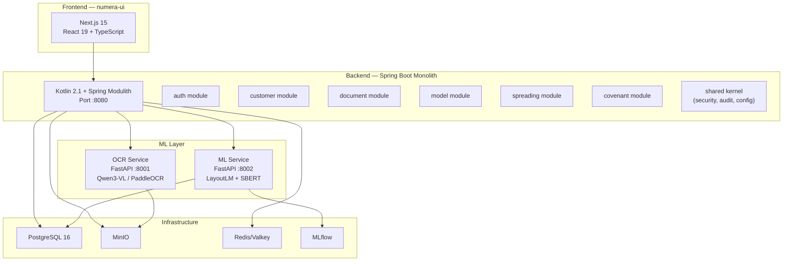

# Numera Platform — Comprehensive Codebase Review

> **Repository**: `f:\Context`
> **Date**: April 10, 2026
> **Stack**: Spring Boot 3.4 / Kotlin • FastAPI / Python • Next.js 15 / React 19 / TypeScript

---

## Architecture Overview



---

## 1. Backend (Spring Boot / Kotlin)

### 1.1 What's Implemented ✅

| Component | Status | Details |
|---|---|---|
| **Project scaffold** | ✅ Complete | Spring Boot 3.4.4, Kotlin 2.1.10, Java 21 toolchain, Spring Modulith 1.3.2 |
| **Build system** | ✅ Complete | Gradle KTS with all deps: JPA, Security, Validation, Actuator, Redis, WebSocket, WebFlux, Flyway, MinIO, JWT, OpenAPI, Micrometer/OTel, Testcontainers |
| **DB Migrations** | ✅ Complete | 10 Flyway migrations: tenants, auth/RBAC, customers, documents, model_templates, spreading, audit_event_log, seed data, plan parity, covenants |
| **Auth Module** | ✅ Complete | `AuthController` → `AuthService` → User/Role/RefreshToken entities & repos. JWT-based with `JwtTokenProvider`, `JwtAuthenticationFilter`, `CurrentUserProvider`, `TenantContext` |
| **Customer Module** | ✅ Complete | `CustomerController` (CRUD + search) → `CustomerService` → `Customer` entity + JPA repo |
| **Document Module** | ✅ Complete | `DocumentController` (upload, status, zones) → `DocumentProcessingService` (11KB) → `Document` + `DetectedZone` entities. Publishes `DocumentProcessedEvent` via Spring events. Integrates `MinioStorageClient` + `MlServiceClient` |
| **Model Template Module** | ✅ Complete | `TemplateController` → `TemplateService` + `FormulaEngine` (9KB) → `ModelTemplate`, `ModelLineItem`, `ModelValidation` entities |
| **Spreading Module** | ✅ Complete | `SpreadController` + `SpreadValueController` + `DashboardController` → `SpreadService` (11KB) + `MappingOrchestrator` (11KB) + `SpreadVersionService` (6KB) + `AutofillService` → `SpreadItem`, `SpreadValue`, `SpreadVersion`, `ExpressionPattern` entities. Supports versioning, diff, rollback. Publishes `SpreadSubmittedEvent` / `SpreadApprovedEvent` |
| **Covenant Module** | ✅ Complete | `CovenantController` + `CovenantMonitoringController` + `EmailTemplateController` + `WaiverController` → `CovenantService` (10KB) + `CovenantMonitoringService` (13KB) + `CovenantPredictionService` + `EmailTemplateService` + `WaiverService` → 11 domain entities |
| **Shared Kernel** | ✅ Complete | Security config (CORS, JWT filter chain), audit system (AuditService + HashChainService + EventLogRepository), exception handling, Jackson/Async/Web config, BaseEntity/TenantAwareEntity |
| **Audit / Hash Chain** | ✅ Complete | Event-sourced audit log with cryptographic hash chains per `AuditEvent`, exposed via `AuditController` |
| **Config** | ✅ Complete | `application.yml` with PostgreSQL, Redis, JWT, MinIO, ML service URLs, Actuator |

### 1.2 What's Remaining / Gaps 🔴

| Gap | Priority | Notes |
|---|---|---|
| **Backend tests** | 🔴 Critical | Test directory exists (`src/test/kotlin/com/`) but **no test files are visible**. The plan specified `ModuleBoundaryTest`, `AuthServiceTest`, `DocumentProcessingTest`, `FormulaEngineTest`, `MappingOrchestratorTest` — none appear to be implemented |
| **Reporting module** | 🟡 Medium | Plan specified a reporting module with read-only views across all modules — not implemented |
| **Admin module** | 🟡 Medium | No Kotlin admin module (user management, system config). Frontend has admin pages but no backend API |
| **Integration module** | 🟡 Medium | Plan specified an integration module for external systems — not implemented |
| **Backend Docker Compose** | 🟡 Medium | Separate `backend/docker-compose.yml` exists but is minimal (just PostgreSQL). The full compose in root covers ML services but not the backend app itself |
| **WebSocket real-time** | 🟡 Medium | Dependency included but no WebSocket endpoints implemented for real-time spread updates |
| **Redis caching** | 🟡 Medium | Dependency included, config in `application.yml`, but no cache annotations or Redis usage in services |
| **Async document processing** | 🟢 Low | `@EnableAsync` is in `NumeraApplication`, `AsyncConfig` exists, but actual async usage in `DocumentProcessingService` unclear |
| **API versioning** | 🟢 Low | All endpoints on `/api/*` with no version prefix |
| **Rate limiting** | 🟢 Low | Not mentioned in plan; may be needed before production |

---

## 2. ML Layer (Python / FastAPI)

### 2.1 OCR Service — What's Implemented ✅

| Component | Status | Details |
|---|---|---|
| **FastAPI scaffold** | ✅ Complete | FastAPI with lifespan management, CORS, global error handler |
| **Dual backend support** | ✅ Complete | Configurable between **Qwen3-VL-8B** (SOTA VLM) and legacy **PaddleOCR** — auto-fallback if VLM fails |
| **Qwen3-VL Processor** | ✅ Complete | Full implementation (373 lines): model loading with 4-bit quantization (bitsandbytes), chat-template inference, JSON response parsing, multi-page support, table extraction → `DetectedTable` format conversion |
| **VLM Prompts** | ✅ Complete | Structured prompts for page extraction, zone classification, and OCR-only extraction |
| **PaddleOCR Engine** | ✅ Complete | Singleton per language, page extraction with normalized bounding boxes |
| **PP-Structure Table Detector** | ✅ Complete | Table detection with cell-level extraction (10KB implementation) |
| **API Endpoints** | ✅ Complete | `POST /api/ocr/extract`, `POST /api/ocr/tables/detect`, `GET /api/ocr/health` with error handling |
| **Storage Client** | ✅ Complete | MinIO integration + local filesystem fallback |
| **Period Parser** | ✅ Complete | Date/currency/unit detection via regex |
| **Docker** | ✅ Complete | Dockerfile with proper system deps |
| **Tests** | ✅ Scaffolded | 6 test files: conftest, test_errors, test_numeric_parser, test_ocr, test_period_parser, test_tables |

### 2.2 ML Service — What's Implemented ✅

| Component | Status | Details |
|---|---|---|
| **FastAPI scaffold** | ✅ Complete | Lifespan management with PostgreSQL pool, feedback store, model manager, zone classifier, semantic matcher, client model resolver |
| **LayoutLM Zone Classifier** | ✅ Complete | Production + Staging dual-model loading, heuristic + ML combined classification, A/B test routing (9.5KB) |
| **Semantic Matcher (SBERT)** | ✅ Complete | Production + Staging models, cosine similarity matching, zone-aware penalty, synonym expansion from taxonomy, target embedding caching, A/B test routing, fallback substring matching (10KB) |
| **Expression Engine** | ✅ Complete | 471-line engine: DIRECT/SUM/NEGATE/ABSOLUTE/SCALE/MANUAL/FORMULA expression types, parent-child hierarchy detection via indentation, sum expression validation with tolerance, unit conversion detection (thousands/millions), `ExpressionMemory` for autofill across periods |
| **Embeddings Cache** | ✅ Complete | Pre-computed embedding store for model line items |
| **Full Pipeline Endpoint** | ✅ Complete | `POST /api/ml/pipeline/process` — 4-step orchestration (OCR→Tables→Zones→Mapping) with graceful degradation, partial results, step-level timing and error tracking |
| **Feedback System** | ✅ Complete | `POST /api/ml/feedback`, `GET /api/ml/feedback/export`, `GET /api/ml/feedback/stats` — PostgreSQL + in-memory fallback, batch export for Colab retraining |
| **A/B Testing** | ✅ Complete | Production vs Staging model routing with configurable ratio for both LayoutLM and SBERT |
| **Client Model Resolver** | ✅ Complete | Tenant-specific model resolution with minimum corrections threshold |
| **Database Layer** | ✅ Complete | asyncpg connection pool management (init/close) |
| **Model Manager** | ✅ Complete | MLflow model loading, local caching, staging model support |
| **API Models** | ✅ Complete | Comprehensive Pydantic models for zones, mapping, feedback, pipeline |
| **Docker** | ✅ Complete | Dockerfile + docker-compose integration |
| **Tests** | ✅ Scaffolded | 6 test files: conftest, test_ab_testing, test_feedback_store, test_mapping, test_pipeline, test_zones |

### 2.3 MLflow

| Component | Status | Details |
|---|---|---|
| **Dockerfile** | ✅ Complete | MLflow server container |
| **Docker Compose integration** | ✅ Complete | SQLite backend store, local artifact root |

### 2.4 ML Training (Colab Notebooks)

| Notebook | Status | Details |
|---|---|---|
| `00_environment_setup.ipynb` | ⚠️ Stub | Basic setup (1.4KB) |
| `00_vlm_environment_setup.ipynb` | ✅ Implemented | VLM environment setup (2.4KB) |
| `01_edgar_data_collection.ipynb` | ⚠️ Stub | Placeholder (396B) |
| `01_vlm_auto_labeling.ipynb` | ✅ Implemented | VLM auto-labeling (5KB) |
| `02_lse_gcc_data_collection.ipynb` | ⚠️ Stub | Placeholder (323B) |
| `02_vlm_data_preparation.ipynb` | ✅ Implemented | VLM data prep (3KB) |
| `03_vlm_fine_tuning.ipynb` | ✅ Implemented | VLM fine-tuning (5.7KB) |
| `03_xbrl_parsing_autolabeling.ipynb` | ⚠️ Stub | Placeholder (316B) |
| `04_ocr_batch_processing.ipynb` | ⚠️ Stub | Placeholder (375B) |
| `04_vlm_evaluation.ipynb` | ✅ Implemented | VLM evaluation (4.7KB) |
| `05_table_extraction_eval.ipynb` | ✅ Implemented | Table extraction eval (3.2KB) |
| `05_vlm_export.ipynb` | ✅ Implemented | VLM export to MLflow (3KB) |
| `06_zone_annotation_tool.ipynb` | ⚠️ Stub | Placeholder (401B) |
| `07_layoutlm_zone_training.ipynb` | ⚠️ Stub | Placeholder (444B) |
| `08_sbert_baseline_eval.ipynb` | ⚠️ Stub | Placeholder (445B) |
| `09_sbert_finetuning.ipynb` | ⚠️ Stub | Placeholder (444B) |
| `10_ifrs_taxonomy_builder.ipynb` | ⚠️ Stub | Placeholder (310B) |
| `11_model_evaluation_report.ipynb` | ✅ Implemented | Evaluation report (2.7KB) |
| `12_export_to_mlflow.ipynb` | ⚠️ Stub | Placeholder (354B) |
| `20_feedback_retraining.ipynb` | ✅ Implemented | Feedback retraining loop (9.9KB) |
| `21_client_model_specialization.ipynb` | ✅ Implemented | Client model training (6.2KB) |

| Supporting Scripts | Status |
|---|---|
| `edgar_downloader.py` | ✅ Implemented (6KB) |
| `xbrl_parser.py` | ✅ Implemented (5.3KB) |
| `data_splitter.py` | ✅ Implemented (2.6KB) |
| `evaluation_utils.py` | ✅ Implemented (3.7KB) |

### 2.5 ML Remaining / Gaps 🔴

| Gap | Priority | Notes |
|---|---|---|
| **Original pipeline notebooks (01-10)** | 🔴 Critical | 8 of the original LayoutLM/SBERT training notebooks are stubs (< 500B each). The VLM notebooks (01_vlm–05_vlm) are implemented but the legacy pipeline training is not. |
| **Test coverage** | 🟡 Medium | Test files exist but need verification of actual test content and passing status |
| **GPU deployment** | 🟡 Medium | Docker compose has GPU support commented out — needs enabling for production |
| **Qwen3-VL fine-tuned model** | 🟡 Medium | Processor loads base model from HuggingFace; no fine-tuned model registered in MLflow yet |
| **Async processing queue** | 🟡 Medium | Pipeline is synchronous HTTP; plan mentions RabbitMQ/Kafka for Phase 1+ |
| **Model evaluation metrics** | 🟢 Low | No automated accuracy benchmarks running in CI |

---

## 3. Frontend (Next.js / React / TypeScript)

### 3.1 What's Implemented ✅

| Component | Status | Details |
|---|---|---|
| **Framework** | ✅ Complete | Next.js 15 with App Router, React 19, TypeScript |
| **Design System** | ✅ Complete | 586-line `globals.css` with comprehensive dark-mode banking theme: Inter font, CSS custom properties, sidebar/header/card/table/button/input/badge/tab/toolbar/progress/modal/workspace/PDF viewer/zone tag/heatmap/formula builder styles with light mode override |
| **Layout Shell** | ✅ Complete | `Layout.tsx` (shell) → `DashboardLayout` (sidebar + header + content), `Sidebar.tsx`, `Header.tsx` |
| **State Management** | ✅ Complete | Zustand stores: `authStore`, `spreadStore`, `uiStore` |
| **API Layer** | ✅ Complete | TanStack React Query + custom hooks: `api.ts` (base fetch), `authApi.ts`, `customerApi.ts`, `documentApi.ts`, `spreadApi.ts` (8 hooks: useSpreadItem, useCustomerSpreads, useProcessSpread, useUpdateSpreadValue, useAcceptAll, useSubmitSpread, useSpreadHistory, useRollbackSpread) |
| **Type System** | ✅ Complete | TypeScript types: `api.ts`, `auth.ts`, `customer.ts`, `document.ts`, `spread.ts` |
| **Query Provider** | ✅ Complete | `QueryProvider.tsx` wrapping TanStack React Query |
| **Dependencies** | ✅ Complete | Radix UI primitives (Dialog, Dropdown, Select, Tabs, Tooltip), ag-grid, recharts, framer-motion, lucide-react, react-hook-form, zod, zustand |

### 3.2 Pages Implemented

| Page | Route | Size | Status |
|---|---|---|---|
| **Login** | `/login` | — | ✅ Complete |
| **Dashboard** | `/dashboard` | 8.8KB | ✅ Complete |
| **Customers List** | `/customers` | 5.3KB | ✅ Complete |
| **Customer Detail** | `/customers/[customerId]/items` | — | ✅ Complete |
| **Documents / File Store** | `/documents` | 6.8KB | ✅ Complete |
| **Spreading Workspace** | `/spreading/[spreadId]` | 22KB | ✅ Complete — Large, full-featured page with PDF viewer, model grid, mapping UI |
| **Covenants** | `/covenants` | 13.6KB | ✅ Complete |
| **Covenant Management** | `/covenants/management` | 6.5KB | ✅ Complete |
| **Covenant Intelligence** | `/covenant-intelligence` | 9.7KB | ✅ Complete |
| **Email Templates** | `/email-templates` | 8.1KB | ✅ Complete |
| **Reports** | `/reports` | 6.8KB | ✅ Complete |
| **Admin > Users** | `/admin/users` | 6.3KB | ✅ Complete |
| **Admin > Formulas** | `/admin/formulas` | 6.5KB | ✅ Complete |
| **Admin > Taxonomy** | `/admin/taxonomy` | 8.5KB | ✅ Complete |
| **Admin > Workflows** | `/admin/workflows` | 16.9KB | ✅ Complete — Large, detailed workflow builder |

### 3.3 Frontend Remaining / Gaps 🔴

| Gap | Priority | Notes |
|---|---|---|
| **API integration** | 🔴 Critical | All pages use **mock/hardcoded data**. The API hooks exist in `services/` but pages render static state. No actual backend communication wired up. |
| **Auth flow** | 🔴 Critical | Login page exists, `authStore` + `authApi` exist, but no JWT token management, route guards, or protected route middleware |
| **Real-time updates** | 🟡 Medium | No WebSocket integration for live spread collaboration |
| **Document upload UI** | 🟡 Medium | File store page exists but actual file upload (drag & drop, progress bar, MinIO upload) not connected |
| **Spread value editing** | 🟡 Medium | Workspace UI exists but inline cell editing, expression input, and mapping acceptance are mock |
| **Error handling** | 🟡 Medium | No global error boundary, toast/notification system, or loading states for API calls |
| **Responsive design** | 🟡 Medium | CSS handles desktop layout; no mobile/tablet breakpoints |
| **E2E tests** | 🟡 Medium | No Playwright or Cypress test suite |
| **Environment config** | 🟢 Low | `.env.local` exists (107B) but API base URL config for dev/staging/prod is minimal |
| **Accessibility** | 🟢 Low | Basic Radix UI provides ARIA, but custom components need aria labels |
| **Pagination** | 🟢 Low | List pages show all items; no server-side pagination |

---

## 4. Infrastructure & DevOps

### 4.1 What's Implemented ✅

| Component | Status |
|---|---|
| Docker Compose (ML stack) | ✅ 5 services: ocr-service, ml-service, mlflow, minio, postgres |
| Dockerfiles | ✅ OCR, ML, MLflow containers |
| MinIO object storage | ✅ Configured |
| PostgreSQL (ML) | ✅ Separate DB for ML feedback |
| Data directory | ✅ IFRS taxonomy, model templates, sample documents |
| `.gitignore` | ✅ Present |
| Third-party licenses | ✅ `THIRD_PARTY_LICENSES.md` |

### 4.2 Infrastructure Gaps 🔴

| Gap | Priority | Notes |
|---|---|---|
| **CI/CD pipeline** | 🔴 Critical | No GitHub Actions, GitLab CI, or any CI/CD configuration |
| **Backend Docker Compose** | 🔴 Critical | No unified compose that starts ALL services (backend + ML + infra) together |
| **Production configs** | 🟡 Medium | No staging/production environment configs, secrets management, or Helm charts |
| **Monitoring / Logging** | 🟡 Medium | Micrometer + Prometheus deps in backend, but no Grafana/Loki/alerting setup |
| **Database backups** | 🟢 Low | No backup strategy documented |
| **SSL/TLS** | 🟢 Low | All services on HTTP; no reverse proxy (nginx/traefik) config |

---

## 5. Documentation

### 5.1 Available

| Document | Size | Content |
|---|---|---|
| `application_specification.md` | 38KB | Full application spec |
| `implementation_plan.md` | 69KB | Original implementation plan |
| `backend_implementation_plan.md` | 51KB | Backend-specific plan |
| `Updatedbackend_implementation_plan.md` | 67KB | Updated backend spec (AI-implementable) |
| `MLimplementation_plan.md` | 78KB | Comprehensive ML plan |
| `frontend_implementation_plan.md` | 41KB | Frontend plan |
| `model_template_architecture.md` | 17KB | Model template design |
| `bootstrapping_strategy.md` | 12KB | Bootstrapping approach |
| Domain reference docs | 23MB | SpreadSmart manuals + covenants help file |

---

## 6. Overall Maturity Summary

```
                    ┌──────────────────────────────────────────┐
                    │       IMPLEMENTATION MATURITY HEATMAP    │
                    ├──────────────┬──────────┬────────────────┤
                    │  Component   │ Code %   │ Production %   │
                    ├──────────────┼──────────┼────────────────┤
                    │ Backend API  │ ██████▒▒ │ ████▒▒▒▒▒▒     │
                    │  (Kotlin)    │   80%    │     40%        │
                    ├──────────────┼──────────┼────────────────┤
                    │ OCR Service  │ ████████ │ ██████▒▒▒▒     │
                    │  (Python)    │   95%    │     60%        │
                    ├──────────────┼──────────┼────────────────┤
                    │ ML Service   │ ████████ │ ██████▒▒▒▒     │
                    │  (Python)    │   95%    │     60%        │
                    ├──────────────┼──────────┼────────────────┤
                    │ ML Training  │ █████▒▒▒ │ ████▒▒▒▒▒▒     │
                    │  (Colab)     │   55%    │     35%        │
                    ├──────────────┼──────────┼────────────────┤
                    │ Frontend UI  │ ████████ │ ███▒▒▒▒▒▒▒     │
                    │  (Next.js)   │   90%    │     30%        │
                    ├──────────────┼──────────┼────────────────┤
                    │ Infra/DevOps │ ████▒▒▒▒ │ ██▒▒▒▒▒▒▒▒     │
                    │              │   40%    │     20%        │
                    └──────────────┴──────────┴────────────────┘
                    
                    Code % = how much code is written
                    Production % = how ready for real production use
```

### Key Takeaway

> [!IMPORTANT]
> **The codebase has strong architectural foundations across all three layers.** Backend has all 6 domain modules fully scaffolded with ~70KB of Kotlin business logic. ML layer has production-grade inference services with A/B testing and feedback loops. Frontend has 15+ pages with a polished dark-mode design system.
>
> **The critical gap is integration.** Frontend pages use mock data. Backend APIs exist but have zero test coverage. ML models aren't trained yet (legacy notebooks are stubs). There's no CI/CD. The pieces exist individually but haven't been wired together end-to-end.

---

## 7. Recommended Priority Order

| # | Action | Impact | Effort |
|---|---|---|---|
| 1 | **Wire frontend → backend API** | Unlocks demo | Medium |
| 2 | **Add backend unit + integration tests** | Build confidence | Medium |
| 3 | **Implement auth flow end-to-end** | Login → JWT → protected routes | Medium |
| 4 | **Complete legacy training notebooks** | Get LayoutLM + SBERT trained | High |
| 5 | **Unified Docker Compose** | One-command `docker compose up` | Low |
| 6 | **CI/CD pipeline** | Automated testing + deployment | Medium |
| 7 | **Backend admin + reporting modules** | Complete API surface | Medium |
| 8 | **WebSocket real-time** | Collaborative spreading | High |
| 9 | **Production hardening** | SSL, monitoring, backups | High |

